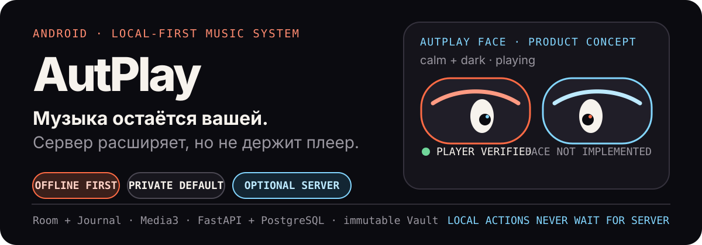
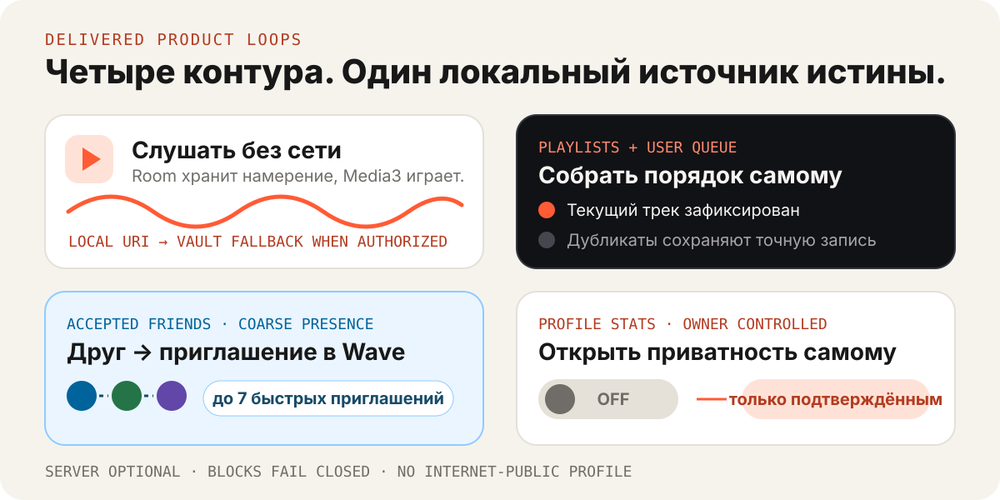
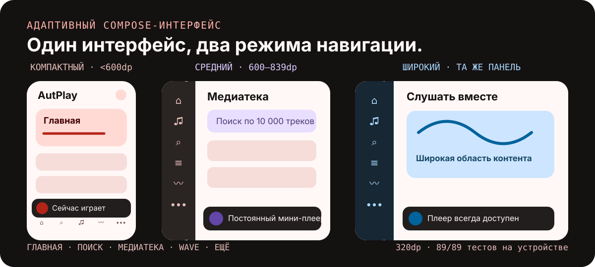

<p align="center">
  
</p>

<p align="center">
  <strong>Слушайте и управляйте медиатекой без сети. Подключайте личный сервер только для синхронизации, Vault и совместных функций.</strong>
</p>

<p align="center">
  <a href="#product">Продукт</a> ·
  <a href="#evidence">Доказательства</a> ·
  <a href="#architecture">Архитектура</a> ·
  <a href="#android">Android</a> ·
  <a href="#quick-start">Запуск</a> ·
  <a href="#progress">Статус</a> ·
  <a href="#release-boundary">Границы</a>
</p>

AutPlay — Android-first, local-first музыкальная система. Изменения медиатеки, плейлистов и обычной очереди сначала фиксируются на устройстве, а Media3 воспроизводит доступный локальный источник без синхронного обращения к серверу. Необязательный CPU-сервер добавляет авторизованную синхронизацию, неизменяемый файловый Vault, импорт, рекомендации, друзей и Hybrid Wave — без обязательного облачного аккаунта, CUDA, Redis, Kafka или внешней аналитики.

<a id="product"></a>

## Музыка работает локально. Сервер расширяет возможности.

<p align="center">
  
</p>

- **Слушать без сети.** Room хранит локальную истину, FTS ищет по кириллице и латинице, а Media3 управляет воспроизведением и загрузками.
- **Собирать плейлисты и очередь вручную.** Дубликаты остаются отдельными записями; `Play next`, перестановка и очистка будущих треков не меняют текущий трек.
- **Подключать только свои устройства.** Android создаёт запрос, владелец подтверждает его в локальном Web-admin, а точное доказательство ключа завершает привязку.
- **Слушать вместе.** Подтверждённых друзей можно быстро пригласить в Wave. Гость без аккаунта получает ограниченный доступ ровно к одной комнате, но не к чужой медиатеке или Vault.
- **Делиться статистикой по выбору.** Профиль закрыт по умолчанию; агрегаты доступны только явно разрешённым, подтверждённым и не заблокированным друзьям.
- **Находить и импортировать музыку.** Ручной TXT/Jamendo flow и выключенная по умолчанию 24-часовая автоматика используют один проверяемый Vault/Identity/Library pipeline. Автоимпорт включается отдельно.
- **Управлять и восстанавливать личный сервер.** Web-admin показывает устройства, сессии, Vault, задания и импорт; опасно выглядящие команды требуют явного подтверждения, а backup/restore изолирован и проверяем.

<a id="evidence"></a>

## Проверено, а не заявлено

AutPlay остаётся локальной development-веткой поверх проверенного RC, а не опубликованным production-продуктом. Ниже — зафиксированное evidence для соответствующих срезов, без смешивания host-, device- и migration-проверок:

| Контур | Последний зафиксированный результат |
| --- | --- |
| Root contracts / release | **119 passed**; OpenAPI, JSON Schema, release inventory и security/privacy assertions |
| Server / PostgreSQL | **662 passed + 1 ожидаемый host-policy skip** на PostgreSQL 18.4 + pgvector 0.8.6; Ruff, format и strict mypy по 232 source files |
| Android host | **199 JVM tests**, `lintDebug`, debug APK и minified release/R8 — PASS |
| Android migration | Реальная Room 12→13 migration и collision regression на API 26 — **1/1** |
| Samsung Galaxy M52 / API 33 | Полный QA side-by-side connected gate более раннего общего frontend-среза: **160 тестов, 0 failures, 3 ожидаемых skips** |
| Очередь после process death | Отдельный stage1 → PID → `adb force-stop` → отсутствие PID → stage2: порядок, current item, позиция и режимы восстановлены |
| Производительность RC | PostgreSQL 100k search p95 **6.403 ms**; Android FTS 10k p95 **12.555 ms** |

Post-RC evidence ведут milestone handoff в [implementation plan](docs/implementation/PLAN.md). Базовый P14 RC зафиксирован отдельно: [release notes 0.2.0](docs/release/RELEASE_NOTES_0.2.0.md), [RC test evidence](docs/release/TEST_EVIDENCE.md), [security review](docs/release/SECURITY_REVIEW.md) и [performance report](docs/release/PERFORMANCE_REPORT.md).

<a id="architecture"></a>

## Как это устроено

<p align="center">
  
</p>

Одна Android-транзакция сохраняет доменное изменение вместе с Journal/outbox-фактом. WorkManager повторяет отложенную синхронизацию, а Media3 независимо управляет воспроизведением и загрузками. На сервере PostgreSQL хранит метаданные, права, события и задания; filesystem/NAS — байты Vault. Необязательный server-rendered Web-admin использует отдельную browser-session authority, а не Android credentials.

Ключевые границы:

- `VaultObject`, `AudioVariant`, `Recording`, `ReleaseTrack` и `UserTrackRef` остаются разными сущностями.
- Знание SHA-256 никогда не является разрешением на чтение Vault.
- Неуверенная идентичность не приводит к тихому auto-merge.
- Обычная очередь редактируется локально; Wave-очередь остаётся server-authoritative и fail-closed. Гостевые Wave-проекции отделены от account-bound `wave_*` по `guest_session_id`.
- Friendship не выдаёт доступ к account, device, library, Vault, media или Wave Room; каждое право проверяется отдельно.
- Статистика private by default; дружба и отсутствие block повторно проверяются на каждом friend-read.
- CPU-путь не импортирует GPU/CUDA-код. Опциональный GPU-проект физически изолирован.

<a id="android"></a>

## Android-интерфейс

<p align="center">
  
</p>

Один Compose-контур адаптируется от нижней навигации телефона до общей боковой панели на складных устройствах и планшетах. Мини-плеер и Now Playing остаются доступными, а Home, Search, Library, Wave, Profile и Settings работают с локальными owner-scoped проекциями.

В профиле находятся собственная статистика, друзья и подключение устройств. Владелец подтверждает account/server context до обмена ключами; recovery и reenrollment не сохраняют bearer-секреты в обычном UI-state. Доступ друзей к статистике включается явно. Плейлисты открываются как редактируемые коллекции, а очередь управляется из Now Playing и контекстных track/detail-поверхностей.

Интерфейс поддерживает system/light/dark темы и акценты Coral, Violet, Green и Blue. Секреты, приватные server origins, raw paths и персональные payloads не входят в обычные логи или экспорт настроек.

<a id="quick-start"></a>

## Запуск репозитория

AutPlay поставляется как воспроизводимый development repository и локальный release candidate. Публичного установщика, production signing key, рабочего container registry и готовой публичной TLS-топологии пока нет.

### Требования

- `uv 0.12.3` и зафиксированный CPython `3.14.7`;
- Microsoft OpenJDK `17.0.20+8-LTS` в `JAVA_HOME`;
- Android SDK Platform `36.1`, Build Tools `36.1.0` и `ANDROID_HOME`;
- Docker Engine + Compose с поддержкой `up --wait`.

Gradle Wrapper загружает Gradle `9.3.1` и проверяет checksum дистрибутива.

### Канонические команды

Запускайте из корня репозитория. README — источник истины для порядка bootstrap и проверок.

Windows PowerShell:

```powershell
powershell.exe -NoProfile -ExecutionPolicy Bypass -File .\scripts\bootstrap.ps1
powershell.exe -NoProfile -ExecutionPolicy Bypass -File .\scripts\check.ps1
powershell.exe -NoProfile -ExecutionPolicy Bypass -File .\scripts\check.ps1 -ServerOnly
```

Linux, macOS или настроенная WSL:

```bash
bash scripts/bootstrap.sh
bash scripts/check.sh
bash scripts/check.sh --server-only
```

`bootstrap` синхронизирует frozen Python-окружения, разрешает Gradle Wrapper и проверяет Compose. `check` выполняет contract/release, server, dependency-policy и Android host gates и поднимает одноразовый PostgreSQL только на случайном loopback-порту.

Точечные команды:

```powershell
uv run --frozen pytest tests/contract tests/release
.\gradlew.bat --no-daemon --console=plain --max-workers=1 `
  :apps:android:lintDebug `
  :apps:android:testDebugUnitTest `
  :apps:android:assembleDebug `
  :apps:android:assembleRelease
```

Для connected gate нужен авторизованный Android API 26+:

```powershell
.\gradlew.bat --no-daemon --console=plain --max-workers=1 `
  :apps:android:connectedDebugAndroidTest
```

L1 process-death gate запускается отдельно, потому что две стадии должны быть разделены внешним `force-stop`:

```powershell
powershell.exe -NoProfile -ExecutionPolicy Bypass `
  -File .\scripts\test-l1-process-death.ps1 `
  -AndroidHome $env:ANDROID_HOME `
  -DeviceSerial <adb-serial> `
  -QaSideBySide
```

<details>
<summary><strong>Одноразовый CPU runtime</strong></summary>

Создайте secret-файл минимум из 32 случайных символов вне репозитория. Runtime-профиль запускает migration, API, CPU-worker и direct streaming; API/streaming по умолчанию доступны только через loopback.

```powershell
$env:AUTPLAY_RUNTIME_AUTH_SECRET_FILE = 'C:\path\outside\repo\autplay-auth-secret.txt'
docker compose -f deploy/compose/compose.yaml -f deploy/compose/compose.runtime.yaml --profile runtime up --build --wait
docker compose -f deploy/compose/compose.yaml -f deploy/compose/compose.runtime.yaml --profile runtime down --volumes
```

```bash
export AUTPLAY_RUNTIME_AUTH_SECRET_FILE=/path/outside/repo/autplay-auth-secret.txt
docker compose -f deploy/compose/compose.yaml -f deploy/compose/compose.runtime.yaml --profile runtime up --build --wait
docker compose -f deploy/compose/compose.yaml -f deploy/compose/compose.runtime.yaml --profile runtime down --volumes
```

Перед использованием прочитайте [runtime Compose guide](deploy/compose/README.md).

</details>

<details>
<summary><strong>Изолированный GPU-проект</strong></summary>

У `gpu/` отдельные lock, image и worker. Канонический CPU-контур его не устанавливает и не импортирует. Ни одна GPU-модель в текущем RC не упакована и не активирована.

```powershell
powershell.exe -NoProfile -ExecutionPolicy Bypass -File .\scripts\test-p12-gpu.ps1
powershell.exe -NoProfile -ExecutionPolicy Bypass -File .\scripts\test-p12-gpu.ps1 `
  -DeviceSelector 'uuid:GPU-...'
```

См. [ADR-025](docs/adr/ADR-025-p12-isolated-gpu-enrichment-and-model-rollout.md) и [ADR-027](docs/adr/ADR-027-p14-conditional-phase-reachability.md).

</details>

## Карта репозитория

| Путь | Ответственность |
| --- | --- |
| `apps/android` | Compose UI, Room v13, Journal, Media3 playback/download, sync, pairing/admission, friends/guest Room access, statistics privacy, playlists, queue and Wave recovery |
| `server/src/autplay` | Modular-monolith CPU API, optional SSR admin, workers, streaming, PostgreSQL/Vault adapters, sync, discovery/import, social, statistics, recommendations and Wave |
| `server/migrations` | Linear Alembic revisions `0001`–`0026`; без destructive fallback |
| `contracts` | OpenAPI 3.1, Draft 2020-12 schemas and cross-language vectors |
| `deploy/compose` | Digest-pinned PostgreSQL and loopback-only runtime profiles |
| `gpu` | Physically isolated optional NVIDIA/ONNX enrichment project |
| `tests` | Contract, release-policy and end-to-end evidence fixtures |
| `docs/design` | Product, system, API, privacy and persistence contracts |
| `docs/adr` | Accepted architectural decisions and boundaries |
| `docs/operations` | CI/release, deployment, recovery and observability guides |
| `docs/release` | RC checklist, evidence, security, performance, SBOM and release notes |

<a id="progress"></a>

## Состояние разработки

P00–P14 закрыты как локальный CPU release candidate. Более новые frontend, pairing, Web-admin, social/privacy, library и discovery milestone ведутся отдельной post-RC линией: они не создают P15 и не меняют границы исходного RC задним числом.

| Линия | Состояние | Подтверждённый результат |
| --- | --- | --- |
| P00–P14 · local RC | **PASS** | Android local-first, sync, Vault, import, CPU recommendations, Wave, hardening и release evidence |
| Frontend M1–M4 | **PASS** | Адаптивный Compose shell, Media3 player, Home/Search/Library и типизированные Track/Release/Playlist/Artist surfaces |
| Product M5A/M5B · Server M6 | **PASS** | Защищённое подключение профиля и устройств, optional CPU-only административный Web-интерфейс |
| Social S1A–S1D · Privacy S2 | **PASS** | Device admission, друзья, private coarse presence, Wave invites, capability-limited guest join и friend-only статистика по явному opt-in |
| Library L1 | **PASS** | Ручные duplicate-preserving плейлисты и долговечная локальная очередь с process-death recovery |
| Discovery A1B / A1C | **PASS** | Ручной TXT/Jamendo flow и default-off 24-hour discovery с отдельно подтверждаемым `AUTO_IMPORT` |

Детальный статус и стоп-границы находятся в [implementation plan](docs/implementation/PLAN.md). Последний закрытый продуктовый срез — [S1D handoff](docs/implementation/HANDOFF_POST_MVP_S1D_GUEST_ROOM_ACCESS.md). Discovery-автоматика по-прежнему выключена по умолчанию.

<a id="release-boundary"></a>

## Границы релиза

- `0.2.0` — проверенный локальный P14 RC baseline; текущая ветка содержит более новые post-RC milestone, но не является новым опубликованным GitHub Release или production deployment.
- Production signing, registry push, public domain/TLS topology, backup target and registration/legal policy intentionally remain operator decisions.
- Friend-visible statistics are not Internet-public; collaborative playlists and cross-device active-queue sync are not delivered.
- Wave evidence covers the declared trusted-local single-API-process topology; public-internet multi-instance fan-out remains deferred.
- Automatic probabilistic Recording merge remains disabled; ambiguous evidence requires review.
- Lyrics, Party Mode/member voting and guest queue editing are outside the delivered scope.
- A1B manual discovery, A1C opt-in automation и Android-only S1D guest Room access закрыты со статусом `PASS`.
- P12 real RTX/model evidence remains `DEFERRED_WITH_APPROVAL`; the deterministic CPU baseline stays authoritative.

Перед эксплуатацией прочитайте [release notes 0.2.0](docs/release/RELEASE_NOTES_0.2.0.md), [CI/release guide](docs/operations/CI_RELEASE.md), [deployment boundary](docs/operations/DEPLOYMENT.md) и [backup/restore guide](docs/operations/BACKUP_RESTORE.md).
