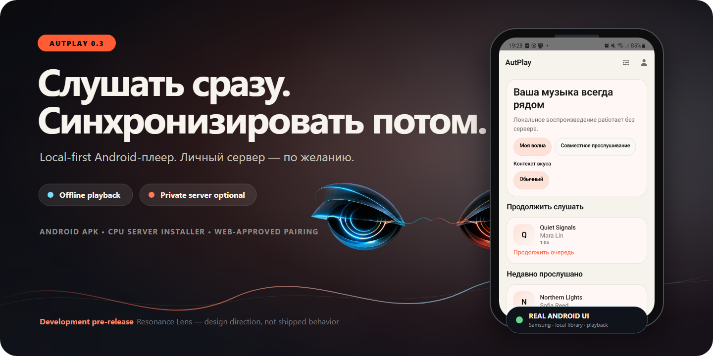
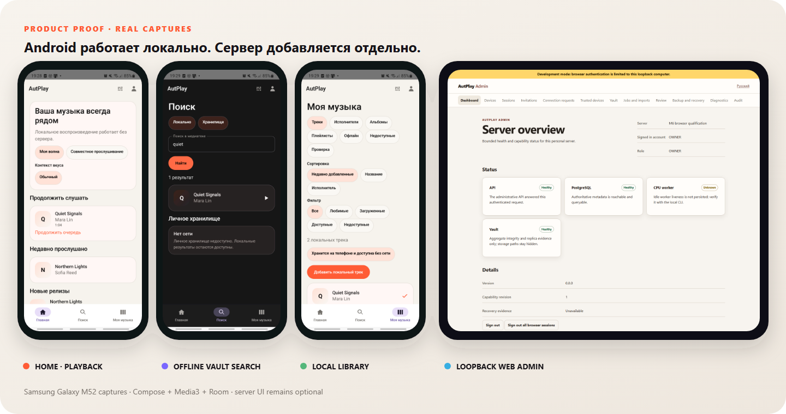
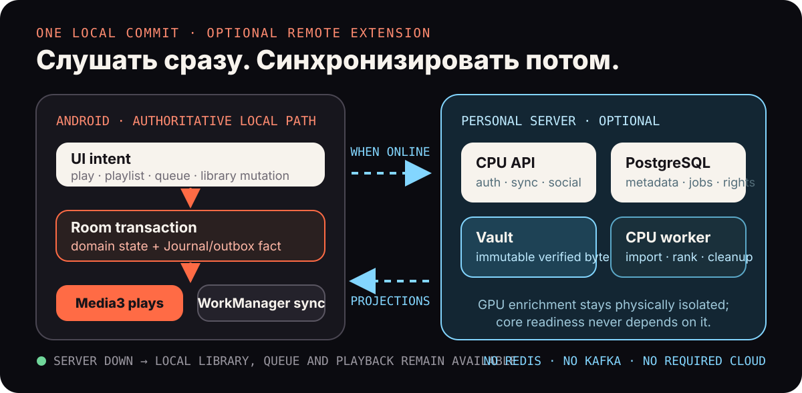

<p align="center">
  
</p>

<p align="center">
  <strong>Android-плеер, который не перестаёт быть вашим без сети. Личный сервер добавляет синхронизацию, Vault и совместные функции — по желанию.</strong>
</p>

<p align="center">
  <a href="https://github.com/Dakstar-cool/AutPlay/releases/tag/v0.3.0"><strong>Скачать v0.3.0</strong></a> ·
  <a href="./docs/operations/INSTALL_AND_PAIR.md">Установка и связывание</a> ·
  <a href="#proof">Реальные экраны</a> ·
  <a href="#architecture">Архитектура</a> ·
  <a href="#development">Сборка и тесты</a>
</p>

> [!IMPORTANT]
> `v0.3.0` — development pre-release. APK подписаны сохранённым development key, а готовый серверный installer рассчитан только на доверенную домашнюю RFC1918-сеть. Это не store-ready Android distribution и не public-Internet production deployment.

AutPlay — Android-first, local-first музыкальная система для владельцев личной библиотеки. Room
хранит локальную истину, Media3 воспроизводит доступный источник, а изменения медиатеки, плейлистов
и очереди не требуют синхронного ответа сервера. Необязательный CPU-сервер добавляет PostgreSQL,
неизменяемый файловый Vault, синхронизацию, импорт, рекомендации, друзей и Wave — без обязательного
облачного аккаунта, CUDA, Redis, Kafka или внешней аналитики.

## Быстрый выбор

| Нужно | Артефакт | Важная граница |
| --- | --- | --- |
| Слушать локальную музыку | [`autplay-0.3.0-dev-signed.apk`](https://github.com/Dakstar-cool/AutPlay/releases/download/v0.3.0/autplay-0.3.0-dev-signed.apk) | Hardened `app.autplay`; HTTP запрещён, сервер требует отдельно настроенный HTTPS |
| Проверить личный сервер дома | [`autplay-0.3.0-trusted-lan.apk`](https://github.com/Dakstar-cool/AutPlay/releases/download/v0.3.0/autplay-0.3.0-trusted-lan.apk) | Отдельный `app.autplay.lan`; debuggable, HTTP только для loopback/RFC1918 |
| Поднять CPU-сервер | [`autplay-server-v0.3.0-installer.zip`](https://github.com/Dakstar-cool/AutPlay/releases/download/v0.3.0/autplay-server-v0.3.0-installer.zip) | `linux/amd64`, Docker Compose 2.24.4+, trusted LAN, без production backup/TLS |

Проверьте скачанные файлы по `SHA256SUMS`. Два Android-варианта изолированы разными application
id и могут стоять рядом; их локальные базы автоматически не объединяются.

<a id="proof"></a>

## Продукт, а не макет

<p align="center">
  
</p>

- **Слушать без сети.** Локальная библиотека, поиск, плейлисты, очередь и playback остаются доступны без сервера.
- **Продолжать после process death.** Media3 и Room восстанавливают текущий элемент, позицию и будущую очередь.
- **Подключать сервер осознанно.** Android сверяет owner-controlled identity fingerprint, затем владелец подтверждает exact device key в loopback Web Admin.
- **Сохранять неоднозначность.** Неуверенная identity evidence уходит на review; probabilistic auto-merge остаётся выключен.
- **Расширять приватно.** Sync, Vault, импорт, рекомендации, друзья, статистика и Wave добавляются отдельными полномочиями, а не одним «доступом ко всему».

## Первый успешный запуск

### Только Android

1. Скачайте hardened APK и сравните SHA-256 с релизным `SHA256SUMS`.
2. Установите APK, откройте AutPlay и выберите папку с музыкой через системный Android picker.
3. Начните воспроизведение. Учётная запись и сервер для этого не нужны.

### Android + личный сервер

1. Установите Docker Engine/Linux containers и Docker Compose `2.24.4+` на `linux/amd64` компьютере.
2. Распакуйте server installer и запустите `install-server.ps1 -BindHost <LAN IPv4>` или `install-server.sh --bind-host <LAN IPv4>`.
3. Получите fingerprint локальной командой `server-control … fingerprint`, один раз создайте OWNER и войдите в Web Admin только через `127.0.0.1`.
4. Установите `AutPlay LAN`, введите адрес mobile API, целиком сравните fingerprint и 12-значный admission code.
5. Одобрите устройство в Web Admin и дождитесь состояния `Подключено` на Android.

Полные команды для Windows/Linux, firewall scope, bootstrap, browser invite, pairing и диагностика:
**[Установка AutPlay и подключение личного сервера](docs/operations/INSTALL_AND_PAIR.md)**.

<a id="architecture"></a>

## Как это устроено

<p align="center">
  
</p>

Одна Android-транзакция сохраняет доменное изменение вместе с Journal/outbox-фактом. WorkManager
повторяет отложенную синхронизацию, а Media3 независимо владеет воспроизведением и загрузками. На
сервере PostgreSQL хранит метаданные, права, события и задания; filesystem/NAS — байты Vault.
Server-rendered Web Admin использует отдельную browser-session authority и остаётся на loopback.

Ключевые инварианты:

- Android local actions не требуют синхронного server trip.
- `VaultObject`, `AudioVariant`, `Recording`, `ReleaseTrack` и `UserTrackRef` — разные сущности; знание SHA-256 не является разрешением.
- Profile, device, library, Vault, media, friendship и Wave проверяют полномочия независимо.
- Private-by-default статистика доступна другу только по явному opt-in и повторной проверке friendship/block.
- CPU-путь не импортирует и не устанавливает GPU/CUDA-код; optional GPU project физически изолирован.
- Неизвестные persisted/API values сохраняются; destructive Room/Alembic fallback запрещён.

## Что входит

| Контур | Реализовано |
| --- | --- |
| Android | Home, Search, Library, Track/Release/Playlist/Artist details, Media3 playback/downloads, ручные плейлисты и очередь, import review, Profile, statistics, sync status |
| Pairing | Signed discovery, owner-controlled fingerprint, exact-key enrollment, Web-approved admission, recovery/reenrollment без plaintext credential persistence |
| Server | CPU modular monolith, PostgreSQL metadata/jobs/sync, immutable filesystem Vault, Range streaming, imports, deterministic recommendations |
| Admin | Loopback SSR Web Admin: devices, sessions, trust, Vault, jobs/imports, review, recovery, diagnostics and audit |
| Social | Same-server friends, private coarse presence, Wave invitations and capability-limited Android guest access |
| Discovery | Manual TXT/Jamendo flow и default-off 24-hour automation с отдельным подтверждением `AUTO_IMPORT` |

## Проверяемая граница

P00–P14 закрыты как локальный CPU release candidate. Frontend M1–M4, Product M5, Server M6,
Discovery A1, Social S1, Privacy S2 и Library L1 ведутся как отдельная post-RC линия и не создают
P15. Текущий release gate проверяет оба Android APK, подписи, installer contract, CPU image identity,
archive reload, media/config smoke и disposable combined Compose runtime.

Основные evidence-документы:

- [v0.3.0 release notes](docs/release/RELEASE_NOTES_0.3.0.md)
- [RC test evidence](docs/release/TEST_EVIDENCE.md)
- [security review](docs/release/SECURITY_REVIEW.md)
- [performance report](docs/release/PERFORMANCE_REPORT.md)
- [P14 handoff](docs/implementation/HANDOFF_P14.md)

## Resonance Lens

Resonance Lens в hero — **визуальное направление, а не реализованная функция**. Концепция описывает
пару оптических «глаз», continuous mood и тонкий resonance filament для будущего Now Playing. Она
не доказывает наличие Face runtime, модели или музыкального анализа в `v0.3.0`; реальное состояние
продукта показано Android/Web screenshots выше.

См. [Resonance Lens exploration](docs/design/explorations/AutPlay_Face_Resonance_Lens_Exploration_v1.md)
и [reviewed implementation plan](docs/design/explorations/AutPlay_Face_Resonance_Lens_Plan.md).

<a id="development"></a>

## Сборка и тесты

### Требования

- `uv 0.12.3` и зафиксированный CPython `3.14.7`;
- Microsoft OpenJDK `17.0.20+8-LTS` в `JAVA_HOME`;
- Android SDK Platform `36.1`, Build Tools `36.1.0` и `ANDROID_HOME`;
- Docker Engine + Docker Compose `2.24.4+`.

Gradle Wrapper загружает Gradle `9.3.1` и проверяет checksum дистрибутива.

### Канонические команды

Запускайте из корня репозитория. Этот README — источник истины для bootstrap/check порядка.

Windows PowerShell:

```powershell
powershell.exe -NoProfile -ExecutionPolicy Bypass -File .\scripts\bootstrap.ps1
powershell.exe -NoProfile -ExecutionPolicy Bypass -File .\scripts\check.ps1
powershell.exe -NoProfile -ExecutionPolicy Bypass -File .\scripts\check.ps1 -ServerOnly
```

Linux, macOS или настроенная WSL:

```bash
bash scripts/bootstrap.sh
bash scripts/check.sh
bash scripts/check.sh --server-only
```

Точечные host-команды:

```powershell
uv run --frozen pytest tests/contract tests/release
.\gradlew.bat --no-daemon --console=plain --max-workers=1 `
  :apps:android:lintDebug `
  :apps:android:testDebugUnitTest `
  :apps:android:assembleDebug `
  :apps:android:assembleTrustedLan `
  :apps:android:assembleRelease
```

Для connected gate нужен явно выбранный Android API 26+:

```powershell
.\gradlew.bat --no-daemon --console=plain --max-workers=1 `
  :apps:android:connectedDebugAndroidTest
```

Release bundle создаётся только из clean tagged `HEAD` и сам запускает полный gate:

```powershell
powershell.exe -NoProfile -ExecutionPolicy Bypass -File .\scripts\package-release.ps1 `
  -ReleaseTag v0.3.0 `
  -JavaHome $env:JAVA_HOME `
  -AndroidHome $env:ANDROID_HOME
```

## Карта репозитория

| Путь | Ответственность |
| --- | --- |
| `apps/android` | Compose UI, Room, Journal, Media3, sync, pairing/admission, social, statistics, import, playlists and queue |
| `server/src/autplay` | CPU API, optional SSR admin, workers, stream, PostgreSQL/Vault, sync, discovery, social, recommendations and Wave |
| `server/migrations` | Линейные Alembic migrations; без destructive fallback |
| `contracts` | OpenAPI 3.1, JSON Schema и cross-language vectors |
| `deploy/compose` | Digest-pinned PostgreSQL и runtime/admin overlays |
| `deploy/installer` | Проверяемый server installer/control scripts для Windows/Linux |
| `gpu` | Изолированный optional NVIDIA/ONNX enrichment project; моделей в релизе нет |
| `tests` | Contract, release-policy и end-to-end evidence fixtures |
| `docs` | Design contracts, ADR, handoffs, operations and release evidence |

## Границы v0.3.0

- Development signing only; production signing key и store policy не выбраны.
- Bundled server — CPU `linux/amd64`, single-operator, trusted-LAN development topology.
- Public domain/TLS/reverse proxy, registry push, production secret delivery, backup destination/retention и rollout policy остаются отдельными решениями.
- Web Admin доступен только на literal loopback; password login и public registration отсутствуют.
- Automatic probabilistic Recording merge выключен; ambiguous evidence требует review.
- P12 model activation и production Face/Resonance Lens runtime отсутствуют; deterministic CPU baseline остаётся authoritative.
- Не используйте `docker compose down --volumes` для данных, которые нужно сохранить: bundled installer не является системой резервного копирования.

Перед эксплуатацией прочитайте [release notes](docs/release/RELEASE_NOTES_0.3.0.md),
[installation guide](docs/operations/INSTALL_AND_PAIR.md),
[deployment boundary](docs/operations/DEPLOYMENT.md) и
[backup/restore guide](docs/operations/BACKUP_RESTORE.md).
