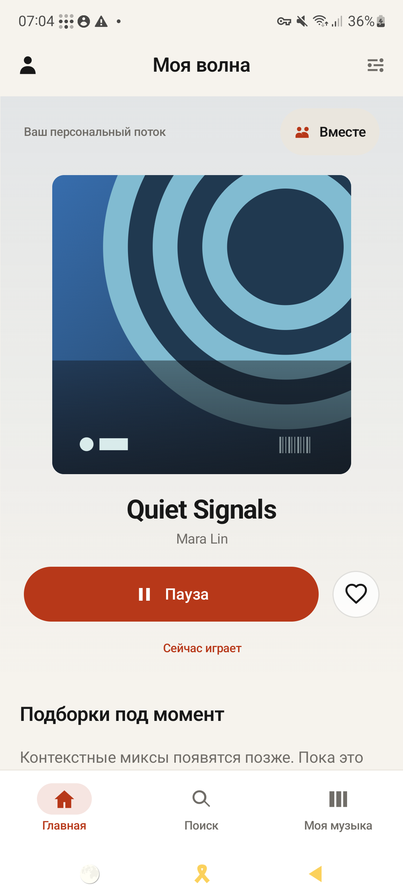
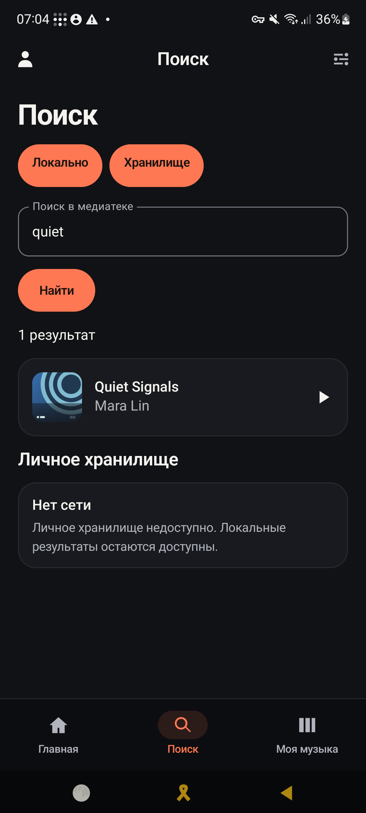
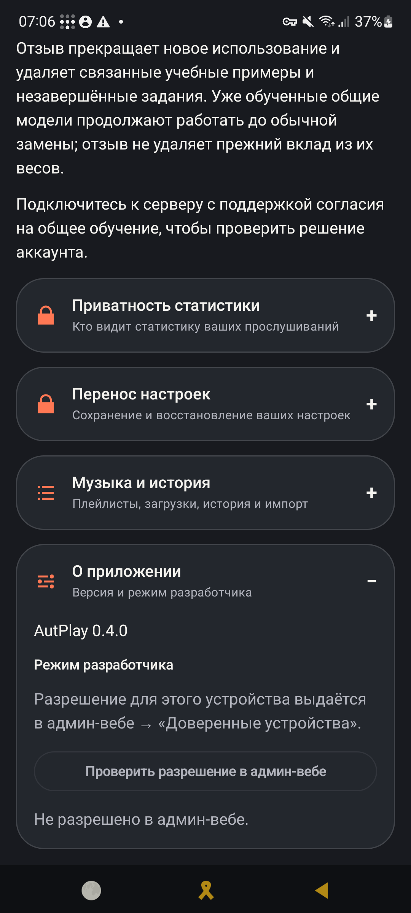
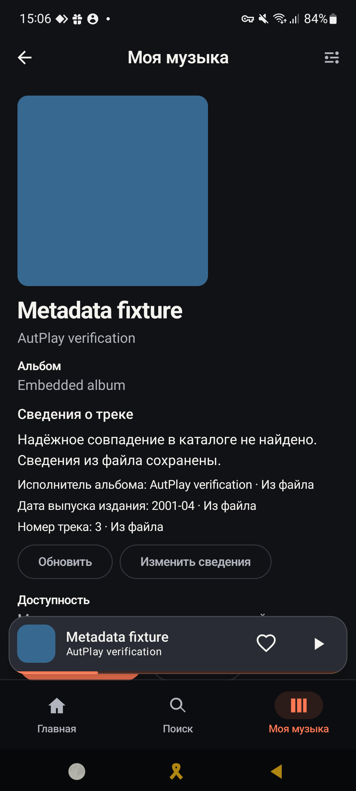
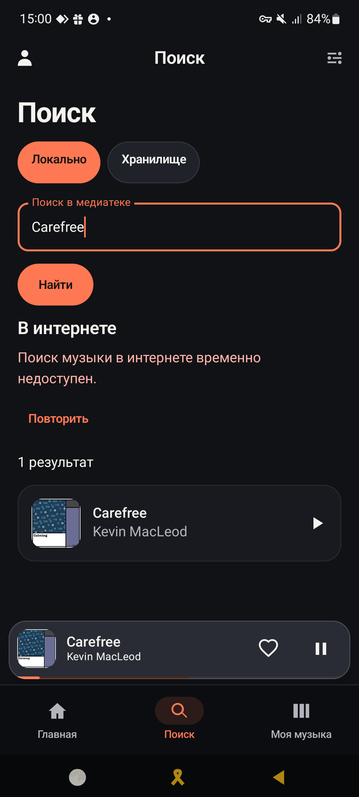

<p align="center">
  
</p>

# AutPlay

**Ваша музыка на Android. Личный сервер — по желанию.**

AutPlay — плеер для собственной музыкальной коллекции: локальная медиатека, поиск,
плейлисты и очередь работают без сети и обязательной регистрации. Личный Linux-сервер
добавляет синхронизацию, хранилище музыки Vault, импорт, рекомендации и совместное
прослушивание Wave. Для основного приложения и сервера GPU не нужен.

<p align="center">
  <a href="#start"><strong>Скачать и начать</strong></a> ·
  <a href="#features">Возможности</a> ·
  <a href="#acquisition">Загрузка музыки</a> ·
  <a href="#release">Что нового в 0.4</a> ·
  <a href="#architecture">Архитектура</a> ·
  <a href="#development">Сборка и тесты</a>
</p>

> [!NOTE]
> **Скачать сейчас:** [v0.4.0](https://github.com/Dakstar-cool/AutPlay/releases/tag/v0.4.0)
> от 22 сентября 2026 года — development-выпуск с Android APK, CPU server installer,
> SBOM и контрольными суммами. Его APK подписан development key.
>
> **Следующий выпуск:** [v1.0.0](docs/release/RELEASE_NOTES_1.0.0.md) подготовлен как
> production-кандидат, но пока не опубликован и не развёрнут. Физическая проверка M52
> выявила проблемы поиска локальных треков после привязки профиля и доступности UI.
> Для production-решения нужны исправления и [оставшиеся проверки](docs/operations/PRODUCTION_READINESS_PLAN.md).

<a id="proof"></a>

## Как выглядит приложение

<p align="center">
  <a href="docs/release/evidence/v0.4.0-m52/m52-home-ru-light.png"></a>
  <a href="docs/release/evidence/v0.4.0-m52/m52-search-vault-offline-ru-dark.png"></a>
  <a href="docs/release/evidence/v0.4.0-m52/m52-settings-about-v040-ru-dark.png"></a>
</p>

Свежие снимки `v0.4.0` сделаны 22 сентября на физическом Samsung Galaxy M52 (Android 13).
Для публичных кадров использована отдельная QA-сборка с синтетическими треками: личных данных,
адреса сервера и токенов на изображениях нет. [Протокол и SHA-256](docs/release/evidence/v0.4.0-m52/README.md).

### Web Admin личного сервера

<p align="center">
  <a href="docs/implementation/evidence/m6-admin-web/desktop-dashboard-en.png"></a>
  <a href="docs/implementation/evidence/m6-admin-web/mobile-sessions-ru-dark-reduced-motion.png"></a>
</p>

Web Admin работает на loopback серверного компьютера. Скриншоты воспроизводятся браузерным
integration-тестом на синтетическом OWNER: dashboard показывает четыре рабочие области, а
мобильный кадр — управление браузерными сеансами. Recovery-экран доступен
[в полном размере](docs/implementation/evidence/m6-admin-web/desktop-recovery-en.png).

<details>
<summary>Сводная галерея предыдущих проверок</summary>

<p align="center">
  <a href="./assets/readme/product-board.png">
    
  </a>
</p>

</details>

**Описания и обложки доступны без сети.** Снимки M52 от 16 сентября:
карточка с происхождением метаданных и приложение после перезапуска без подключения.

<p align="center">
  <a href="docs/release/evidence/metadata-2026-09-16/embedded-detail.png"></a>
  <a href="docs/release/evidence/metadata-2026-09-16/external-offline.png"></a>
</p>

<a id="features"></a>

## Что можно делать сейчас

| Возможность | Как это работает |
| --- | --- |
| **Слушать без сети** | Добавляйте аудиофайлы через системный Android picker, ищите в локальной библиотеке, открывайте треки, альбомы и исполнителей. |
| **Управлять прослушиванием** | Редактируйте плейлисты, добавляйте треки следующими или в конец очереди, меняйте порядок и продолжайте с сохранённой позиции после перезапуска процесса. |
| **Управлять своим вкусом** | Ставьте Like/Dislike и исключайте текущее прослушивание или всю сессию очереди из профиля вкуса. Базовые рекомендации используют предпочтения, историю, новизну и разнообразие; Android сохраняет пакеты для работы без сети. |
| **Подключить личный сервер** | Синхронизируйте данные, храните файлы в Vault, слушайте потоковое аудио и управляйте импортом. История, загрузки и серверные функции показывают отдельные записи, доступные действия и состояния. |
| **Переносить музыку между телефоном и Vault** | Выбирайте аудио системным picker: AutPlay сохраняет доступ и индексирует исходный файл без лишней копии. Трек можно отправить в Vault, а серверный вариант — скачать для прослушивания без сети. |
| **Выбирать музыку из Интернета** | По явному поиску приложение показывает до пяти результатов YouTube. Выберите конкретную запись и сохраните её в Vault либо в Vault и на телефон. Функция включается оператором; ошибки источника классифицируются и показываются без ложного успеха. |
| **Дополнять описания и обложки** | Встроенные теги, MusicBrainz, Cover Art Archive и настраиваемый AcoustID помогают заполнить карточку. У полей виден источник; ручные правки сохраняются, неоднозначные издания требуют выбора. |
| **Слушать вместе** | Добавляйте друзей на том же сервере, приглашайте в Wave, используйте гостевой доступ с ограниченными полномочиями и подтверждаемую передачу ведущего. |
| **Контролировать доступ и аккаунт** | Сверяйте отпечаток сервера, подтверждайте устройства в Web Admin или добавляйте своё устройство по QR. Доступны passkey, одноразовое TXT-восстановление, отзыв старых полномочий и удаление аккаунта с 30-дневным окном отмены. |
| **Следить за новыми релизами** | Используйте TXT/Jamendo-импорт и включаемый вручную поиск релизов раз в 24 часа. Автоматический импорт требует отдельного подтверждения. |

<a id="release"></a>

## Главное в v0.4.0

- **Аккаунты без общего пароля.** Admin Web разделён на обзор, аккаунты и устройства,
  музыку и передачи, сервер. Добавлены WebAuthn/passkey и отзыв браузерных сеансов.
- **Самостоятельное подключение и восстановление.** OWNER, ADMIN и USER могут добавить
  своё устройство по QR. Одноразовый TXT-документ восстанавливает аккаунт с ротацией кода
  и отзывом прежних устройств, сеансов, доверия и passkey.
- **Удаление и приватность.** Запрос удаления немедленно приостанавливает доступ, оставляет
  30 дней на отмену и защищает последнего активного OWNER. Согласие на общее обучение
  выключено по умолчанию, версионируется и может быть отозвано.
- **Измеряемые квоты.** По умолчанию доступны 5 устройств, 2 воспроизведения и 2 передачи
  на аккаунт; сервер удерживает ресурс до подтверждённой остановки процесса и очищает
  незавершённые операции после восстановления.
- **Надёжнее музыка и синхронизация.** Android инициализирует отсутствующий sync binding,
  повторяет полный snapshot при пропущенной серверной записи, возобновляет Media3-загрузки
  после перезапуска и не дублирует выбранные пользователем файлы. Сервер различает временные
  и окончательные ошибки интернет-источника и поддерживает изолированный PO-token provider.

Полный состав, проверки и границы выпуска: [release notes v0.4.0](docs/release/RELEASE_NOTES_0.4.0.md).

<a id="start"></a>

## Скачать и начать

Для приложения нужен **Android 8.0+ (API 26)**.

| Скачать v0.4.0 | Для чего |
| --- | --- |
| [Основной APK](https://github.com/Dakstar-cool/AutPlay/releases/download/v0.4.0/autplay-0.4.0-dev-signed.apk) | `app.autplay`: локальная музыка; подключение к серверу только по HTTPS. |
| [AutPlay LAN](https://github.com/Dakstar-cool/AutPlay/releases/download/v0.4.0/autplay-0.4.0-trusted-lan.apk) | `app.autplay.lan`: отдельная отладочная сборка; HTTP разрешён только для loopback и частных RFC1918-адресов. |
| [Installer ZIP](https://github.com/Dakstar-cool/AutPlay/releases/download/v0.4.0/autplay-server-v0.4.0-installer.zip) | Личный CPU-сервер: Docker Compose, `linux/amd64`, доверенная домашняя сеть. |

> [!IMPORTANT]
> Опубликованные APK подписаны development key. Пакет сервера предназначен для доверенной
> домашней сети; готовность публичного развёртывания в Интернете ещё не подтверждена.

Перед установкой сверьте файлы с релизным
[SHA256SUMS](https://github.com/Dakstar-cool/AutPlay/releases/download/v0.4.0/SHA256SUMS).
Основное приложение и LAN-вариант могут стоять рядом, но используют отдельные локальные базы.

### Только телефон

1. Установите основной APK и откройте **«Моя музыка»**.
2. Нажмите **«Добавить локальный трек»** и выберите аудиофайл через системный диалог.
3. Запустите трек. Сервер и учётная запись для этого не нужны.

### Телефон и личный сервер

1. Подготовьте Docker Engine с Linux-контейнерами и Docker Compose `2.24.4+`.
2. Распакуйте installer и запустите `install-server.ps1 -BindHost <LAN IPv4>`
   либо `install-server.sh --bind-host <LAN IPv4>`.
3. Получите отпечаток сервера локальной командой управления, создайте владельца и войдите
   в Web Admin на серверном компьютере через `127.0.0.1`.
4. В **AutPlay LAN** укажите адрес API и сверьте полный отпечаток сервера. Запросите
   подключение и сравните 12-значный код на телефоне и в Web Admin.
5. Одобрите устройство в Web Admin и дождитесь состояния **«Подключено»**.

**[Пошаговая установка и связывание](docs/operations/INSTALL_AND_PAIR.md)** содержит точные
команды для Windows/Linux, вход в Web Admin, настройку firewall и диагностику. Для разработки,
всех вариантов Android, Compose, внешних источников, backup/restore и выпуска используйте
**[полное руководство по настройке проекта](docs/operations/FULL_PROJECT_SETUP.md)**.

<a id="acquisition"></a>

## Загрузка музыки из TXT-плейлиста

В репозитории есть отдельный переносимый
[загрузчик музыки](tools/local_music_acquisition/README.md).
Он работает локально или как сохраняемая очередь на Linux-сервере.

- **Источники:** Jamendo, Hitmo, YouTube через yt-dlp; опционально SoundCloud, Bandcamp
  и Yandex Music. Источники включаются с подтверждением прав; Yandex требует OAuth-токен.
- **Очередь:** сохранение после каждого трека, продолжение после перезапуска, пауза,
  ограниченные повторы и отдельный учёт пропусков и ошибок. Можно обрабатывать до четырёх
  строк параллельно, сохраняя последовательность внутри каждого источника.
- **Сопоставление:** нормализация TXT, проверка исполнителей и версии записи, переносимые
  каталоги подтверждённых исправлений и ссылок на конкретные треки.
- **Расширение коллекции:** отдельный включаемый режим ищет до трёх подходящих записей,
  когда точной нет. Live, remix и другие версии сохраняются отдельно со своими метаданными;
  исходная очередь и уже скачанные файлы сохраняются.
- **Проверка файлов:** в режиме очереди обязательны полный SHA-256 и декодирование аудио
  через FFmpeg. Уже сохранённые файлы не перезаписываются.

Загрузчик сохраняет файлы отдельно. Для автоматического добавления завершённых загрузок в личный
Vault доступен [локальный сервис импорта](tools/ACQUISITION_VAULT_BRIDGE.md), который оператор
включает для выбранного владельца и каталогов. Наличие адаптера не гарантирует доступность источника
или нахождение всех треков.
Используйте его для музыки, которую вам разрешено скачивать; обход DRM не поддерживается.

[Локальный запуск](tools/local_music_acquisition/README.md) ·
[Серверная очередь, восстановление и выборочный прокси](tools/local_music_acquisition/SERVER_QUEUE.md) ·
[Проверки развёртывания от 14 сентября](tools/local_music_acquisition/DEPLOYMENT_2026-09-14.md)

## Resonance Lens и музыкальный анализ

**В плеере уже работает локальная визуализация Resonance Lens.** Она реагирует на энергию
и динамику воспроизводимого PCM-аудио, состояния play/pause и Like/Dislike; поддерживает
уменьшение движения. Эта реакция не является распознаванием настроения, тембра или высоты тона.

**Face Contract v1 реализован как основа будущего анализа:** схемы, проверка идентичности
результата, семантические валидаторы и выборка по времени воспроизведения. Производственный
timeline, интерпретатор музыкального характера и модель в приложении пока не активированы.

Отдельный CPU-эксперимент проверил Musicnn → DEAM и Discogs-EffNet → Jamendo на **72 фрагментах
из 24 записей**. Он подтверждает техническую совместимость и воспроизводимость результатов
на этой выборке; качество определения эмоций, калибровка и ONNX/CUDA ещё не подтверждены.

[Face Contract v1](contracts/face/v1/README.md) ·
[Эксперимент и его ограничения](docs/release/PLAYLIST_FACE_ML_2026-09-11.md) ·
[Инструменты эксперимента](tools/face-experiment/README.md)

<a id="architecture"></a>

## Как это устроено

На Android **Room** сохраняет локальные изменения и журнал синхронизации одной транзакцией.
**Media3** управляет воспроизведением и загрузками, **WorkManager** выполняет отложенную работу.
Локальные действия не ждут ответа сервера.

Сервер — модульное CPU-приложение: **PostgreSQL** хранит метаданные, права и задания,
а **файловая система/NAS** — неизменяемые байты Vault. Web Admin доступен через loopback.
GPU-обработка и обучение вынесены в отдельные Python-проекты.

Права на профиль, устройство, библиотеку, файлы и комнаты Wave проверяются независимо.
Знание хеша файла не даёт к нему доступа, а неоднозначные совпадения записей требуют
проверки. Обязательного облачного аккаунта и внешней аналитики нет.

<a id="development"></a>

## Сборка и тесты

Команды выполняются из корня репозитория. Версии инструментов зафиксированы в lock-файлах,
Gradle Wrapper и каталоге зависимостей.

| Инструмент | Версия / назначение |
| --- | --- |
| uv / CPython | `0.12.3` / `3.14.7` |
| Microsoft OpenJDK | `17.0.20+8-LTS` в `JAVA_HOME` |
| Android SDK | Platform `36.1`, Build Tools `36.1.0`, переменная `ANDROID_HOME` |
| Gradle | `9.3.1`, через wrapper; strict SHA-256 verification |
| Docker / Compose | Linux-контейнеры, Compose `2.24.4+`; для проверки сервера используется отдельный временный PostgreSQL |
| FFmpeg / ffprobe | В `PATH` для тестов загрузчика; Linux CI и контейнер используют `8.1.2` |

Для браузерных проверок загрузчика установите Firefox из его закреплённого Playwright.
Для реальной загрузки с YouTube дополнительно нужен Node.js `22+`; настройки остальных
источников описаны в [README загрузчика](tools/local_music_acquisition/README.md).

### Полная проверка

Windows PowerShell:

```powershell
powershell.exe -NoProfile -ExecutionPolicy Bypass -File .\scripts\bootstrap.ps1
uv run --project tools/local_music_acquisition --frozen playwright install firefox
powershell.exe -NoProfile -ExecutionPolicy Bypass -File .\scripts\check.ps1
```

Linux / настроенная WSL:

```bash
bash scripts/bootstrap.sh
uv run --project tools/local_music_acquisition --frozen playwright install --with-deps firefox
bash scripts/check.sh
```

Bootstrap создаёт изолированные окружения. Полный check проверяет пять Python-проектов
(root, server, GPU, Sona training, acquisition), Android lint/unit/debug/trustedLan/release
и серверные тесты с временным PostgreSQL. FFmpeg/ffprobe нужно подготовить заранее:
bootstrap не устанавливает их. Изолированный Face-эксперимент имеет
[собственный порядок запуска](tools/face-experiment/README.md).

Только CPU-сервер и корневые контракты, без Android/GPU/acquisition:

```powershell
powershell.exe -NoProfile -ExecutionPolicy Bypass -File .\scripts\check.ps1 -ServerOnly
```

```bash
bash scripts/check.sh --server-only
```

<details>
<summary>Отдельные проверки, окружения и упаковка релиза</summary>

Корневые контракты и Android host-проверка:

```powershell
uv run --frozen pytest tests/contract tests/release
.\gradlew.bat --no-daemon --console=plain --max-workers=1 --dependency-verification=strict `
  :apps:android:lintDebug :apps:android:testDebugUnitTest `
  :apps:android:assembleDebug :apps:android:assembleTrustedLan :apps:android:assembleRelease
```

Connected-проверка требует отдельного тестового устройства или эмулятора API 26+.
Для проверки завершения процесса нужен **одноразовый эмулятор**: сценарий сбрасывает тестовую базу.
Укажите его фактический serial вместо примера:

```powershell
$env:ANDROID_SERIAL = "emulator-5554"
.\gradlew.bat --no-daemon --console=plain --max-workers=1 --dependency-verification=strict `
  :apps:android:connectedDebugAndroidTest
uv run --frozen python scripts/test_l1_process_death.py --serial $env:ANDROID_SERIAL
```

Bootstrap также поддерживает отдельный корень Python-окружений:

```powershell
powershell.exe -NoProfile -ExecutionPolicy Bypass -File .\scripts\bootstrap.ps1 `
  -PythonEnvironmentRoot D:\AutPlay-Environments
```

```bash
bash scripts/bootstrap.sh --python-environment-root /var/tmp/autplay-environments
```

Этот параметр действует на вызов bootstrap; обычный check использует project-local `.venv`.

Упаковка требует чистого `HEAD` на точном релизном теге и запускает полный gate.
Пример ниже воспроизводит текущий development-выпуск `v0.4.0`:

```powershell
powershell.exe -NoProfile -ExecutionPolicy Bypass -File .\scripts\package-release.ps1 `
  -ReleaseTag v0.4.0 -JavaHome $env:JAVA_HOME -AndroidHome $env:ANDROID_HOME
```

Порядок выпуска и подписи: [CI и релизы](docs/operations/CI_RELEASE.md),
[хранение ключа Android](docs/operations/ANDROID_SIGNING_CUSTODY.md).

</details>

## Проверенное состояние и открытая работа

- **[v0.4.0 опубликован](docs/release/RELEASE_NOTES_0.4.0.md).** Доступны development APK
  и серверный installer с manifest, SBOM и SHA-256. Проверены локальное воспроизведение
  на M52 и запуск сервера на одноразовом стенде. Этот выпуск не предназначен для публичного
  production-развёртывания.
- **[v1.0.0 — кандидат](docs/release/RELEASE_NOTES_1.0.0.md).** Подготовлены исходники,
  production-подпись и аудит, связывающий APK с образом сервера. На M52 прошли привязка,
  локальное и офлайн-воспроизведение. Остались дефекты поиска и доступности, полный
  серверный gate и проверка точного релиза на A55 с точным образом сервера. Кандидат не развёрнут.
- **[Face — отдельная работа](docs/release/PLAYLIST_FACE_ML_2026-09-11.md).** Нейтральная
  PCM-визуализация уже работает в плеере. Семантическая модель и timeline ещё проходят
  квалификацию и не входят в текущий production core.

Актуальные критерии production-выпуска и порядок работы — в
[production readiness plan](docs/operations/PRODUCTION_READINESS_PLAN.md).
Датированные [отчёты о разработке](docs/release/README.md) сохраняют результаты прежних прогонов;
их числа тестов не подтверждают более поздние APK и серверные образы.

Текущий серверный профиль `production` требует отдельного журнала удалений и его ключа
даже при выключенной функции удаления. До обновления конфигурации прочитайте
[порядок настройки и ограничения восстановления](docs/release/ADMIN_ACCOUNT_DELETION_2026_09_18.md#operator-configuration-not-enabled-here).
Отсутствующий или повреждённый журнал блокирует запуск; автоматически он не создаётся.

Открытые границы сгруппированы в плане: production-подпись и точный A55 release, Admin Gates A-D,
ресурсные бюджеты worker, Face Timeline/quality, PA3 TLS/mobile/rollback, R1B/R1C и отдельный
продуктовый backlog. Краткие эксплуатационные источники:
[развёртывание](docs/operations/DEPLOYMENT.md) ·
[публичный edge](docs/operations/PUBLIC_EDGE_PA3.md) ·
[резервное копирование](docs/operations/BACKUP_RESTORE.md).

## Карта репозитория

- `apps/android` — Compose UI, Room, Media3, синхронизация и локальная визуализация.
- `server/src/autplay` — CPU API, Web Admin, Vault, импорт, рекомендации и Wave.
- `server/migrations` — миграции PostgreSQL через Alembic.
- `contracts` — OpenAPI, JSON Schema и общие тестовые векторы, включая Face v1.
- `deploy` — Docker Compose, installer и конфигурация развёртывания.
- `tools/local_music_acquisition` — переносимый загрузчик и сохраняемая очередь.
- `tools/face-experiment` — эксперимент с замороженными музыкальными моделями.
- `gpu` / `gpu/training` — опциональная GPU-обработка и обучение Sona-Lite.
- `tests` — контрактные проверки, политика релизов и end-to-end fixtures.
- `docs` — архитектура, решения, эксплуатация и результаты проверок.

Начните с [установки приложения](docs/operations/INSTALL_AND_PAIR.md),
[загрузчика](tools/local_music_acquisition/README.md) или [сборки из исходников](#development).
