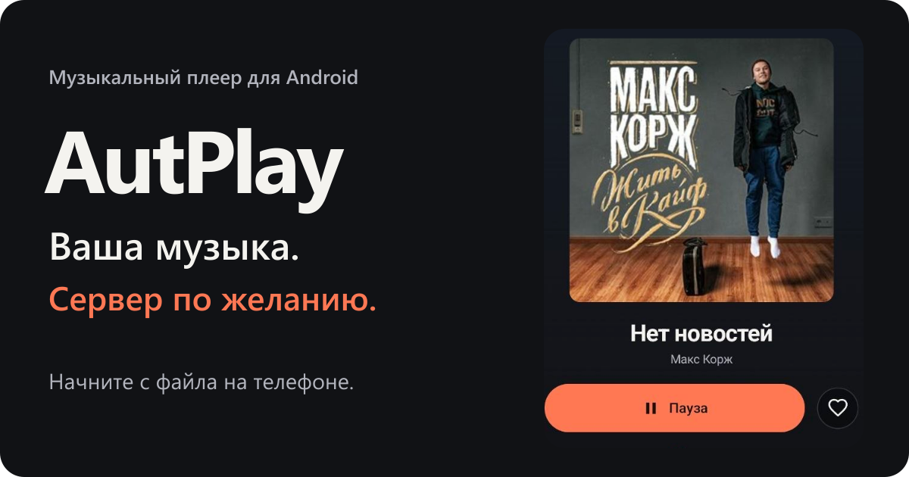

# AutPlay

<p align="center">
  <a href="assets/readme/source/home-with-cover.png"></a>
</p>

**Ваша музыка на Android. Личный сервер — по желанию.** Слушайте собственную коллекцию,
ищите треки и управляйте очередью без сети и регистрации. Для доступа с нескольких
устройств можно подключить личный сервер.

[Скачать APK 1.0.5](https://github.com/Dakstar-cool/AutPlay/releases/download/v1.0.5-m52-test.1/autplay-1.0.5-m52-test.1.apk) ·
[Возможности](#features) ·
[Личный сервер](#server) ·
[Что нового в исходниках](#source) ·
[Разработчикам](#developers)

> [!NOTE]
> **Опубликованный APK — 1.0.5, предварительный выпуск.** Нужен Android 8.0 или новее.
> Исходники в `master` содержат более новые изменения; они ещё не входят в этот APK.
> Карточка выше — снимок приложения в работе, а не перечень возможностей выпуска 1.0.5.

## Начать слушать

1. [Скачайте APK 1.0.5](https://github.com/Dakstar-cool/AutPlay/releases/download/v1.0.5-m52-test.1/autplay-1.0.5-m52-test.1.apk) и установите его на Android.
2. Откройте **«Моя музыка»**, нажмите **«Добавить локальный трек»** и выберите аудиофайл.
3. Запустите воспроизведение. Сервер и аккаунт для этого не нужны.

Если у вас уже установлено основное приложение из выпуска 0.4.0, Android может отклонить
обновление: APK 1.0.5 подписан другим ключом. **Не удаляйте старое приложение, если важны
его локальная библиотека, загрузки или настройки:** удаление стирает данные приложения.

[Контрольная сумма APK и состав выпуска 1.0.5](https://github.com/Dakstar-cool/AutPlay/releases/tag/v1.0.5-m52-test.1).

<a id="features"></a>

## Что умеет AutPlay

| На телефоне | С личным сервером |
| --- | --- |
| Локальные треки, поиск, альбомы и исполнители | Личное хранилище музыки Vault |
| Плейлисты и управление очередью | Синхронизация библиотеки и устройств |
| Сохранение очереди и позиции после перезапуска | Рекомендации и совместное прослушивание Wave |
| Теги, обложки и ручные правки карточек | Web Admin для управления сервером |

Музыку можно выбрать системным диалогом Android, отправить в Vault или скачать из Vault
на телефон. Локальные файлы доступны и при выключенном сервере.

<a id="source"></a>

## Что нового в `master`

В исходниках уже доступны изменения плеера и библиотеки, которые ещё не опубликованы
в APK 1.0.5:

- Нажатие на уведомление открывает **«Сейчас играет»**; в уведомлении есть дизлайк и лайк.
- Горизонтальные свайпы на обложке переключают трек вперёд и назад.
- Опция плавного переключения срезает последние 3 секунды текущего трека и первые
  3 секунды следующего в обычной очереди. Громкость не затухает; короткие и недоступные
  для перемотки треки воспроизводятся целиком.
- Обновлены обработка метаданных, импорт локальной музыки и серверное управление.

[Проверка объединённого плеера](docs/release/PLAYBACK_INTEGRATION_2026-10-07.md) ·
[План разработки](docs/operations/PRODUCTION_READINESS_PLAN.md).

<a id="server"></a>

## Личный сервер

Для домашнего сервера доступен отдельный
[комплект 0.4.0](https://github.com/Dakstar-cool/AutPlay/releases/tag/v0.4.0):
установщик для Linux-контейнеров `amd64` и приложение **AutPlay LAN** для подключения
в доверенной домашней сети. AutPlay LAN устанавливается отдельно от основного приложения
и хранит собственные данные. Серверный установщик не входит в выпуск Android 1.0.5.

[Пошаговая установка и подключение](docs/operations/INSTALL_AND_PAIR.md) описывает
требования, настройку и ограничения домашнего комплекта.

### Загрузка музыки из TXT-плейлиста

В репозитории есть [отдельный загрузчик](tools/local_music_acquisition/README.md), который
обрабатывает TXT-список локально или как очередь на личном сервере. Доступность треков
зависит от выбранного источника; некоторые источники требуют вашей авторизации.
Используйте загрузчик для музыки, которую вам разрешено скачивать. Обход DRM не поддерживается.

<a id="developers"></a>

## Для разработчиков

Android-приложение использует Kotlin, Jetpack Compose, Room, Media3 и WorkManager.
Необязательный сервер хранит метаданные в PostgreSQL, а аудио — в файловом хранилище.
Основные функции работают на CPU; GPU-компоненты подключаются отдельно.

- `apps/android` — Android UI, локальная библиотека, плеер и синхронизация.
- `server/src/autplay` — API, Web Admin, Vault, рекомендации и Wave.
- `contracts` — API и схемы обмена.
- `deploy` — Docker Compose и установщик сервера.
- `tools/local_music_acquisition` — загрузчик и сохраняемая очередь.
- `gpu` — необязательная обработка и обучение.

Версии инструментов закреплены в lock-файлах и Gradle Wrapper. Для полной настройки нужны
Python с `uv`, JDK 17, Android SDK и Docker для серверных проверок.
[Полное руководство по окружению](docs/operations/FULL_PROJECT_SETUP.md) содержит точные версии.

<details>
<summary>Подготовка окружения и полная проверка из корня репозитория</summary>

```powershell
powershell.exe -NoProfile -ExecutionPolicy Bypass -File .\scripts\bootstrap.ps1
powershell.exe -NoProfile -ExecutionPolicy Bypass -File .\scripts\check.ps1
```

```bash
bash scripts/bootstrap.sh
bash scripts/check.sh
```

Для серверных тестов нужен временный PostgreSQL. Дополнительные зависимости, в том числе
FFmpeg и Playwright Firefox для проверок загрузчика, перечислены в руководстве по окружению.

</details>

[Архитектура](docs/design/AutPlay%20System%20Architecture%20v1.md) ·
[CI и выпуск](docs/operations/CI_RELEASE.md) ·
[План разработки](docs/operations/PRODUCTION_READINESS_PLAN.md) ·
[История проверок](docs/release/README.md)
