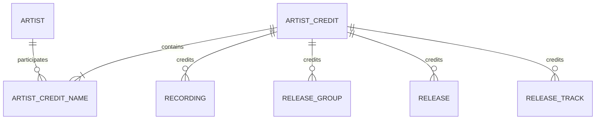
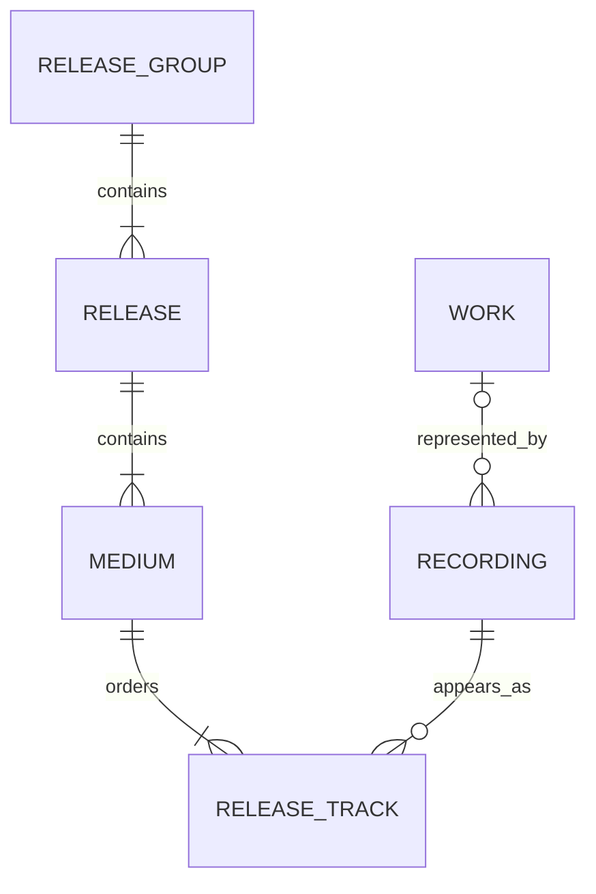
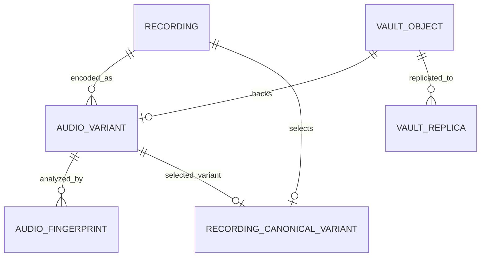
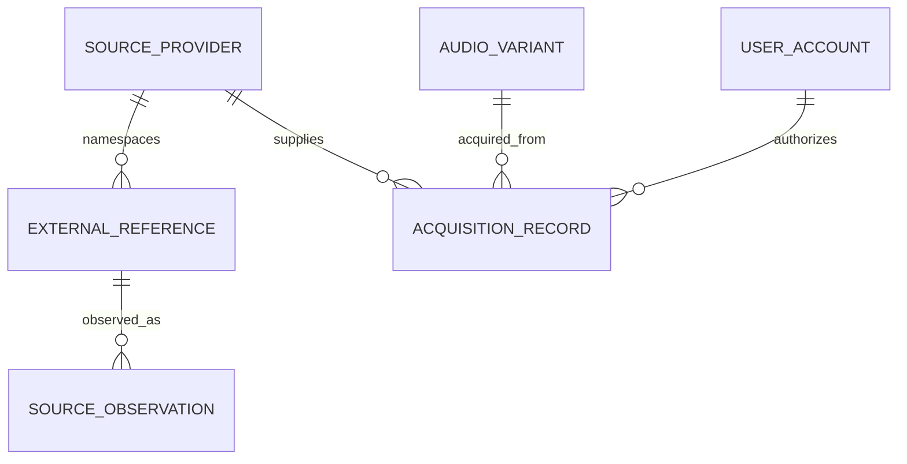
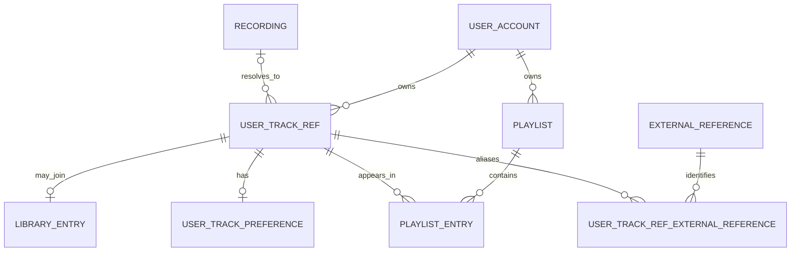
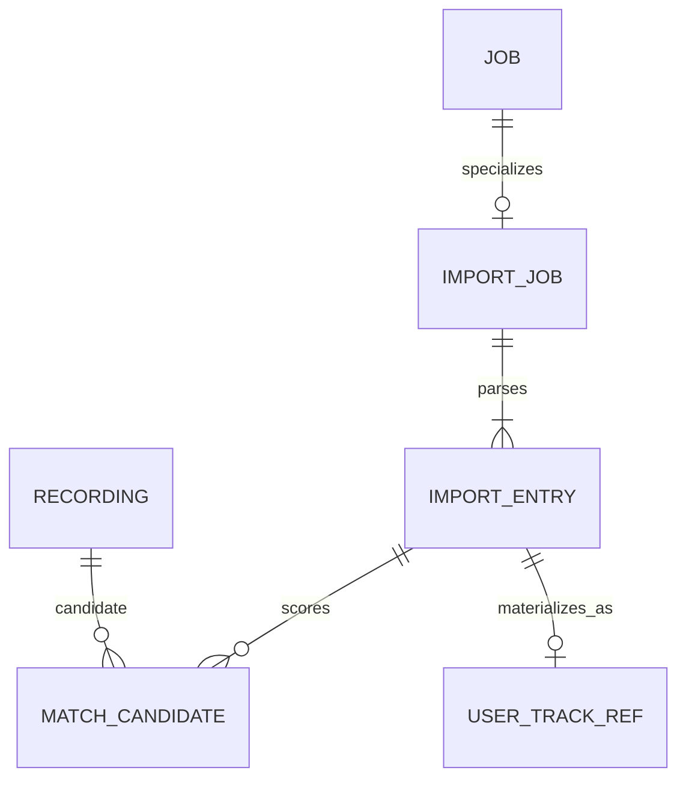
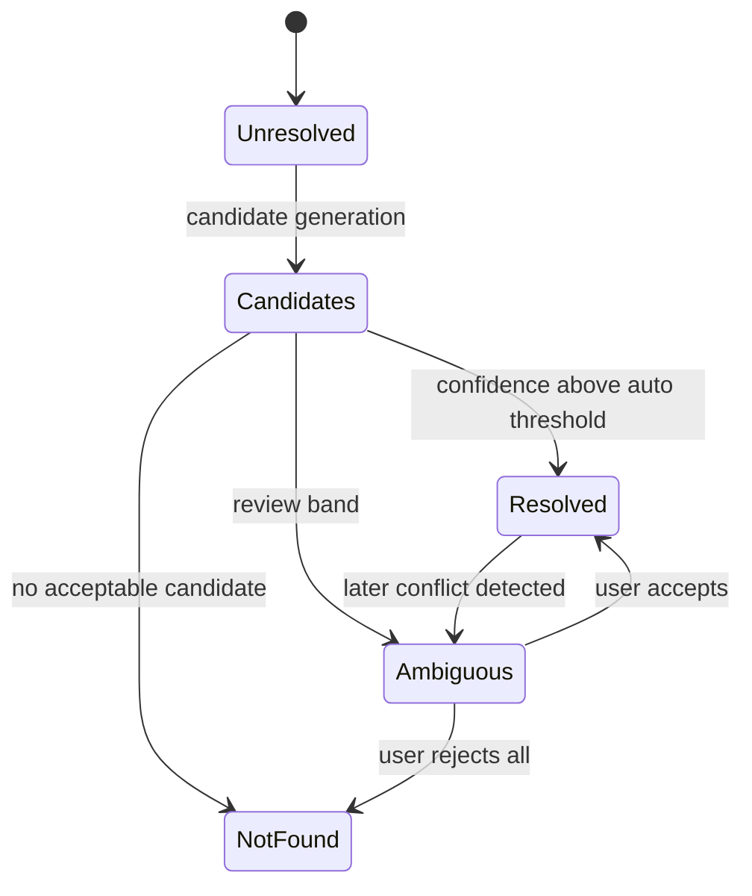
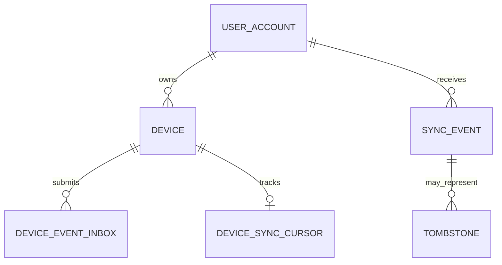
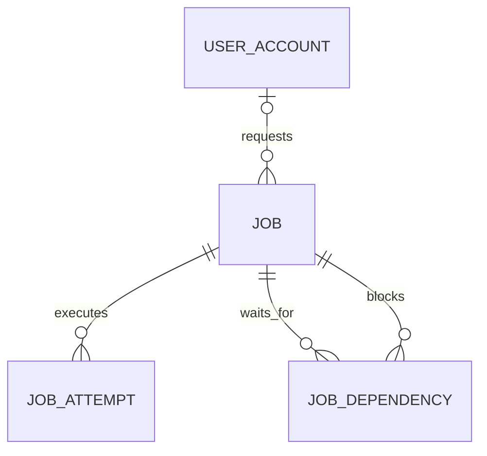
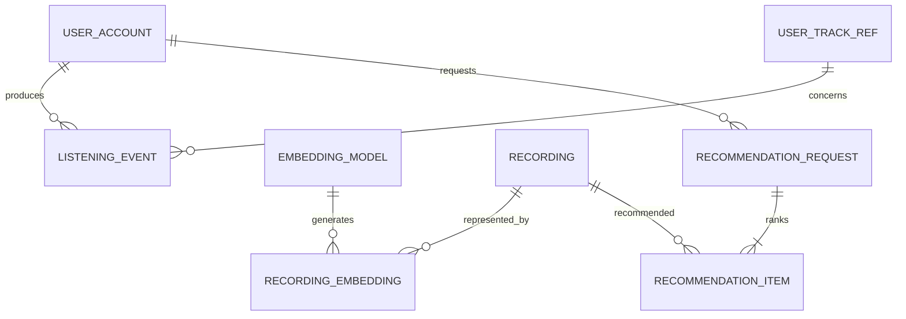

# AutPlay ER Model v1

**Статус:** Draft for schema design  
**Версия:** 1.0  
**Основание:** `ТЗ AutPlay Draft 0.3` и `AutPlay System Architecture v1`  
**Целевая СУБД сервера:** PostgreSQL + pgvector  
**Целевая локальная БД:** Android Room  
**Связанный документ:** [AutPlay System Architecture v1](<AutPlay System Architecture v1.md>)  

---

# 1. Назначение

ER Model v1 определяет логическую модель данных AutPlay до написания PostgreSQL и Room migrations.

Главная задача модели - не допустить смешения:

- музыкального произведения;
- конкретной аудиозаписи;
- позиции записи в релизе;
- физического кодирования;
- неизменяемого файла;
- пользовательской ссылки на еще не найденный Track.

Документ является основой для:

- PostgreSQL Schema v1;
- Android Room Schema v1;
- Track Identity Specification;
- Import/Matching Protocol;
- Sync Protocol;
- merge/split operations;
- Vault integrity rules.

---

# 2. Терминология

| Термин | Значение в AutPlay |
| --- | --- |
| Work | Абстрактное музыкальное произведение. Optional после MVP |
| Recording | Конкретная студийная, live, remix, edit или иная аудиозапись |
| Track | Пользовательский/API alias для Recording, если контекст однозначен |
| ReleaseGroup | Концептуальный альбом, сингл или EP |
| Release | Конкретное издание с датой, страной, label и barcode |
| Medium | Диск, сторона или цифровой носитель внутри Release |
| ReleaseTrack | Позиция Recording на Medium с собственным credited title/artist |
| AudioVariant | Техническое представление Recording: codec, bitrate, sample rate |
| VaultObject | Неизменяемые bytes, адресуемые SHA-256 |
| UserTrackRef | Пользовательская ссылка на желаемый Track, в том числе unresolved |
| LibraryEntry | Факт присутствия UserTrackRef в библиотеке пользователя |
| PlaylistEntry | Отдельное вхождение UserTrackRef в playlist; повторы разрешены |

## 2.1. Важное правило именования

В PostgreSQL таблица называется `recording`, а не `track`.

`track` допускается:

- в UI;
- в совместимом API;
- в названиях пользовательских сценариев.

Это предотвращает смешение Recording и ReleaseTrack в коде.

---

# 3. Общие соглашения данных

## 3.1. Идентификаторы

- Primary key - UUID, предпочтительно UUIDv7 для новых записей.
- UUID никогда не выводится из title, filename, ISRC, fingerprint или external ID.
- Старый UUID после merge не переиспользуется и остается разрешимым через redirect.
- SHA-256 идентифицирует bytes, а не Recording.

## 3.2. Время

- Все server timestamps используют `timestamptz` и UTC.
- `occurred_at` хранит время события на устройстве.
- `received_at` хранит server time.
- Для device clock сохраняется uncertainty/skew metadata при необходимости.

## 3.3. Строки

- Raw metadata сохраняется без разрушительного изменения.
- Search normalization хранится отдельно.
- Нормализация включает Unicode normalization, case folding, punctuation policy и transliteration indexes.
- Display title никогда не заменяется normalized title.

## 3.4. JSONB

JSONB разрешен для:

- versioned raw provider payload;
- versioned event payload;
- adapter-specific bounded metadata;
- audit before/after snapshot;
- ML metrics.

JSONB не заменяет нормализованные FK, статусы и поля, участвующие в основных запросах.

## 3.5. Common columns

Если не указано иначе, изменяемые сущности содержат:

```text
created_at
updated_at
row_version
deleted_at nullable
```

`row_version` увеличивается при конфликтных edits и используется вместе с ETag/`If-Match`.

---

# 4. PostgreSQL module schemas

| Schema | Владелец | Основные таблицы |
| --- | --- | --- |
| `catalog` | Identity Catalog | artist, recording, release_group, release, medium, release_track |
| `identity` | Identity Resolution | identifiers, external refs, candidates, redirects, change sets |
| `vault` | Music Vault | vault_object, replica, audio_variant, fingerprint, canonical variant |
| `account` | Users and Devices | user_account, device, session |
| `library` | User Library | user_track_ref, user_track_ref_external_reference, library_entry, preference, listening_event |
| `playlist` | Playlist Engine | playlist, playlist_entry |
| `importing` | Library Migration | import_job, import_entry, match_candidate |
| `sync` | Sync Engine | device_event_inbox, sync_event, cursor, tombstone, idempotency |
| `jobs` | Job Scheduler | job, attempt, dependency |
| `ml` | Recommendation Engine | model, embedding, taste cluster, recommendation request/item, offline pack |
| `audit` | Operations | audit_event, catalog_change_set, catalog_change_item |

Модули не должны произвольно писать в таблицы другого schema.

---

# 5. Catalog: Artist Credits

Один credited artist может состоять из нескольких исполнителей с сохранением порядка и join phrase.



## 5.1. `catalog.artist`

| Поле | Тип | Ограничение |
| --- | --- | --- |
| `artist_id` | UUID | PK |
| `name` | text | NOT NULL |
| `sort_name` | text | NOT NULL |
| `normalized_name` | text | NOT NULL, indexed |
| `artist_type` | enum | PERSON, GROUP, ORCHESTRA, OTHER, UNKNOWN |
| `disambiguation` | text | Nullable |
| `country_code` | char(2) | Nullable |
| `identity_status` | enum | ACTIVE, PROVISIONAL, MERGED, DEPRECATED |

## 5.2. `catalog.artist_credit`

| Поле | Тип | Ограничение |
| --- | --- | --- |
| `artist_credit_id` | UUID | PK |
| `display_name` | text | NOT NULL |
| `normalized_name` | text | NOT NULL |

## 5.3. `catalog.artist_credit_name`

| Поле | Тип | Ограничение |
| --- | --- | --- |
| `artist_credit_id` | UUID | FK, PK part |
| `position` | integer | PK part, >= 0 |
| `artist_id` | UUID | FK artist |
| `credited_name` | text | NOT NULL |
| `join_phrase` | text | NOT NULL, default empty |
| `role` | enum | PRIMARY, FEATURED, REMIXER, CONDUCTOR, OTHER |

Порядок credit восстанавливается только по `position`, не по имени.

---

# 6. Catalog: Recording and Releases



## 6.1. `catalog.recording`

| Поле | Тип | Ограничение |
| --- | --- | --- |
| `recording_id` | UUID | PK |
| `artist_credit_id` | UUID | FK artist_credit |
| `title` | text | NOT NULL |
| `normalized_title` | text | NOT NULL, indexed |
| `duration_ms` | bigint | Nullable, > 0 |
| `recording_kind` | enum | STUDIO, LIVE, REMIX, EDIT, DEMO, OTHER, UNKNOWN |
| `version_text` | text | Nullable |
| `disambiguation` | text | Nullable |
| `explicit` | boolean | Nullable when unknown |
| `identity_status` | enum | ACTIVE, PROVISIONAL, MERGED, DEPRECATED |
| `metadata_confidence` | numeric | 0..1 |

Recording может существовать без AudioVariant.

## 6.2. `catalog.work`

MAY и не входит в обязательный MVP schema.

| Поле | Тип | Ограничение |
| --- | --- | --- |
| `work_id` | UUID | PK |
| `title` | text | NOT NULL |
| `work_type` | enum | SONG, COMPOSITION, OTHER |
| `language_code` | text | Nullable |

Связь Recording -> Work является optional и не влияет на dedup audio.

## 6.3. `catalog.release_group`

| Поле | Тип | Ограничение |
| --- | --- | --- |
| `release_group_id` | UUID | PK |
| `artist_credit_id` | UUID | FK |
| `title` | text | NOT NULL |
| `normalized_title` | text | Indexed |
| `primary_type` | enum | ALBUM, SINGLE, EP, BROADCAST, OTHER |
| `secondary_types` | text[] | Bounded values |
| `first_release_date` | date | Nullable |
| `date_precision` | enum | YEAR, MONTH, DAY |

## 6.4. `catalog.release`

| Поле | Тип | Ограничение |
| --- | --- | --- |
| `release_id` | UUID | PK |
| `release_group_id` | UUID | FK |
| `artist_credit_id` | UUID | FK |
| `title` | text | NOT NULL |
| `country_code` | char(2) | Nullable |
| `release_date` | date | Nullable |
| `date_precision` | enum | YEAR, MONTH, DAY |
| `status` | enum | OFFICIAL, PROMOTION, BOOTLEG, PSEUDO, UNKNOWN |
| `barcode` | text | Nullable, indexed candidate signal |
| `label_name` | text | Nullable in v1 |
| `catalog_number` | text | Nullable |

Barcode не является global unique key из-за ошибок и переизданий.

## 6.5. `catalog.medium`

| Поле | Тип | Ограничение |
| --- | --- | --- |
| `medium_id` | UUID | PK |
| `release_id` | UUID | FK |
| `position` | integer | >= 1 |
| `format` | text | Nullable |
| `title` | text | Nullable |
| `track_count` | integer | Nullable |

Unique: `(release_id, position)`.

## 6.6. `catalog.release_track`

| Поле | Тип | Ограничение |
| --- | --- | --- |
| `release_track_id` | UUID | PK |
| `medium_id` | UUID | FK |
| `recording_id` | UUID | FK |
| `artist_credit_id` | UUID | FK |
| `sequence_no` | integer | Stable order, >= 1 |
| `number_text` | text | Display value such as A1 or 01 |
| `title` | text | Credited title on release |
| `duration_ms` | bigint | Nullable |
| `hidden` | boolean | Default false |

Unique: `(medium_id, sequence_no)`.

Одна Recording может встречаться в нескольких ReleaseTrack без дублирования Recording.

---

# 7. Recording Identifiers

## 7.1. `identity.recording_identifier`

| Поле | Тип | Ограничение |
| --- | --- | --- |
| `recording_identifier_id` | UUID | PK |
| `recording_id` | UUID | FK |
| `scheme` | enum | ISRC, MBID, OTHER |
| `value` | text | NOT NULL, normalized per scheme |
| `provider_id` | UUID | Nullable provenance |
| `confidence` | numeric | 0..1 |
| `verified` | boolean | Default false |

Unique: `(recording_id, scheme, value)`.

Индекс `(scheme, value)` используется для candidate generation, но не имеет global UNIQUE: ошибочные и повторно назначенные identifiers должны попадать в review, а не ломать import.

---

# 8. Vault and Audio Variants



## 8.1. `vault.vault_object`

| Поле | Тип | Ограничение |
| --- | --- | --- |
| `vault_object_id` | UUID | PK |
| `sha256` | bytea или char(64) | UNIQUE, NOT NULL |
| `byte_size` | bigint | > 0 |
| `detected_mime_type` | text | NOT NULL |
| `commit_status` | enum | STAGING, COMMITTED, QUARANTINED, DELETED |
| `committed_at` | timestamptz | Required for COMMITTED |
| `last_verified_at` | timestamptz | Nullable |
| `verification_error` | text | Sanitized, nullable |

Bytes считаются доступными только в `COMMITTED`.

## 8.2. `vault.vault_replica`

| Поле | Тип | Ограничение |
| --- | --- | --- |
| `vault_replica_id` | UUID | PK |
| `vault_object_id` | UUID | FK |
| `storage_backend` | text | LOCAL, NAS, WEBDAV, OTHER |
| `storage_key` | text | Generated, not user filename |
| `replica_status` | enum | AVAILABLE, MISSING, CORRUPT, COPYING, QUARANTINED |
| `verified_at` | timestamptz | Nullable |

Unique: `(storage_backend, storage_key)`.

## 8.3. `vault.audio_variant`

| Поле | Тип | Ограничение |
| --- | --- | --- |
| `audio_variant_id` | UUID | PK |
| `recording_id` | UUID | FK |
| `vault_object_id` | UUID | FK, UNIQUE, NOT NULL in v1 |
| `codec` | text | NOT NULL |
| `container` | text | NOT NULL |
| `bitrate_bps` | integer | Nullable for lossless/VBR |
| `bit_depth` | integer | Nullable |
| `sample_rate_hz` | integer | > 0 |
| `channels` | integer | > 0 |
| `duration_ms` | bigint | > 0 |
| `validation_status` | enum | VALID, SUSPECT, INVALID, QUARANTINED |
| `quality_score` | numeric | Nullable |
| `quality_policy_version` | text | Nullable |

AudioVariant не содержит storage path. Он ссылается на VaultObject.

## 8.4. `vault.audio_fingerprint`

| Поле | Тип | Ограничение |
| --- | --- | --- |
| `audio_fingerprint_id` | UUID | PK |
| `audio_variant_id` | UUID | FK |
| `algorithm` | text | Например CHROMAPRINT |
| `algorithm_version` | text | NOT NULL |
| `duration_ms` | bigint | NOT NULL |
| `fingerprint_hash` | bytea/text | Indexed candidate representation |
| `fingerprint_payload` | bytea | MAY compress |

Unique: `(audio_variant_id, algorithm, algorithm_version)`.

## 8.5. `vault.recording_canonical_variant`

| Поле | Тип | Ограничение |
| --- | --- | --- |
| `recording_id` | UUID | PK, FK |
| `audio_variant_id` | UUID | FK |
| `policy_version` | text | NOT NULL |
| `reason` | jsonb | Bounded explanation |
| `selected_at` | timestamptz | NOT NULL |

Constraint/trigger: selected AudioVariant должен принадлежать той же Recording.

---

# 9. Source, Provenance and Acquisition



## 9.1. `identity.source_provider`

| Поле | Тип | Ограничение |
| --- | --- | --- |
| `provider_id` | UUID | PK |
| `provider_key` | text | UNIQUE, stable |
| `display_name` | text | NOT NULL |
| `adapter_id` | text | NOT NULL |
| `adapter_version` | text | NOT NULL |
| `capabilities` | text[] | Bounded enum values |
| `enabled` | boolean | NOT NULL |

## 9.2. `identity.external_reference`

ExternalReference может указывать не более чем на одну каноническую сущность. До resolution все target FK могут оставаться `NULL`.

Пользовательские ссылки связываются с ExternalReference через association table из раздела 10.5. Это позволяет нескольким пользователям ссылаться на один provider ID и устраняет циклический FK между `identity` и `library`.

| Поле | Тип | Ограничение |
| --- | --- | --- |
| `external_reference_id` | UUID | PK |
| `provider_id` | UUID | FK |
| `external_entity_type` | text | NOT NULL |
| `external_id` | text | NOT NULL |
| `market_scope` | text | NOT NULL, default GLOBAL |
| `artist_id` | UUID | Nullable FK |
| `recording_id` | UUID | Nullable FK |
| `release_group_id` | UUID | Nullable FK |
| `release_id` | UUID | Nullable FK |
| `first_seen_at` | timestamptz | NOT NULL |
| `last_seen_at` | timestamptz | NOT NULL |

Database CHECK: `num_nonnulls(artist_id, recording_id, release_group_id, release_id) <= 1`.

Unique: `(provider_id, external_entity_type, external_id, market_scope)`.

## 9.3. `identity.source_observation`

| Поле | Тип | Ограничение |
| --- | --- | --- |
| `source_observation_id` | UUID | PK |
| `external_reference_id` | UUID | FK |
| `observed_at` | timestamptz | NOT NULL |
| `adapter_version` | text | NOT NULL |
| `raw_metadata_hash` | bytea/text | NOT NULL |
| `raw_metadata` | jsonb | Size-limited |
| `confidence` | numeric | 0..1 |

Raw metadata append/replace policy определяется retention. Canonical edits не изменяют raw observation.

## 9.4. `vault.acquisition_record`

| Поле | Тип | Ограничение |
| --- | --- | --- |
| `acquisition_record_id` | UUID | PK |
| `audio_variant_id` | UUID | FK |
| `provider_id` | UUID | FK |
| `external_reference_id` | UUID | Nullable FK |
| `authorized_by_user_id` | UUID | Nullable FK |
| `rights_capability` | enum | AUTHORIZED_DOWNLOAD, USER_UPLOAD, LOCAL_IMPORT, RESTORE |
| `source_uri_encrypted` | bytea | Nullable |
| `acquired_at` | timestamptz | NOT NULL |
| `adapter_version` | text | Nullable |

Source URI и credentials не выводятся в обычный export/log.

---

# 10. User Library and Unresolved Tracks

## 10.1. Зачем нужен UserTrackRef

Глобальная Recording не должна создаваться автоматически для каждой плохо распознанной строки импорта.

`UserTrackRef` сохраняет пользовательское намерение:

- Track есть в экспортированной библиотеке;
- Track находится в playlist;
- audio пока не найден;
- совпадение неоднозначно;
- Recording может быть привязана позднее.

После надежного resolution `recording_id` заполняется, а LibraryEntry и PlaylistEntry не меняют собственные ID и порядок.



## 10.2. `account.user_account`

| Поле | Тип | Ограничение |
| --- | --- | --- |
| `user_id` | UUID | PK |
| `display_name` | text | NOT NULL |
| `role` | enum | OWNER, ADMIN, USER |
| `status` | enum | ACTIVE, DISABLED |
| `settings_version` | bigint | NOT NULL |

## 10.3. `account.device`

| Поле | Тип | Ограничение |
| --- | --- | --- |
| `device_id` | UUID | PK |
| `user_id` | UUID | FK |
| `device_name` | text | NOT NULL |
| `platform` | text | ANDROID, WEB, OTHER |
| `app_version` | text | NOT NULL |
| `revoked_at` | timestamptz | Nullable |
| `last_seen_at` | timestamptz | Nullable |

## 10.4. `library.user_track_ref`

| Поле | Тип | Ограничение |
| --- | --- | --- |
| `user_track_ref_id` | UUID | PK |
| `user_id` | UUID | FK |
| `recording_id` | UUID | Nullable FK |
| `resolution_status` | enum | UNRESOLVED, CANDIDATES, RESOLVED, AMBIGUOUS, NOT_FOUND |
| `raw_title` | text | Nullable; required without external identity |
| `raw_artist` | text | Nullable; required without external identity |
| `raw_album` | text | Nullable |
| `raw_duration_ms` | bigint | Nullable |
| `resolved_at` | timestamptz | Nullable |
| `resolution_confidence` | numeric | Nullable, 0..1 |

Constraint:

- `RESOLVED` требует `recording_id`;
- unresolved row требует raw title/artist или хотя бы одну external reference association;
- привязка Recording не уничтожает raw fields.

Unique active: `(user_id, recording_id)` для non-null canonical Recording. Resolve и catalog merge обязаны coalesce уже существующие UserTrackRef до изменения FK, сохраняя PlaylistEntry и history.

## 10.5. `library.user_track_ref_external_reference`

| Поле | Тип | Ограничение |
| --- | --- | --- |
| `user_track_ref_id` | UUID | FK, PK part |
| `external_reference_id` | UUID | FK, PK part |
| `relation_role` | enum | PRIMARY_SOURCE, ALIAS, IMPORT_EVIDENCE |
| `first_seen_at` | timestamptz | NOT NULL |

Один ExternalReference может использоваться несколькими UserTrackRef разных пользователей. Каноническая target-связь при этом хранится один раз в `identity.external_reference`.

## 10.6. `library.library_entry`

| Поле | Тип | Ограничение |
| --- | --- | --- |
| `library_entry_id` | UUID | PK |
| `user_id` | UUID | FK |
| `user_track_ref_id` | UUID | FK |
| `added_at` | timestamptz | NOT NULL |
| `source` | enum | LOCAL, IMPORT, SEARCH, SHARE, RESTORE |
| `availability_status` | enum | LOCAL, VAULT, EXTERNAL, PENDING, NOT_FOUND, AMBIGUOUS |
| `removed_at` | timestamptz | Nullable tombstone projection |

Unique active: `(user_id, user_track_ref_id)`.

Constraint/trigger: `library_entry.user_id` совпадает с владельцем UserTrackRef.

## 10.7. `library.user_track_preference`

| Поле | Тип | Ограничение |
| --- | --- | --- |
| `user_track_ref_id` | UUID | PK, FK |
| `preference` | enum | NEUTRAL, LIKED, DISLIKED |
| `rating` | smallint | Nullable, defined range |
| `excluded_from_taste` | boolean | Default false |
| `updated_by_event_id` | UUID | For conflict trace |

---

# 11. Playlists

## 11.1. `playlist.playlist`

| Поле | Тип | Ограничение |
| --- | --- | --- |
| `playlist_id` | UUID | PK |
| `owner_user_id` | UUID | FK |
| `name` | text | NOT NULL |
| `description` | text | Nullable |
| `visibility` | enum | PRIVATE, SHARED, PUBLIC |
| `playlist_type` | enum | MANUAL, SMART, SYSTEM |
| `row_version` | bigint | Optimistic concurrency |
| `deleted_at` | timestamptz | Nullable |

## 11.2. `playlist.playlist_entry`

| Поле | Тип | Ограничение |
| --- | --- | --- |
| `playlist_entry_id` | UUID | PK |
| `playlist_id` | UUID | FK |
| `user_track_ref_id` | UUID | FK |
| `position_key` | text | Sortable token |
| `added_by_user_id` | UUID | FK |
| `added_at` | timestamptz | NOT NULL |
| `source_position` | integer | Nullable import provenance |
| `removed_at` | timestamptz | Nullable |

Не создавать UNIQUE `(playlist_id, user_track_ref_id)`: один Track может повторяться в playlist.

Unique active: `(playlist_id, position_key)`.

Constraint/trigger для v1: UserTrackRef в PlaylistEntry принадлежит `owner_user_id` playlist. Collaborative mode заменит это правило membership/ACL policy.

V1 playlist принадлежит одному user. Collaborative playlist потребует отдельного membership schema и ADR.

## 11.3. Smart playlists

`playlist.smart_playlist_rule`:

```text
playlist_id PK/FK
rule_schema_version
rule_json
compiled_hash
last_validated_at
```

Rule JSON проходит schema validation и не содержит SQL fragments.

---

# 12. Device-local Audio State

Local URI не хранится в server catalog.

Android Room содержит `device_audio_state`:

| Поле | Назначение |
| --- | --- |
| `device_audio_state_id` | Local identity |
| `user_track_ref_id` | Локальная projection |
| `recording_id` | Nullable until resolution |
| `audio_variant_id` | Nullable server ID |
| `content_uri` | MediaStore/SAF URI |
| `local_sha256` | Byte identity |
| `local_fingerprint` | Candidate identity |
| `status` | AVAILABLE, MISSING, CORRUPT, VERIFYING |
| `storage_class` | PINNED, USER_DOWNLOAD, PROACTIVE_CACHE, STREAM_CACHE |
| `last_verified_at` | Integrity time |

Server MAY хранить compact availability inventory, но не Android `content_uri`.

---

# 13. Library Migration and Matching



## 13.1. `importing.import_job`

| Поле | Тип | Ограничение |
| --- | --- | --- |
| `import_job_id` | UUID | PK |
| `job_id` | UUID | FK jobs.job, UNIQUE |
| `user_id` | UUID | FK |
| `adapter_id` | text | NOT NULL |
| `adapter_version` | text | NOT NULL |
| `input_sha256` | text/bytea | NOT NULL |
| `input_schema_version` | text | Nullable |
| `mode` | enum | LIBRARY_ONLY, MATERIALIZE |
| `checkpoint` | jsonb | Versioned, bounded |
| `summary` | jsonb | Counts only |

## 13.2. `importing.import_entry`

| Поле | Тип | Ограничение |
| --- | --- | --- |
| `import_entry_id` | UUID | PK |
| `import_job_id` | UUID | FK |
| `source_row_key` | text | Stable within input |
| `raw_title` | text | NOT NULL |
| `raw_artist` | text | NOT NULL |
| `raw_album` | text | Nullable |
| `raw_duration_ms` | bigint | Nullable |
| `raw_external_id` | text | Nullable |
| `raw_payload` | jsonb | Size-limited |
| `match_status` | enum | PENDING, AUTO_MATCH, REVIEW_REQUIRED, NO_MATCH, REJECTED |
| `selected_recording_id` | UUID | Nullable FK |
| `user_track_ref_id` | UUID | Nullable FK after materialization |

Unique: `(import_job_id, source_row_key)`.

## 13.3. `importing.match_candidate`

| Поле | Тип | Ограничение |
| --- | --- | --- |
| `match_candidate_id` | UUID | PK |
| `import_entry_id` | UUID | FK |
| `recording_id` | UUID | FK |
| `rank` | integer | >= 1 |
| `confidence` | numeric | 0..1 |
| `feature_scores` | jsonb | Versioned explanation |
| `matcher_version` | text | NOT NULL |
| `decision` | enum | NONE, ACCEPTED, REJECTED |
| `decided_by_user_id` | UUID | Nullable |

Unique: `(import_entry_id, recording_id, matcher_version)`.

---

# 14. Match Decision Model

Candidate generation выполняется отдельно от decision.

## 14.1. Candidate sources

1. Exact provider external ID.
2. ISRC/MBID lookup.
3. Normalized artist + title + version markers.
4. Artist + title + duration window.
5. Album/release context.
6. Fuzzy/transliteration search.
7. После получения audio - fingerprint similarity.

## 14.2. Decision states



## 14.3. Required decision evidence

```text
matcher_version
candidate_generation_version
feature_scores
duration_delta_ms
fingerprint_similarity nullable
external_id_match flags
version_marker conflicts
confidence
threshold_set_version
actor: SYSTEM | USER | ADMIN
decided_at
```

Пороговые значения не задаются в ER document. Они выпускаются после validation benchmark.

---

# 15. Merge, Redirect and Split

## 15.1. Почему нельзя просто удалить duplicate Recording

Старый `recording_id` может находиться:

- на offline Android device;
- в export/profile;
- в playlist/share link;
- в sync event;
- в audit/history;
- во внешнем mapping.

Поэтому merge сохраняет redirect.

## 15.2. `identity.recording_redirect`

| Поле | Тип | Ограничение |
| --- | --- | --- |
| `source_recording_id` | UUID | PK, FK |
| `target_recording_id` | UUID | FK |
| `change_set_id` | UUID | FK audit change set |
| `reason` | text | NOT NULL |
| `created_at` | timestamptz | NOT NULL |

Constraints:

- source != target;
- redirect graph acyclic;
- API resolve следует redirect до active Recording;
- глубина ограничена, chains compacted transactionally;
- source Recording получает status `MERGED`, но не hard delete.

## 15.3. `audit.catalog_change_set`

| Поле | Тип | Ограничение |
| --- | --- | --- |
| `change_set_id` | UUID | PK |
| `operation_type` | enum | MERGE, SPLIT, REASSIGN, UNDO |
| `actor_type` | enum | SYSTEM, USER, ADMIN |
| `actor_user_id` | UUID | Nullable FK; required for USER/ADMIN |
| `reason` | text | NOT NULL |
| `confidence` | numeric | Nullable |
| `created_at` | timestamptz | NOT NULL |
| `reversible_until` | timestamptz | Nullable |
| `status` | enum | PLANNED, APPLIED, REVERTED, FAILED |

## 15.4. `audit.catalog_change_item`

Хранит versioned operation items:

```text
change_item_id
change_set_id
entity_type
entity_id
action
from_snapshot
to_snapshot
sequence_no
```

Split создает новую Recording и перемещает выбранные ReleaseTrack, AudioVariant, identifiers и references через один change set. Частично примененный change set запрещен.

---

# 16. Sync Entities



## 16.1. `sync.device_event_inbox`

| Поле | Тип | Ограничение |
| --- | --- | --- |
| `event_id` | UUID | PK, client-generated |
| `device_id` | UUID | FK |
| `user_id` | UUID | FK |
| `device_sequence` | bigint | NOT NULL |
| `event_type` | text | NOT NULL |
| `schema_version` | integer | NOT NULL |
| `aggregate_type` | text | NOT NULL |
| `aggregate_id` | UUID | NOT NULL |
| `payload` | jsonb | Size-limited |
| `occurred_at` | timestamptz | Client time |
| `received_at` | timestamptz | Server time |
| `apply_status` | enum | RECEIVED, APPLIED, DUPLICATE, CONFLICT, REJECTED |
| `error_code` | text | Nullable |

Unique: `(device_id, device_sequence)`.

## 16.2. `sync.sync_event`

Canonical server event log:

| Поле | Тип | Ограничение |
| --- | --- | --- |
| `server_sequence` | bigint | PK, monotonic |
| `event_id` | UUID | UNIQUE |
| `user_id` | UUID | FK |
| `origin_device_id` | UUID | Nullable FK |
| `event_type` | text | NOT NULL |
| `schema_version` | integer | NOT NULL |
| `aggregate_type` | text | NOT NULL |
| `aggregate_id` | UUID | NOT NULL |
| `payload` | jsonb | Size-limited |
| `created_at` | timestamptz | NOT NULL |

Index: `(user_id, server_sequence)`.

## 16.3. `sync.device_sync_cursor`

| Поле | Тип | Ограничение |
| --- | --- | --- |
| `device_id` | UUID | PK/FK |
| `user_id` | UUID | FK |
| `last_pulled_server_sequence` | bigint | NOT NULL |
| `last_acked_device_sequence` | bigint | NOT NULL |
| `updated_at` | timestamptz | NOT NULL |

## 16.4. `sync.tombstone`

| Поле | Тип | Ограничение |
| --- | --- | --- |
| `tombstone_id` | UUID | PK |
| `user_id` | UUID | FK |
| `aggregate_type` | text | NOT NULL |
| `aggregate_id` | UUID | NOT NULL |
| `deleted_by_event_id` | UUID | NOT NULL |
| `deleted_at` | timestamptz | NOT NULL |
| `retain_until` | timestamptz | NOT NULL |

Unique active: `(user_id, aggregate_type, aggregate_id)`.

## 16.5. `sync.idempotency_record`

| Поле | Тип | Ограничение |
| --- | --- | --- |
| `scope` | text | PK part, user/route scope |
| `idempotency_key` | text | PK part |
| `request_hash` | bytea/text | NOT NULL |
| `response_code` | integer | Nullable until complete |
| `response_reference` | jsonb | Bounded, no secrets |
| `status` | enum | IN_PROGRESS, COMPLETED, FAILED |
| `expires_at` | timestamptz | NOT NULL |

Повтор того же key с другим request hash отклоняется.

---

# 17. Job Entities



## 17.1. `jobs.job`

| Поле | Тип | Ограничение |
| --- | --- | --- |
| `job_id` | UUID | PK |
| `job_type` | text | NOT NULL |
| `schema_version` | integer | NOT NULL |
| `user_id` | UUID | Nullable FK |
| `priority` | smallint | P0..P4 mapping |
| `state` | enum | QUEUED, RUNNING, RETRY_WAIT, PAUSED, COMPLETED, FAILED, CANCELLED |
| `idempotency_scope` | text | Nullable; required together with key |
| `idempotency_key` | text | Nullable; required together with scope |
| `payload` | jsonb | Small, versioned |
| `checkpoint` | jsonb | Bounded |
| `progress_current` | bigint | Nullable |
| `progress_total` | bigint | Nullable |
| `attempt_count` | integer | >= 0 |
| `scheduled_at` | timestamptz | NOT NULL |
| `lease_owner` | text | Nullable |
| `lease_deadline` | timestamptz | Nullable |
| `heartbeat_at` | timestamptz | Nullable |
| `cancel_requested_at` | timestamptz | Nullable |
| `error_code` | text | Nullable |
| `error_detail` | jsonb | Sanitized |

CHECK: `idempotency_scope` и `idempotency_key` либо оба `NULL`, либо оба заданы.

Unique partial: `(idempotency_scope, idempotency_key) WHERE idempotency_key IS NOT NULL`.

Queue index, partial:

```text
(priority, scheduled_at, created_at)
WHERE state IN ('QUEUED', 'RETRY_WAIT')
```

## 17.2. `jobs.job_attempt`

| Поле | Тип | Ограничение |
| --- | --- | --- |
| `job_attempt_id` | UUID | PK |
| `job_id` | UUID | FK |
| `attempt_no` | integer | NOT NULL |
| `worker_id` | text | NOT NULL |
| `started_at` | timestamptz | NOT NULL |
| `finished_at` | timestamptz | Nullable |
| `outcome` | enum | SUCCESS, RETRYABLE_ERROR, TERMINAL_ERROR, LEASE_EXPIRED, CANCELLED |
| `error_code` | text | Nullable |
| `metrics` | jsonb | Bounded |

Unique: `(job_id, attempt_no)`.

## 17.3. `jobs.job_dependency`

```text
job_id
depends_on_job_id
dependency_policy: REQUIRE_SUCCESS | REQUIRE_TERMINAL
```

PK: `(job_id, depends_on_job_id)`. Self-dependency и cycles запрещены.

---

# 18. Listening and Recommendation Entities



## 18.1. `library.listening_event`

| Поле | Тип | Ограничение |
| --- | --- | --- |
| `listening_event_id` | UUID | PK |
| `user_id` | UUID | FK |
| `device_id` | UUID | FK |
| `user_track_ref_id` | UUID | FK |
| `recording_id` | UUID | Nullable denormalized resolved ID |
| `started_at` | timestamptz | NOT NULL |
| `played_ms` | bigint | >= 0 |
| `track_duration_ms` | bigint | Nullable |
| `completion_ratio` | numeric | 0..1; replay создает отдельное событие |
| `event_origin` | enum | ORGANIC, RECOMMENDED, PLAYLIST, SEARCH, WAVE |
| `context` | enum/text | GENERAL, WORKOUT, CYCLING, WORK, SLEEP, PARTY |
| `recommendation_request_id` | UUID | Nullable FK |
| `explicit_feedback` | enum | NONE, LIKE, DISLIKE |
| `excluded_from_taste` | boolean | NOT NULL |

Partitioning по времени MAY добавляться после измерения объема.

## 18.2. `ml.embedding_model`

| Поле | Тип | Ограничение |
| --- | --- | --- |
| `embedding_model_id` | UUID | PK |
| `model_key` | text | NOT NULL |
| `version` | text | NOT NULL |
| `task` | text | NOT NULL |
| `weights_sha256` | text | NOT NULL |
| `license_id` | text | NOT NULL |
| `runtime` | text | NOT NULL |
| `precision` | text | NOT NULL |
| `input_sample_rate_hz` | integer | NOT NULL |
| `segment_duration_ms` | integer | NOT NULL |
| `preprocessing_version` | text | NOT NULL |
| `pooling_strategy` | text | NOT NULL |
| `dimension` | integer | NOT NULL |
| `status` | enum | BENCHMARK, ACTIVE, RETIRED, BLOCKED |

Unique: `(model_key, version, preprocessing_version, pooling_strategy)`.

## 18.3. `ml.recording_embedding`

| Поле | Тип | Ограничение |
| --- | --- | --- |
| `recording_embedding_id` | UUID | PK |
| `recording_id` | UUID | FK |
| `embedding_model_id` | UUID | FK |
| `audio_variant_id` | UUID | FK source variant |
| `vector` | vector/halfvec | Dimension matches model |
| `normalized` | boolean | NOT NULL |
| `quality_flags` | jsonb | Bounded |
| `created_at` | timestamptz | NOT NULL |

Unique: `(recording_id, embedding_model_id, audio_variant_id)`.

Active query выбирает embedding по active model alias/policy. HNSW создается только после benchmark.

## 18.4. `ml.recommendation_request`

```text
recommendation_request_id
user_id
context
model_bundle_version
candidate_policy_version
filter_policy_version
reranker_version
seed
created_at
```

## 18.5. `ml.recommendation_item`

```text
recommendation_request_id
rank
recording_id
score
candidate_sources
explanation_code
availability_snapshot
```

PK: `(recommendation_request_id, rank)`. Unique candidate per request unless policy explicitly permits repeat.

## 18.6. Taste clusters

`ml.taste_cluster`:

```text
taste_cluster_id
user_id
context
model_bundle_version
centroid
weight
created_at
retired_at
```

`ml.taste_cluster_member`:

```text
taste_cluster_id
user_track_ref_id
membership_score
explicit_weight
```

PK: `(taste_cluster_id, user_track_ref_id)`.

---

# 19. Offline Recommendation Pack

`ml.offline_recommendation_pack`:

| Поле | Тип | Ограничение |
| --- | --- | --- |
| `offline_pack_id` | UUID | PK |
| `user_id` | UUID | FK |
| `device_id` | UUID | Nullable target |
| `catalog_snapshot` | bigint/text | NOT NULL |
| `model_bundle_version` | text | NOT NULL |
| `payload_version` | integer | NOT NULL |
| `payload_encoding` | text | JSON_ZSTD, PROTOBUF_ZSTD или иной versioned codec |
| `payload` | bytea | Compressed, bounded |
| `payload_sha256` | text | NOT NULL |
| `created_at` | timestamptz | NOT NULL |
| `expires_at` | timestamptz | NOT NULL |

Pack содержит только candidate IDs/features, которые разрешены пользователю. Наличие в pack не является authorization на stream.

---

# 20. Audit Events

`audit.audit_event` является append-only:

```text
audit_event_id
occurred_at
actor_type
actor_user_id nullable
actor_device_id nullable
action
target_type
target_id
request_id
reason_code
metadata_sanitized
```

Обязательные audit actions:

- login/session revoke;
- role change;
- adapter enable/disable;
- model enable/disable;
- global merge/split;
- global Track delete;
- Vault quarantine/delete;
- backup/restore;
- destructive migration/admin command.

Audit не содержит access token, password, raw credentials или полный private URL.

---

# 21. Deletion and Retention

| Сущность | Обычное удаление | Физическое удаление |
| --- | --- | --- |
| LibraryEntry | Tombstone/removed_at | После sync retention |
| PlaylistEntry | Tombstone/removed_at | После sync retention |
| UserTrackRef | Сохраняется, пока есть history/playlist/import refs | Только privacy retention job |
| Recording | MERGED/DEPRECATED status | Только admin policy, обычно никогда |
| AudioVariant | `validation_status = QUARANTINED`, serving disabled | После проверки references |
| VaultObject | QUARANTINED | После grace period, replica/ref recheck и audit |
| ListeningEvent | По user retention/privacy policy | Partition/retention job |
| JobAttempt | Retention window | Operational cleanup |
| Raw import payload | User/configured retention | Secure cleanup |
| Embedding/index | RETIRED/derived | Safe rebuildable cleanup |

`ON DELETE CASCADE` разрешен только для чистых association/derived children, когда parent deletion уже прошел domain policy.

Для catalog, Vault и user content default - `RESTRICT` плюс явная application command.

---

# 22. Key Database Constraints

1. `vault_object.sha256` unique.
2. AudioVariant допускается к serving только при `validation_status = VALID` и связанном `VaultObject.COMMITTED`.
3. Canonical AudioVariant принадлежит той же Recording.
4. ReleaseTrack всегда принадлежит одному Medium и одной Recording.
5. ArtistCreditName position unique внутри ArtistCredit.
6. ExternalReference указывает не более чем на одну canonical target entity; targetless row допустима до resolution.
7. UserTrackRef и ExternalReference связаны association table, поэтому один provider ID может использоваться несколькими users.
8. Resolved UserTrackRef имеет Recording.
9. Unresolved UserTrackRef сохраняет raw/external identity.
10. У одного пользователя не более одного active UserTrackRef на canonical Recording; merge выполняет coalesce.
11. LibraryEntry user совпадает с владельцем UserTrackRef; в v1 PlaylistEntry также не пересекает user boundary.
12. Playlist duplicate Track entries разрешены.
13. Playlist position key unique среди active entries.
14. Device event ID и device sequence уникальны.
15. Idempotency key с другим request hash отклоняется, а job key всегда namespaced scope.
16. Recording redirect не образует cycles.
17. Job dependency graph не образует cycles.
18. Embedding dimension соответствует Model Registry.
19. User-owned entity access проверяет user/principal, а не только UUID.

Часть cross-table constraints потребует deferred trigger или application invariant с integration tests. Они должны быть перечислены в PostgreSQL Schema v1 явно.

---

# 23. Required Indexes

| Таблица | Index | Назначение |
| --- | --- | --- |
| `recording` | GIN/trigram normalized title | Fuzzy candidate generation |
| `artist` | GIN/trigram normalized name | Fuzzy artist search |
| `release_track` | recording_id | Все release appearances |
| `recording_identifier` | scheme, value | ISRC/MBID candidates |
| `external_reference` | provider, type, external_id, market | Exact provider resolution |
| `vault_object` | unique sha256 | CAS dedup |
| `audio_fingerprint` | algorithm/version/hash representation | Fingerprint candidates |
| `user_track_ref` | partial unique user_id, recording_id for active resolved rows | User resolution lookup and coalesce invariant |
| `user_track_ref_external_reference` | external_reference_id, user_track_ref_id | Reverse provider lookup |
| `library_entry` | user_id, removed_at, added_at | Library pages |
| `playlist_entry` | playlist_id, position_key | Ordered playlist |
| `device_event_inbox` | device_id, device_sequence | Dedup/order |
| `sync_event` | user_id, server_sequence | Incremental pull |
| `job` | partial priority/scheduled_at | Queue claim |
| `job` | lease_deadline where RUNNING | Expired lease recovery |
| `listening_event` | user_id, started_at | History/statistics |
| `recording_embedding` | model_id plus vector index | Similarity search |

Index types и parameters фиксируются после `EXPLAIN ANALYZE` на reference dataset.

---

# 24. Identity Scenario Validation

| Сценарий | Recording | ReleaseTrack | AudioVariant | VaultObject | UserTrackRef |
| --- | ---: | ---: | ---: | ---: | ---: |
| Один FLAC импортирован двумя пользователями | 1 | 0 или существующие | 1 | 1 | 2 |
| FLAC и MP3 одной записи | 1 | Без изменения | 2 | 2 | Один active ref на пользователя; source IDs сохраняются associations |
| Одна запись в сингле и альбоме | 1 | 2 | 1+ | 1+ | Без обязательного дублирования |
| Live версия той же песни | 2 | По релизам | Отдельные | Отдельные | Разрешаются отдельно |
| Remix | 2 | По релизам | Отдельные | Отдельные | Разрешаются отдельно |
| Radio edit с иной длительностью | Обычно 2, auto-merge запрещен | По релизам | Отдельные | Отдельные | Review при сомнении |
| Remaster | Auto-merge запрещен, решение по evidence | Может быть несколько | Обычно отдельные | Отдельные | Не теряется raw source |
| Track только в export, audio нет | 0 до resolution или 1 resolved без variant | MAY metadata release | 0 | 0 | 1 unresolved/resolved |
| Неоднозначный импорт | Без новой global Recording | 0 | 0 | 0 | 1 AMBIGUOUS |
| Один Track дважды в playlist | Без изменения | Без изменения | Без изменения | Без изменения | 1 ref, 2 PlaylistEntry |
| Повторный импорт того же файла | Без дубликатов | Без дубликатов | Без дубликатов | Без дубликатов | Existing refs reused/mapped |

## 24.1. Acceptance fixtures

Минимальный fixture dataset должен содержать:

- album и single appearance;
- live version;
- studio remaster;
- remix;
- radio edit;
- compilation Various Artists;
- multiple artist credits с join phrases;
- multi-disc release;
- duplicate playlist entry;
- unavailable imported track;
- ошибочный общий ISRC;
- похожие названия с разной длительностью;
- Cyrillic/Latin transliteration;
- одинаковый audio в разных codec;
- corrupted and truncated file.

---

# 25. Room Projection Rules

Android Room не обязан повторять весь PostgreSQL catalog.

Минимальные local entities:

```text
RecordingProjection
ReleaseProjection
ReleaseTrackProjection
UserTrackRef
LibraryEntry
Playlist
PlaylistEntry
LocalAudioState
DownloadTask
QueueSnapshot
ListeningEvent
OfflineJournalEvent
SyncCursor
Tombstone
RecommendationPack
```

Правила:

- Server UUID сохраняется nullable для local-only entities.
- Local UUID создается до первого sync и остается idempotency identity.
- Room transaction объединяет domain state change и journal append.
- Server projection update не перезаписывает pending local edit.
- Local content URI никогда не отправляется как server storage key.
- Unknown enum/payload version сохраняется или отклоняется безопасно без удаления row.

---

# 26. Migration Order for PostgreSQL Schema v1

Рекомендуемый порядок migrations:

1. PostgreSQL extensions и enum strategy.
2. `account` users/devices.
3. `catalog` artist credits, recordings, releases.
4. `audit` base events and catalog change sets.
5. `identity` providers, external refs, identifiers, redirects.
6. `library` UserTrackRef, external reference associations and entries.
7. `playlist` playlists and entries.
8. `vault` objects, replicas, variants, fingerprints.
9. `jobs` generic queue.
10. `importing` job extensions and candidates.
11. `sync` inbox, event log, cursors, tombstones.
12. `ml` model registry and embeddings.
13. deferred cross-module FK, indexes and constraints requiring populated tables.

Migration tests должны проверять:

- clean install;
- upgrade from every supported release;
- downgrade/rollback where declared safe;
- preservation of UUID and playlist order;
- redirect resolution;
- idempotent migration rerun where tooling permits;
- failure before and after data backfill boundary.

---

# 27. Decisions Fixed by ER v1

1. Internal canonical entity is Recording; UI may call it Track.
2. ReleaseTrack is never replaced by album fields on Recording.
3. VaultObject owns SHA-256 and storage replicas.
4. AudioVariant owns technical audio metadata, not storage path.
5. Fingerprints are versioned children of AudioVariant.
6. Unresolved imports live in UserTrackRef, not as low-confidence global Recording.
7. LibraryEntry and PlaylistEntry refer to UserTrackRef.
8. Playlist entries have stable IDs and allow duplicates.
9. External IDs are namespaced by provider/type/market.
10. Merge preserves source UUID through RecordingRedirect.
11. Sync deletion uses tombstones.
12. Job lease lives in durable PostgreSQL state.
13. Embeddings coexist by model/preprocessing version.
14. Generic operational events use versioned JSON payload, while core relations remain normalized.
15. Provider ExternalReference может быть targetless до resolution и переиспользуется между user-owned associations.

---

# 28. Open Decisions for PostgreSQL Schema v1

| Вопрос | Варианты | Предварительное направление |
| --- | --- | --- |
| UUID generation | UUIDv7 library, database extension, UUIDv4 | UUIDv7 in application with compatibility test |
| SHA-256 storage | `bytea` или `char(64)` | `bytea` internally, hex at API boundary |
| Enum strategy | PostgreSQL enum или lookup/text check | Text/check for frequently evolving state, enum for stable closed sets |
| Playlist position | Lexicographic token или numeric fractional key | Lexicographic token with rebalance protocol |
| Fingerprint index | Hash/prefix/LHS-specific representation | Benchmark on real collection |
| pgvector type | vector или halfvec | Quality/storage benchmark |
| Raw metadata retention | Latest, history, bounded generations | Keep latest plus hash/history policy per provider |
| Listening partitioning | None, monthly partitions | Start unpartitioned, migrate after measured volume |
| Full-text engine | PostgreSQL FTS + pg_trgm или external | PostgreSQL first |
| Cross-schema FK | Direct FK или published IDs only | Direct FK inside one DB, module writes still restricted |

---

# 29. ER v1 Acceptance Checklist

ER v1 готова к DDL design, когда:

1. Все identity scenarios из раздела 24 имеют ожидаемое число сущностей.
2. Unresolved import не загрязняет global catalog.
3. Один blob не копируется для нескольких пользователей.
4. Playlist duplicates и order сохраняются.
5. Старый Recording UUID разрешается после merge.
6. Split имеет atomic change set и audit.
7. Удаление пользователя не удаляет общий VaultObject без reference check.
8. Server sync может дедуплицировать event и command retry.
9. ML model change не требует destructive update embeddings.
10. Room projection поддерживает local-first IDs до server connection.
11. Все полиморфные связи имеют DB constraint или явно документированный application invariant.
12. PostgreSQL Schema v1 сможет быть создана без циклической обязательной migration dependency.

---

# 30. Следующий шаг

На основе ER v1 необходимо подготовить:

1. PostgreSQL DDL v1 с точными типами, CHECK, FK и indexes.
2. Alembic initial migration и migration test matrix.
3. SQLAlchemy typed models без смешения domain и persistence entities.
4. Android Room Schema v1.
5. Match confidence benchmark specification.
6. Merge/Split command contract.
7. Sync Event Envelope v1.
