# AutPlay System Architecture v1

**Статус:** Draft for implementation review  
**Версия:** 1.0  
**Основание:** `ТЗ AutPlay`, Draft 0.3  
**Основной клиент:** Android  
**Production server:** Linux x86_64, headless  
**Server core:** Linux / Windows / macOS, CPU-only compatible  
**Опциональный ускоритель:** NVIDIA GeForce RTX 3060 12 GB  
**Связанный документ:** [AutPlay ER Model v1](<AutPlay ER Model v1.md>)  

---

# 1. Назначение документа

Документ переводит продуктовое ТЗ AutPlay в реализуемую системную архитектуру.

Он фиксирует:

- границы Android-клиента и домашнего сервера;
- процессы и deployment units;
- модули server core и правила зависимостей;
- владельцев данных;
- критические потоки ingest, sync, import, streaming и ML;
- изоляцию GPU и VPN;
- правила отказоустойчивости, безопасности и наблюдаемости;
- рекомендуемую структуру репозитория;
- порядок реализации Architecture v1.

Детальные поля сущностей и связи вынесены в `AutPlay ER Model v1`.

## 1.1. Входит в Architecture v1

- Android local-first core;
- Personal Server и Multi-user Server;
- Music Vault;
- server catalog;
- Offline Journal и incremental sync;
- Source Adapter и Library Import Adapter;
- PostgreSQL job queue;
- direct HTTP Range streaming;
- CPU ingest workers;
- опциональный GPU ML worker;
- backup, audit, metrics и minimal administration;
- архитектурные точки расширения для Recommendation Engine и Wave.

## 1.2. Не входит в Architecture v1

- точный UI-дизайн экранов;
- финальный OpenAPI contract;
- финальный Android Room DDL;
- полный PostgreSQL DDL;
- конкретная embedding-модель до benchmark;
- полный Wave Protocol;
- публичный multi-tenant SaaS;
- Kubernetes;
- обязательный Redis, RabbitMQ или отдельная vector database;
- собственная реализация VPN.

---

# 2. Неподвижные архитектурные инварианты

1. Android воспроизводит локальную музыку без сервера.
2. Сервер расширяет возможности, но не является обязательным для local playback.
3. VPN не входит в AutPlay и не управляется им.
4. Recording, ReleaseTrack, AudioVariant и VaultObject являются разными сущностями.
5. Fingerprint является сигналом сопоставления, а не безусловным primary key.
6. VaultObject неизменяем и адресуется SHA-256.
7. Любая повторно доставленная команда или sync event обрабатывается идемпотентно.
8. Успешный core ingest не зависит от embedding, GPU или внешнего metadata provider.
9. RTX 3060 доступна только ML worker и не участвует в playback critical path.
10. PostgreSQL является source of truth для серверных metadata и job state.
11. Векторные индексы, thumbnails, transcoding cache и embeddings являются derived data.
12. Удаление пользовательской ссылки не означает немедленное удаление общего blob.
13. Любой автоматический merge должен быть объяснимым, аудируемым и обратимым.
14. Внешние источники вызываются только через versioned adapters с capability policy.

---

# 3. Архитектурный стиль

## 3.1. Выбор

AutPlay v1 реализуется как **модульный монолит с несколькими process entrypoints**.

Это означает:

- единый server codebase;
- одна PostgreSQL database;
- четкие внутренние модули и владельцы таблиц;
- отдельные процессы API, streaming, CPU worker и GPU worker;
- общие domain contracts без сетевого вызова между внутренними модулями;
- возможность позднее вынести модуль в отдельный service без изменения domain model.

## 3.2. Почему не microservices

Для 1-5 пользователей и каталога до 100 000 Recording микросервисы добавят больше операционных рисков, чем пользы:

- распределенные транзакции;
- отдельные deployment и version compatibility;
- больше сетевых failure modes;
- сложнее локальная разработка и восстановление;
- лишний broker и observability overhead.

Отдельный service появляется только при измеренном bottleneck, отдельной модели безопасности или необходимости независимого масштабирования.

## 3.3. Внутренняя организация

Server core использует упрощенную ports-and-adapters архитектуру:

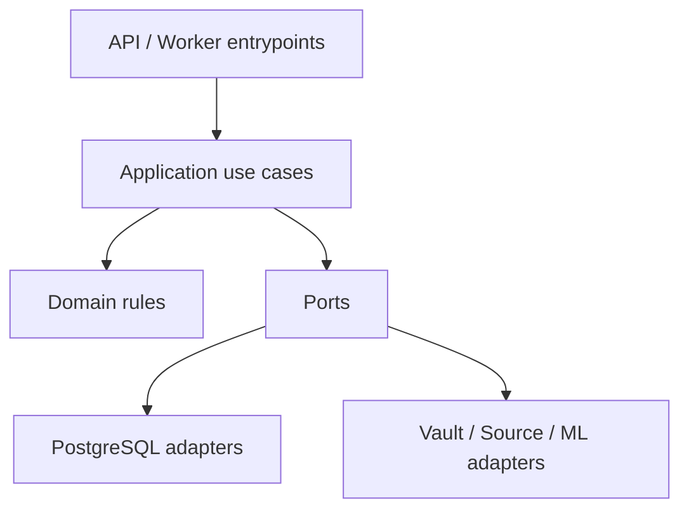

Правила:

- Domain не импортирует FastAPI, SQLAlchemy, FFmpeg, CUDA и HTTP clients.
- Application координирует use cases и transaction boundaries.
- Ports описывают интерфейсы storage, queue, source, fingerprint и ML.
- Adapters реализуют технические интеграции.
- Entrypoints преобразуют HTTP, WebSocket и job payload в application commands.

---

# 4. System Context

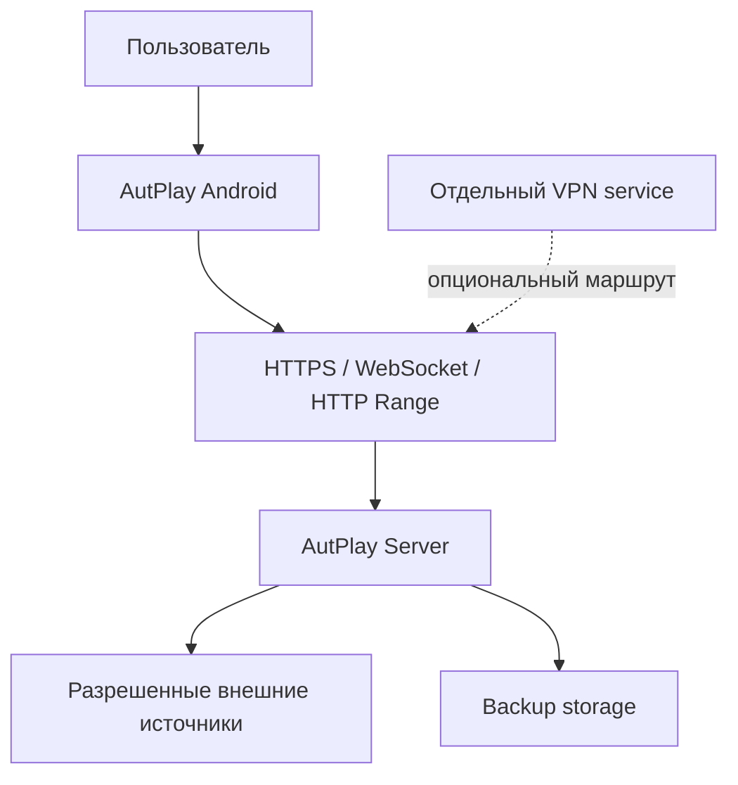

Ключевой смысл схемы:

- Android является самостоятельным продуктовым клиентом;
- transport не знает, проходит ли соединение через LAN, VPN или reverse proxy;
- VPN не имеет API-доступа к AutPlay и не использует его persistent volumes;
- external sources не считаются надежным source of truth;
- backup storage не обслуживает пользовательские запросы напрямую.

---

# 5. Режимы работы

| Режим | Компоненты | Что доступно | Ограничения |
| --- | --- | --- | --- |
| Standalone | Только Android | Local library, player, playlists, history, local import, local search, profile export | Нет Vault, shared sync и server ML |
| Personal Server CPU | Android + CPU server | Vault, restore, sync, import, direct streaming, fingerprint, metadata | ML enrichment медленнее или deferred |
| Personal Server GPU | Android + server + RTX 3060 | Полный CPU mode плюс batch embeddings, tags и semantic retrieval | GPU остается необязательной |
| Multi-user Server | Несколько Android clients + server | Общий catalog/blob, отдельные профили и playlists | Требуется строгая object authorization |

Переход между режимами не требует пересоздания пользовательской библиотеки.

---

# 6. Deployment Architecture

## 6.1. Production topology

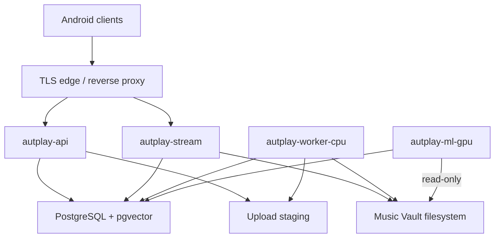

## 6.2. Deployment units

| Unit | Назначение | Persistent state | GPU | Можно перезапускать отдельно |
| --- | --- | --- | --- | --- |
| `autplay-api` | REST, auth, sync commands, resumable upload ingress, job creation, admin commands | Не владеет; bounded write в staging | Нет | Да |
| `autplay-stream` | Authorization, Range streaming, optional transcode coordination | Только cache | Нет | Да |
| `autplay-worker-cpu` | Ingest, hash, fingerprint, import, metadata, integrity, backup jobs | Staging | Нет | Да |
| `autplay-ml-gpu` | Embeddings, tags, batch re-embedding | Model cache; read-only Vault mount | RTX 3060 | Да |
| `autplay-db` | Server metadata, events, jobs, pgvector | PostgreSQL volume | Нет | Отдельная процедура |
| `vault-storage` | Immutable blobs и replicas, без собственного application process | Vault volume | Нет | Remount/reconnect по storage runbook |
| `autplay-observability` | Metrics/dashboard/log collection | Опционально | Нет | Да |
| `vpn-service` | Независимый сетевой сервис | Собственный volume | По своим требованиям | Да |

## 6.3. Volumes

| Volume | Владелец | Содержимое | Backup class |
| --- | --- | --- | --- |
| `postgres-data` | PostgreSQL | Critical catalog, profile, sync, jobs | Critical |
| `vault-data` | Vault | Original immutable audio blobs | Primary blobs |
| `staging-data` | Ingest module | Partial uploads и временный ingest; API пишет, CPU worker читает | Disposable |
| `transcode-cache` | Stream worker | Derived audio | Rebuildable |
| `model-cache` | GPU worker | Approved weights и runtime cache | Re-downloadable при наличии manifest |
| `backup-staging` | Backup worker | Temporary consistent backup generation | Temporary |

AutPlay volumes не монтируются в VPN container.

## 6.4. Cross-platform profile

Единый server core обязан проходить CPU-only integration tests на Linux, Windows и macOS.

Production features, завязанные на Linux:

- контейнерный deployment;
- NVIDIA Container Toolkit;
- основной runbook;
- system metrics и filesystem behavior reference environment.

Платформенные различия изолируются в adapters, а не в domain/application слоях.

---

# 7. Android Architecture

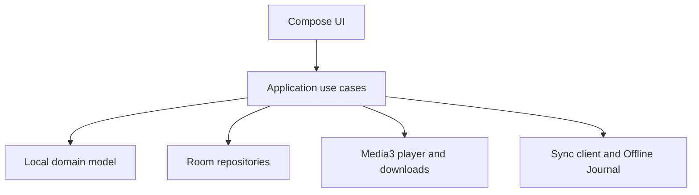

## 7.1. Android layers

| Layer | Ответственность | Не должна делать |
| --- | --- | --- |
| UI | State rendering, navigation, user intents | Прямой SQL, HTTP и filesystem |
| Application | Use cases, transactions, background work coordination | Хранить Android `Context` в domain objects |
| Domain | Track/playlist/library rules и state transitions | Зависеть от Room, Retrofit или Media3 |
| Data | Room, MediaStore/SAF, network, cache, profile import/export | Решать merge без domain policy |
| Playback | Media3 session, queue snapshot, local/stream source selection | Менять library state скрыто |
| Background | WorkManager, Media3 DownloadService, retry constraints | Полагаться на вечный process lifetime |

## 7.2. Локальные источники истины

- Room хранит local catalog projection, library, playlists, queue, history и Offline Journal.
- Local audio хранится через MediaStore/SAF URI и не адресуется абсолютным путем в domain model.
- DownloadService владеет долгими media downloads.
- WorkManager владеет гарантированно завершаемыми sync/metadata jobs.
- UI читает observable projections и не ожидает server round-trip для локальной операции.

## 7.3. Local command pattern

Любое пользовательское действие сначала фиксируется локально одной Room transaction:

```text
update local state
+ append Offline Journal event
+ update UI projection
```

После этого background sync передает событие серверу. Неуспешная сеть не откатывает локальное действие, если оно допустимо в Standalone mode.

---

# 8. Server Module Map

| Модуль | Владеет | Основные команды | Разрешенные зависимости |
| --- | --- | --- | --- |
| Identity Catalog | Recording, Release, Artist, redirects, match decisions | resolve, merge, split, normalize | Metadata, Fingerprint ports |
| User Library | UserTrackRef, LibraryEntry, preferences | add, remove, like, dislike, pin policy | Identity Catalog |
| Playlist | Playlist, PlaylistEntry, position keys | create, reorder, duplicate entry, share | User Library, Identity Catalog |
| Vault | VaultObject, replica, AudioVariant, canonical variant | stage, commit, verify, quarantine, GC | Filesystem, Identity Catalog |
| Acquisition | Source adapters, search, download intents | search, resolve, acquire | Identity Catalog, Jobs, Vault |
| Ingest | Validation pipeline и technical metadata | validate, hash, fingerprint, commit | Vault, Identity Catalog, Jobs |
| Library Migration | ImportJob, raw entries, match candidates | parse, preview, materialize, resume | Adapters, Identity Catalog, User Library |
| Sync | Event inbox/outbox, cursors, tombstones | push, pull, bootstrap, compact | User Library, Playlist, Identity Catalog |
| Jobs | Generic job state, attempt, lease, checkpoints | enqueue, claim, heartbeat, retry, cancel | PostgreSQL clock/locking |
| Streaming | Authorized direct play и transcode cache | HEAD, Range, stream, transcode | Auth, Vault |
| Recommendations | Embeddings, taste clusters, queue construction | embed, retrieve, rank, explain | Identity, Library, ML port |
| Wave | Room state и synchronized commands | create room, preflight, clock | Streaming, Library, Sync contracts |
| Operations | Health, metrics, audit, backup, diagnostics | inspect, backup, restore, reconcile | Все read-only contracts, limited commands |

## 8.1. Dependency rule

Модули не читают чужие таблицы произвольным SQL. Межмодульное чтение идет через application query interfaces или специально опубликованные read models.

Исключение допускается для отчетных materialized views, не участвующих в business write path.

---

# 9. Data Ownership

| Данные | Source of truth | Локальная копия | Стратегия восстановления |
| --- | --- | --- | --- |
| Локальный audio URI | Android device | Только Android | Rescan + fingerprint |
| User library и playlists | Local-first events + server normalized state | Room и PostgreSQL | Sync snapshot + event replay |
| Shared catalog identity | PostgreSQL | Room projection | Server bootstrap/export |
| Vault blob | Immutable Vault storage | MAY local cached copy | Replica/backup/external recovery |
| SHA-256 | Вычисляется из bytes | Да | Recompute |
| Fingerprint | Derived from decoded audio | Да | Recompute |
| Embedding | Derived from model/version | Опционально | Recompute |
| Vector index | PostgreSQL/derived files | Нет | Rebuild from embeddings |
| Raw import file | Import retention policy | MAY original user file | Re-upload/export |
| Audit | PostgreSQL append-only | Нет | DB backup |

---

# 10. Critical Flow: Local Import and Vault Reconciliation

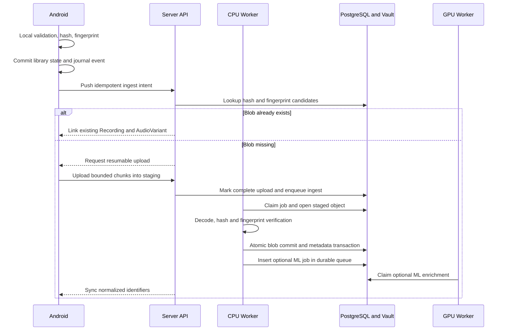

Transaction boundary:

- blob сначала полностью проходит validation в staging;
- atomic move в CAS выполняется до database commit или согласованным recoverable protocol;
- AudioVariant допускается к serving только при `VaultObject.COMMITTED` и `validation_status = VALID`;
- optional ML job записывается в durable `jobs.job` рядом с core transaction и может быть восстановлена enrichment scheduler;
- повторный upload того же SHA-256 возвращает существующий VaultObject.

---

# 11. Critical Flow: Vault-first Acquisition

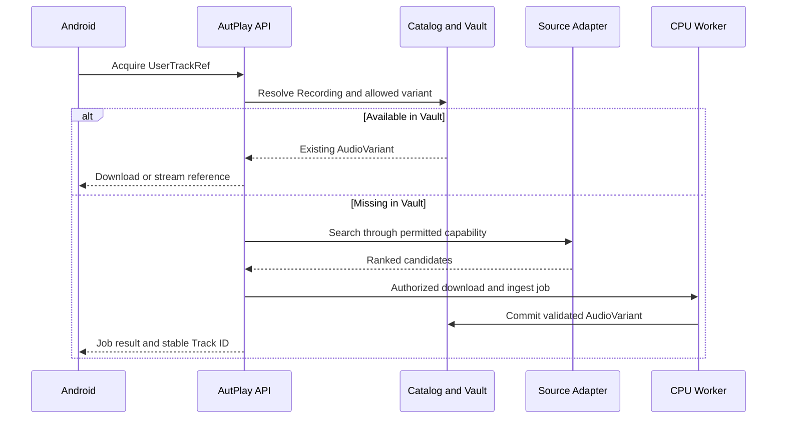

External source failure leaves UserTrackRef and metadata intact with `PENDING_SEARCH`, `PENDING_RESTORE`, `NOT_FOUND` или `REVIEW_REQUIRED`.

---

# 12. Critical Flow: Incremental Sync

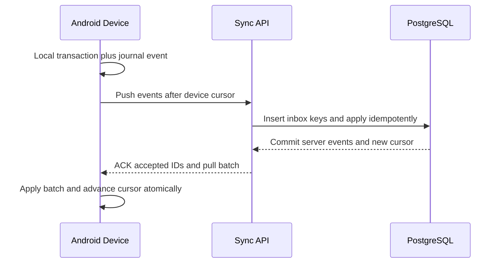

Semantics:

- delivery is at-least-once;
- event IDs and idempotency keys are stable across retry;
- sequence is monotonic per device;
- server cursor is opaque to client;
- deletion travels as tombstone;
- compacting occurs only behind acknowledged cursors;
- snapshot bootstrap is used for a new or reset device;
- unresolved conflict becomes visible `REVIEW_REQUIRED` instead of silent data loss.

---

# 13. Critical Flow: Streaming

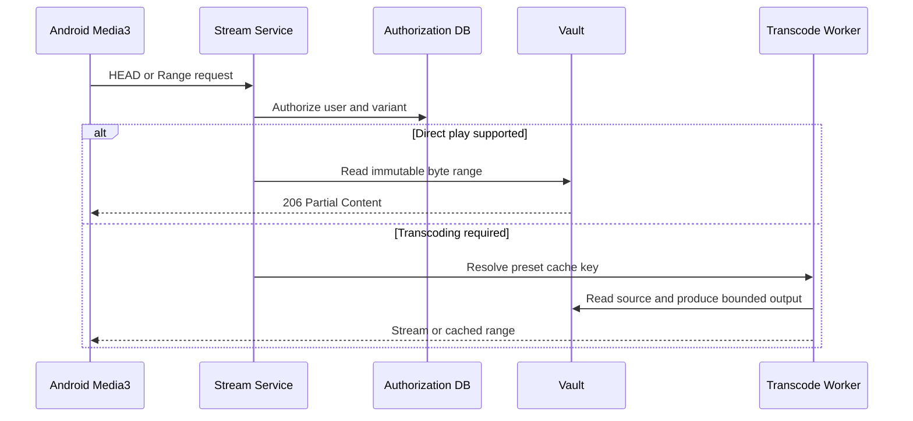

Rules:

- stream URL does not bypass authorization;
- Range, HEAD, Content-Length, Content-Type и ETag are mandatory;
- direct play is preferred;
- transcoding cache key includes source SHA-256, preset and encoder version;
- client disconnect cancels disposable live transcode;
- GPU is not used for v1 transcoding;
- external provider URL is never proxied as if it were a trusted VaultObject.

---

# 14. Critical Flow: Library Migration

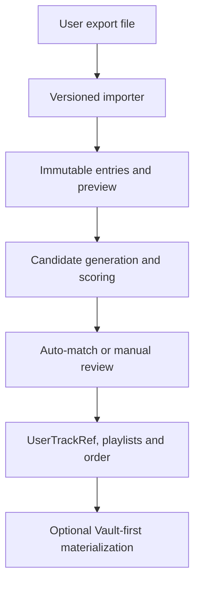

Import architecture:

- raw input SHA-256, adapter version и parser schema фиксируются;
- parsing не создает AudioVariant;
- preview создается до materialization;
- playlist order и duplicate entries сохраняются;
- ImportJob хранит cursor/checkpoint;
- `AUTO_MATCH`, `REVIEW_REQUIRED` и `NO_MATCH` основаны на benchmark thresholds;
- подтвержденное пользователем mapping может быть повторно использовано;
- Library Only завершается без скачивания audio;
- Materialize создает отдельные bounded acquisition jobs.

---

# 15. Job Architecture

## 15.1. PostgreSQL queue

Начальная очередь использует PostgreSQL row locking с `FOR UPDATE SKIP LOCKED`.

Job содержит:

- type и schema version;
- priority;
- state;
- idempotency key;
- payload reference, но не крупный binary payload;
- attempt count;
- scheduled time;
- lease owner и lease deadline;
- heartbeat time;
- checkpoint;
- progress;
- structured error code;
- cancellation request;
- created/started/completed timestamps.

## 15.2. Generic state machine

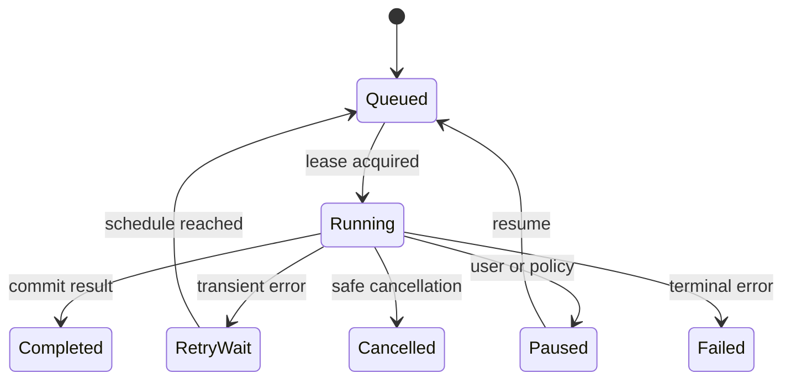

Worker contract:

- claim small batch;
- renew heartbeat;
- write checkpoint before irreversible boundary;
- classify retryable and terminal errors;
- release or expire lease after crash;
- never rely on in-memory state as the only progress record;
- make every side effect idempotent.

## 15.3. Priorities

| Priority | Workload | Rule |
| --- | --- | --- |
| P0 | Playback control and active streaming | Never queued behind bulk work |
| P1 | Interactive API and search | Bounded latency |
| P2 | Sync and user-requested download | User-visible progress |
| P3 | Import, ingest and restore | Bounded concurrency |
| P4 | Embedding, reindex, integrity and analytics | Yield under pressure |

Отдельный broker вводится только после benchmark и ADR.

---

# 16. GPU and ML Architecture

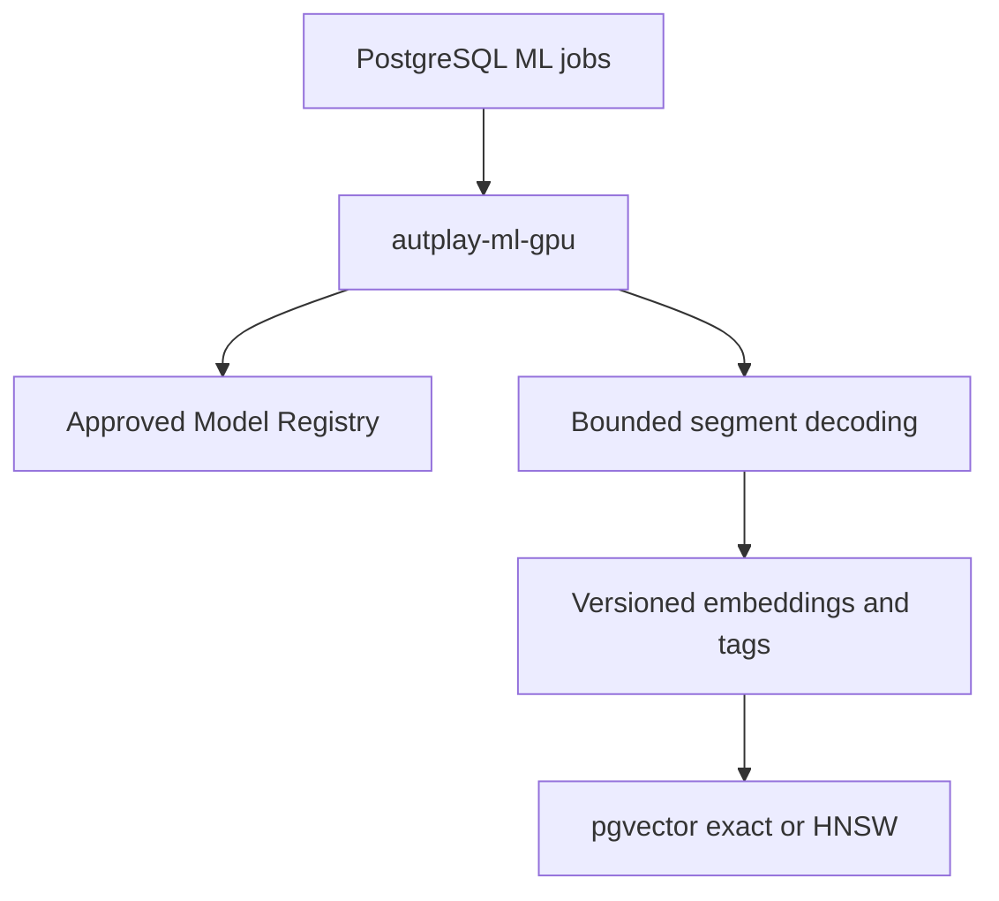

## 16.1. GPU boundary

- Только GPU worker видит NVIDIA device.
- API не загружает ML weights.
- Model Registry содержит source, license, SHA-256, preprocessing и runtime version.
- Arbitrary model URL в job payload запрещен.
- Один тяжелый GPU job выполняется одновременно до benchmark.
- OOM вызывает ограниченное уменьшение batch, затем terminal/deferred state.

## 16.2. Core versus enrichment

| Core ingest | ML enrichment |
| --- | --- |
| Decode validation | Segment embeddings |
| SHA-256 | Mood/style tags |
| Fingerprint | Semantic audio/text retrieval data |
| Technical metadata | Taste clustering inputs |
| CAS commit | Experimental transition features |

Core ingest завершает доступность audio независимо от ML result.

## 16.3. Model change

Новая модель не перезаписывает старые vectors in-place:

1. зарегистрировать model version;
2. создать параллельные embedding rows;
3. построить новый index;
4. сравнить quality/latency;
5. переключить active model alias;
6. сохранить rollback window;
7. удалить старые derived data отдельной retention job.

---

# 17. Search and Recommendation Serving

Recommendation Engine состоит из стадий:

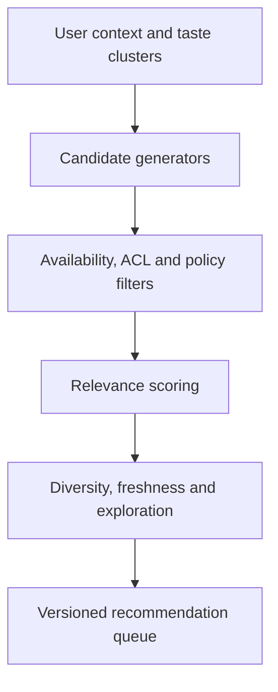

Для каталога до 100 000 Recording:

1. exact pgvector cosine является baseline;
2. HNSW добавляется после измерения recall и p95/p99;
3. exact re-score применяется к короткому ANN candidate list;
4. отдельный vector service рассматривается только после ADR;
5. все запросы фильтруются по model version, ACL, availability и user policy.

Каждая выдача хранит `recommendation_request_id`, модель, параметры, origin и ranked item IDs. Это позволяет объяснять результат и отделять organic events от recommendation-driven events.

---

# 18. Security Boundaries

| Граница | Основные угрозы | Обязательные меры |
| --- | --- | --- |
| Android <-> API | Token theft, replay, broken object auth | TLS, rotating refresh tokens, device sessions, object authorization, idempotency |
| Internet <-> Edge | Brute force, DoS, misconfiguration | Rate limit, body limits, timeouts, restricted admin routes |
| Source Adapter <-> Internet | SSRF, malicious payload, token leakage | Egress allowlist/policy, block private networks, bounded download, sanitized logs |
| Upload <-> Ingest | Archive bomb, malformed media, path traversal | Staging, size/time/memory limits, generated storage keys, sandboxed process args |
| API <-> Vault | Unauthorized object access | Access by domain authorization, not by hash knowledge |
| Worker <-> Shell tools | Command injection | Argument arrays, no shell interpolation, allowlisted codecs/options |
| GPU worker <-> Models | Malicious weights, supply chain | Approved registry, hash/license validation, pinned runtime |
| Admin operations | Accidental global delete/merge | RBAC, confirmation, audit, reversible workflow |

Tokens, user paths, private URLs и raw source payloads не попадают в обычные logs.

---

# 19. Observability

## 19.1. Common correlation fields

```text
request_id
trace_id
job_id
device_id
user_id_hash
recording_id
adapter_id
```

## 19.2. Required metrics

| Area | Metrics |
| --- | --- |
| API | Request count, p50/p95/p99, error code, rate-limit count |
| Sync | Push/pull batch, cursor lag, duplicate events, conflicts |
| Jobs | Queue depth, oldest age, attempts, lease expiry, duration |
| Vault | Used/free space, commit failures, corruption, quarantine, replica count |
| Streaming | Start latency, active streams, bytes, Range errors, transcode ratio |
| Adapters | Success, timeout, 429, circuit state, schema failures |
| GPU | Queue age, utilization, VRAM, OOM, tracks/hour, model version |
| Backup | Last success, age, size, restore drill status |

## 19.3. Health endpoints

- `/health/live` проверяет process responsiveness.
- `/health/ready` проверяет обязательные dependencies конкретного process.
- API readiness не зависит от GPU readiness.
- Stream readiness может быть degraded при недоступном Vault.
- External providers не участвуют в server readiness.

---

# 20. Failure and Degradation Matrix

| Отказ | Доступно | Недоступно/отложено | Реакция |
| --- | --- | --- | --- |
| Server offline | Local Android playback, library, playlists | Vault, shared sync, server search | Journal events locally |
| VPN offline | LAN/direct routes, local client | Только маршруты, зависевшие от VPN | AutPlay state не меняется |
| GPU offline | API, Vault, stream, sync, existing vector search | Новые embeddings/tags | `PENDING_ACCELERATOR` |
| External provider offline | Local/Vault content | Новый external resolution | Circuit breaker, retry |
| Vault filesystem offline | Metadata, local Android playback | Server audio stream/ingest | Readiness degraded, no false delete |
| PostgreSQL offline | Local Android playback | Server commands and authorization | API fails closed, no local rollback |
| Low disk | Existing direct reads where safe | New download/ingest/transcode cache | Pause jobs and alert |
| Worker crash | API and committed data | Current attempt delayed | Lease expiry and resume checkpoint |
| Corrupt blob | Catalog and other variants | Affected variant | Quarantine and recovery job |
| Failed migration | Previous app release where compatible | New release rollout | Stop startup, restore/rollback runbook |

---

# 21. Backup and Restore Architecture

Backup generation содержит:

- consistent PostgreSQL snapshot;
- manifest всех ожидаемых VaultObject SHA-256;
- config schema version без секретов в открытом виде;
- application/database version;
- timestamp и generation ID;
- optional original blobs по выбранной Full Backup policy.

Derived data MAY быть исключены:

- pgvector indexes;
- embeddings, если model weights доступны и rebuild проверен;
- thumbnails;
- transcode cache;
- temporary import/staging files.

Restore выполняется в порядке:

1. проверить manifest и версии;
2. восстановить PostgreSQL в изолированное окружение;
3. восстановить/подключить Vault replicas;
4. запустить integrity reconciliation;
5. перестроить derived indexes;
6. выполнить smoke tests;
7. только затем переключить production.

Target для profile/database: RPO <= 24 h, RTO <= 4 h. Restore drill выполняется не реже одного раза в квартал.

---

# 22. API and Contract Rules

## 22.1. Public contracts

- REST/OpenAPI под `/api/v1`;
- WebSocket только для live state: Wave, job progress hints и invalidation;
- HTTP Range для audio;
- JSON event envelope для sync;
- versioned export/import formats.

## 22.2. Compatibility

- OpenAPI является source of truth для generated client models.
- Сервер поддерживает текущую и предыдущую mobile API version минимум в пределах объявленного compatibility window.
- Unknown enum values не должны приводить к удалению данных.
- Additive fields игнорируются старым клиентом безопасно.
- Destructive rename/remove требует новой API version или compatibility adapter.

## 22.3. Command rules

- Idempotency key обязателен для upload, import, acquire, merge и destructive commands.
- ETag/`If-Match` или resource version используется для конфликтных edits.
- List endpoint использует cursor pagination и bounded page size.
- Error response имеет stable machine code, user-safe message, retryability и request ID.

---

# 23. Recommended Repository Structure

| Path | Содержимое |
| --- | --- |
| `apps/android` | Kotlin, Compose, Media3, Room, WorkManager |
| `server/pyproject.toml` | Python project metadata и uv dependencies |
| `server/uv.lock` | Воспроизводимый dependency lock |
| `server/src/autplay/domain` | Pure domain entities, policies, state machines |
| `server/src/autplay/application` | Commands, queries, use cases, transactions |
| `server/src/autplay/ports` | Repository, Vault, Source, ML и clock interfaces |
| `server/src/autplay/adapters` | PostgreSQL, filesystem, HTTP providers, FFmpeg, Chromaprint, ML runtimes |
| `server/src/autplay/entrypoints` | FastAPI, stream process, CPU worker, GPU worker, CLI |
| `server/migrations` | Alembic migrations |
| `contracts/openapi` | OpenAPI source and compatibility snapshots |
| `contracts/events` | Sync/job event JSON schemas |
| `deploy/compose` | CPU и GPU deployment profiles |
| `docs/adr` | Нумерованные Architecture Decision Records |
| `tests/fixtures/adapters` | Golden import/source fixtures |
| `tests/e2e` | End-to-end scenarios and failure recovery |

Запуск Python development workflow по умолчанию:

```text
uv sync
uv run pytest
uv run ruff check .
uv run mypy server/src
```

Конкретные команды уточняются после создания репозитория и `pyproject.toml`.

---

# 24. ADR Register

| ADR | Решение | Статус |
| --- | --- | --- |
| ADR-001 | Modular monolith with multiple process entrypoints | Accepted |
| ADR-002 | PostgreSQL as metadata source of truth and initial job queue | Accepted |
| ADR-003 | Immutable SHA-256 addressed VaultObject | Accepted |
| ADR-004 | Recording separated from ReleaseTrack and AudioVariant | Accepted |
| ADR-005 | At-least-once sync with idempotent consumers and tombstones | Accepted |
| ADR-006 | Optional isolated NVIDIA GPU worker | Accepted |
| ADR-007 | Linux production, cross-platform CPU server core | Accepted |
| ADR-008 | pgvector exact baseline, HNSW after benchmark | Accepted |
| ADR-009 | Direct HTTP Range before HLS | Accepted |
| ADR-010 | External sources only through capability-declaring adapters | Accepted |
| ADR-011 | No broker/vector service before measured need | Accepted |
| ADR-012 | UserTrackRef preserves unresolved imported tracks | Proposed in ER v1 |

---

# 25. Implementation Slices

## Slice A - Architecture Skeleton

- server package через `uv`;
- domain/application/ports/adapters boundaries;
- PostgreSQL migrations;
- FastAPI health endpoint;
- CPU worker entrypoint;
- Compose CPU profile;
- structured logging and request IDs.

Exit gate: один command создается API, claim-ится worker, завершается идемпотентно и переживает worker crash.

## Slice B - Identity and Local Core

- ER catalog identity;
- Android local database;
- local scan/import;
- Media3 playback;
- fingerprint candidate matching;
- merge/split review primitives.

Exit gate: тестовые live/remix/remaster и album/single scenarios не дают опасного auto-merge.

## Slice C - Vault

- staging;
- decode/hash/fingerprint validation;
- immutable CAS commit;
- AudioVariant link;
- Range streaming;
- integrity/quarantine;
- backup manifest.

Exit gate: crash в любой точке не создает доступный partial blob и повтор не создает duplicate.

## Slice D - Sync

- Android Offline Journal;
- server inbox/outbox;
- cursor push/pull;
- tombstones;
- playlist order conflicts;
- device bootstrap.

Exit gate: duplicate, reordered and interrupted event delivery проходит автоматические property/e2e tests.

## Slice E - Library Migration

- versioned importer manifest;
- HTML/CSV/JSON/M3U fixtures;
- preview;
- match candidates;
- checkpoint/resume;
- Library Only и Materialize.

Exit gate: повторный импорт сохраняет playlists/order и не дублирует библиотеку.

## Slice F - GPU Recommendation Foundation

- GPU Compose profile;
- Model Registry;
- benchmark harness;
- versioned embeddings;
- pgvector exact baseline;
- offline Recommendation Pack.

Exit gate: остановка GPU не нарушает core paths, а смена модели имеет rollback.

---

# 26. Open Decisions Before Coding Feature Logic

| Решение | Нужный результат | Блокирует |
| --- | --- | --- |
| Android `minSdk` | Подтвержденный device matrix | Android project setup |
| PostgreSQL major version | Pinned container/runtime | Initial migrations |
| Reverse proxy | Caddy, Traefik или Nginx decision | Internet-facing deployment only |
| Vault filesystem | ext4/ZFS/Btrfs/NAS constraints | Backup and replica runbook |
| Local server on Windows | Native process или container profile | Windows production support, не core logic |
| Embedding model | Benchmark report on RTX 3060 | Recommendation quality, не Vault |
| Exact/HNSW switch threshold | Measured recall/latency | Recommendation scale only |
| Backup backend | Local/NAS/WebDAV policy | Full production readiness |
| OpenSubsonic layer | Compatibility mapping ADR | Third-party clients only |

---

# 27. Architecture v1 Acceptance Checklist

Architecture v1 готова к переходу в backlog, когда:

1. ER v1 утверждает identity, user references, Vault и sync entities.
2. Все P0 use cases имеют owner module и transaction boundary.
3. Android local action не требует синхронного server response.
4. Core ingest завершается без GPU.
5. Partial blob не становится доступным.
6. Duplicate sync/job delivery безопасна.
7. VPN отсутствует в AutPlay dependency graph.
8. Multi-user authorization проверяется до stream/blob access.
9. Backup и restore имеют manifest и проверяемый порядок.
10. Каждый process имеет liveness/readiness и resource limits.
11. Open decisions не маскируются случайными implementation defaults.
12. Первые ADR и contract skeleton добавлены до feature growth.

---

# 28. Следующий документ

После Architecture v1 и ER v1 следует подготовить:

1. ADR-004 Track Identity Specification с формулой confidence.
2. PostgreSQL Schema v1 и Alembic migration plan.
3. Android Room Schema v1.
4. Sync Protocol v1 с JSON event envelope.
5. OpenAPI Skeleton v1.
6. MVP backlog, разбитый по implementation slices A-F.
