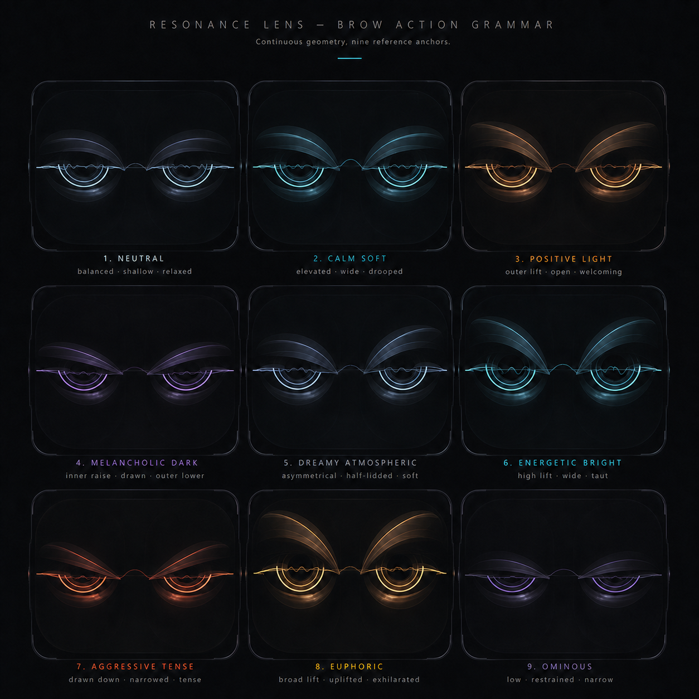

# AutPlay Face: Brow Action Grammar exploration v2

| Field | Value |
| --- | --- |
| Status | Non-normative visual/interaction exploration; not an implementation milestone |
| Date | 2026-08-31 |
| Scope | Make the upper aperture materially contribute to perceived musical character |
| Preview | [`autplay-face-brow-action-grammar-v2.png`](autplay-face-brow-action-grammar-v2.png) |
| Supersedes | The repeated upper-aperture poses in the v1 concept board, not the approved plan |

## Problem

In the v1 board, the eyebrow-like upper aperture ribbons differ mostly in color and small changes of
tilt. Their inner/outer endpoints, baseline height, curvature, and central convergence are too
similar. As a result, Calm, Positive, Dark, Energetic, and Intense read as one pose with different
lighting.

The v2 direction treats each upper aperture as a deformable four-point ribbon, coordinated with the
upper and lower lid masks. It remains an abstract optical component rather than a literal human brow.

The bitmap is a mood board, not geometric ground truth. The normalized control table below is the
authoritative exploration input because generated imagery may reverse an inner or outer endpoint.

## What the psychology evidence supports

Facial Action Coding System research provides a useful movement vocabulary rather than a universal
emotion dictionary:

- `AU1` raises the inner brow region, `AU2` raises the outer region, and `AU4` lowers and draws the
  brows together. Their combinations are non-additive, so the renderer must blend visible geometry,
  not simply add three independent offsets.
- Inner-brow raising contributes strongly to recognized sadness, while brow lowering contributes
  strongly to anger. Raising both brow regions is more characteristic of surprise/alertness.
- In dynamic faces, observers look earlier and longer at the eye region for anger and sadness. The
  mouth/cheek region carries more diagnostic information for happiness.
- Eyebrows can carry exaggerated emotional information in simplified/cartoon faces, especially for
  sadness, but happiness inferred from eyebrows alone is inconsistent. Positive/euphoric states
  therefore need coordinated lower-lid/cheek-like lift (`AU6` abstraction), aperture openness, and
  luminous distribution rather than a nominally happy brow.
- Large cross-cultural evidence finds both convergence and culture-/person-specific variation. The
  product should retain continuous axes and calibrated mixtures rather than claim a canonical
  one-to-one emotion classifier.

These findings constrain legibility only. AutPlay still describes musical character, never the
listener's psychological state and never a diagnosis of a performer.

## Parametric ribbon

Each eye uses the same normalized controls. Positive vertical values move upward; positive
`center_pull` moves the inner endpoint toward the bridge.

| Control | Range | Meaning |
| --- | ---: | --- |
| `inner_y` | `-1..1` | Height of the ribbon endpoint nearest the binocular bridge |
| `outer_y` | `-1..1` | Height of the lateral endpoint |
| `arch` | `-1..1` | Signed midpoint curvature; independent of endpoint slope |
| `center_pull` | `0..1` | Inward convergence/tension of the two inner endpoints |
| `ribbon_tension` | `0..1` | Straight/taut versus soft/elastic curvature and thickness response |
| `upper_open` | `0..1` | Upper aperture exposure; an abstraction of upper-lid raise |
| `lower_lift` | `0..1` | Lower aperture/cheek-like lift; necessary for positive legibility |
| `lid_tightness` | `0..1` | Orbital compression; distinguishes force from simple darkness |
| `asymmetry` | `-1..1` | Small binocular phase/height difference; normally clamped to 3–6% |

The implementation must use a smooth bounded curve with explicit control points. It must not rotate
one stock arc or select a pre-rendered eyebrow asset.

## Nine reference anchors

Values are starting hypotheses for a perceptual prototype, not production tuning. They deliberately
make the starting positions and forms different enough to test in monochrome.

| Anchor | `inner_y` | `outer_y` | `arch` | `center_pull` | `upper_open` | `lower_lift` | `lid_tightness` | Geometric read |
| --- | ---: | ---: | ---: | ---: | ---: | ---: | ---: | --- |
| Neutral | `0.00` | `0.00` | `0.05` | `0.00` | `0.55` | `0.05` | `0.10` | Shallow, balanced baseline |
| Calm soft | `0.10` | `0.05` | `0.12` | `0.00` | `0.48` | `0.10` | `0.05` | Wide, slightly elevated, low tension |
| Positive light | `0.08` | `0.24` | `0.16` | `0.00` | `0.68` | `0.34` | `0.10` | Outer lift plus open/lower-lid lift |
| Melancholic dark | `0.34` | `-0.10` | `0.08` | `0.24` | `0.40` | `0.08` | `0.24` | Inner endpoints high and inward; outer ends lower |
| Dreamy atmospheric | `0.10` | `0.18` | `0.28` | `0.00` | `0.40` | `0.08` | `0.08` | Soft high arch with controlled left/right phase |
| Energetic bright | `0.28` | `0.36` | `0.20` | `0.02` | `0.88` | `0.16` | `0.28` | Both regions high, wide and taut |
| Aggressive tense | `-0.32` | `-0.10` | `-0.04` | `0.44` | `0.42` | `0.42` | `0.82` | Inner endpoints lowest, strongly convergent, compressed |
| Euphoric | `0.22` | `0.34` | `0.24` | `0.00` | `0.78` | `0.58` | `0.12` | Broad lift with strong lower-aperture participation |
| Ominous | `-0.18` | `-0.16` | `0.00` | `0.16` | `0.24` | `0.08` | `0.56` | Low, quiet, near-horizontal and symmetrical |

`Melancholic dark` and `Aggressive tense` are the key polarity test: melancholy raises the inner
endpoints above the outer ones; aggression lowers them below the outer ones and increases central
pull/tightness. `Positive light` and `Euphoric` are the other key test: both depend on lower-aperture
lift, with euphoria adding range and luminosity rather than merely exaggerating the brow.

## Continuous color grammar

Color reinforces the geometry but never identifies a state by itself. Cross-cultural research finds
strong shared color/emotion associations alongside linguistic and geographic differences, so the
renderer must not encode claims such as red equals anger or blue equals sadness. Hue, chroma, and
tone remain separate continuous controls.

| Color dimension | Primary semantic input | Rendering rule |
| --- | --- | --- |
| Hue | character family / valence-temperature mixture | Blend between restrained spectral families; never select one color per named anchor |
| Chroma | energy plus semantic confidence | More energetic and well-supported analysis may be more chromatic; calm or uncertain states move toward neutral, not toward another mood |
| Tone | light ↔ dark | Controls perceived luminosity and contrast independently of hue |
| Spectral width | direct ↔ atmospheric | Direct states use a narrow coherent band; atmospheric states permit a bounded adjacent-hue spread |
| Accent attack | soft ↔ aggressive / transient intensity | Changes the short-lived filament/core accent, not the permanent background or UI semantic colors |

The future Android renderer should interpolate in HCT or an equivalent perceptual color space rather
than blending encoded RGB/HSL values. Hue interpolation follows bounded palette paths; tone and
chroma are clamped separately so intermediate mixtures do not become muddy, unexpectedly brighter,
or inaccessible.

### Initial spectral anchors

These are palette hypotheses for testing, not categorical state colors. Values are approximate HCT
hue regions; production tone/chroma require device evidence.

| Reference anchor | Hue region | Chroma behavior | Tone behavior | Rationale |
| --- | ---: | --- | --- | --- |
| Neutral | `215–235` blue-cyan | low | medium | Instrumental baseline without a strong affect claim |
| Calm soft | `195–220` cyan | low | medium-high | Spacious and cool; geometry remains the primary calm cue |
| Positive light | `55–75` amber | medium | high | Warm/light association without a literal smile or warning red |
| Melancholic dark | `275–300` violet | low-medium | low | Recessive and deep; never rely on conventional sad-blue alone |
| Dreamy atmospheric | `245–290` blue-violet spread | low-medium | medium-low | Adjacent-hue spectral width communicates atmosphere |
| Energetic bright | `185–205` electric cyan | high | high | High chroma/tone communicates activation without changing geometry |
| Aggressive tense | `20–35` coral-orange | high but bounded | medium | Warm attack accent; avoid pure error red and red/green dependence |
| Euphoric | `65–95` gold-yellow | high | high | Expansive luminosity plus lower-lid geometry |
| Ominous | `275–300` desaturated violet | low | very low | Quiet low-tone pressure, distinct from high-chroma aggression |

### Color roles

1. The upper-aperture ribbon receives the clearest state color because its geometry is already the
   dominant expression carrier.
2. Iris arcs use the same palette family at staggered tones/chroma, creating optical depth without a
   second semantic code.
3. The resonance filament uses a short high-tone accent derived from the current family. It does not
   introduce a random contrasting mood color on every transient.
4. The optical core and background remain neutral. Playback, errors, warnings, Like, and other UI
   semantics retain their established app color roles and are never overridden by Face color.
5. User accent/theme preferences may harmonize the palette at the renderer, but cannot rewrite the
   canonical timeline or remove geometric distinction.
6. Abstention or low confidence reduces chroma and motion range toward the neutral presentation; it
   never fabricates a more certain named mood.

### Color accessibility gates

- Every required anchor-pair test must still pass in monochrome and under common color-vision-
  deficiency simulations.
- Pure red/green opposition is forbidden. Shape, aperture, tone, and motion remain redundant cues.
- At the smallest target size, the primary ribbon and iris need measured non-text contrast against
  the visor; bloom alone does not count as an edge.
- Dark/light theme, system contrast settings, display gamut, user accent harmonization, and reduced
  color/chroma each require screenshots and physical-device checks.
- Color is decorative for accessibility semantics and cannot be the only representation of a
  playback state, action result, error, or control affordance.

## Continuous mapping rules

1. The nine anchors are perceptual fixtures, never an enum emitted by the track model.
2. Semantic axes blend control values before curve construction. Rendered shapes are not crossfaded
   bitmaps.
3. Endpoint slope, midpoint curvature, aperture openness, and lid tightness use separate critically
   damped channels. This avoids a rubbery line that changes every property at once.
4. `AU` names stay in design documentation only. Runtime fields use neutral geometric names and do
   not claim to detect a human emotion.
5. Musical-event motion is layered after the baseline. A drop may briefly change tension/opening but
   cannot permanently overwrite the track-character geometry.
6. Color and glow are tertiary. A silhouette/monochrome test must still separate the anchor pairs.

## Required prototype tests

1. A forced-choice monochrome test without labels distinguishes at least these pairs: melancholic
   versus aggressive, calm versus ominous, positive versus euphoric, and dreamy versus energetic.
2. Remove iris color and filament motion: target readings must still remain above chance.
3. Test eyebrow-only, aperture-only, and combined conditions. Positive states are expected to fail
   or become ambiguous in eyebrow-only form; that is evidence to keep lower-lid participation.
4. Test intermediate semantic mixtures and transitions so the system does not collapse into the
   nearest anchor.
5. Validate at the smallest intended Now Playing size and in reduced-motion mode.
6. Use neutral wording in studies: participants rate visible musical qualities such as tense,
   open, heavy, bright, soft, or energetic—not the mental state of a person.
7. Run a geometry-only versus geometry-plus-color study. Color is accepted only if it improves
   confidence or transition continuity without creating new anchor confusions.
8. Test palette interpolation at axis extremes and midpoints in HCT/equivalent perceptual space,
   including low-confidence desaturation and user-accent harmonization.

## Primary research references

- Tian, Kanade, and Cohn, [Recognizing Action Units for Facial Expression Analysis](https://pmc.ncbi.nlm.nih.gov/articles/PMC4157835/): visible definitions and non-additive combinations of upper-face `AU1`, `AU2`, and `AU4`.
- Krumhuber et al., [Human and machine validation of 14 databases of dynamic facial expressions](https://pmc.ncbi.nlm.nih.gov/articles/PMC8062366/): relative contribution of action units to recognized expressions and the importance of prototypicality.
- Kohler et al., [Differences in facial expressions of four universal emotions](https://pubmed.ncbi.nlm.nih.gov/15541780/): FACS-coded eyebrow/eyelid configurations associated with recognition of sadness, anger, fear, and happiness.
- Calvo et al., [Selective eye fixations on diagnostic face regions of dynamic emotional expressions](https://www.nature.com/articles/s41598-018-35259-w): eye-region attention for anger/sadness and mouth/cheek-region attention for happiness.
- Chen et al., [The Influence of Key Facial Features on Recognition of Emotion in Cartoon Faces](https://pmc.ncbi.nlm.nih.gov/articles/PMC8382696/): eyebrow sufficiency and ambiguity in simplified/cartoon versus real faces.
- Cowen et al., [How emotion is experienced and expressed in multiple cultures](https://pmc.ncbi.nlm.nih.gov/articles/PMC11223574/): 45,231 reactions, multidimensional affective structure, cross-cultural convergence, and culture-specific display tendencies.
- Jonauskaite et al., [Universal Patterns in Color-Emotion Associations Are Further Shaped by Linguistic and Geographic Proximity](https://www.psychologicalscience.org/journals/psychological-science/0956797620948810/): color/emotion associations from 4,598 participants in 30 nations, with shared and culture-specific structure.
- Wilms and Oberfeld, [Color and emotion: effects of hue, saturation, and brightness](https://www.staff.uni-mainz.de/oberfeld/downloads/Wilms-Oberfeld2018_Article_ColorAndEmotionEffectsOfHueSat.pdf): independent manipulation of hue, saturation, and brightness rather than treating named colors as indivisible categories.
- Android Developers, [Android color for mobile design](https://developer.android.com/design/ui/mobile/guides/styles/color): HCT hue/chroma/tone roles, contrast, color-vision variability, and the requirement not to rely on color alone.

## Boundary

This exploration does not modify the approved Resonance Lens plan, activate Face Contract, select a
renderer, or turn psychological research into a human-state inference feature. Promotion requires
explicit user approval and an update/re-review of the locked visual contract.
