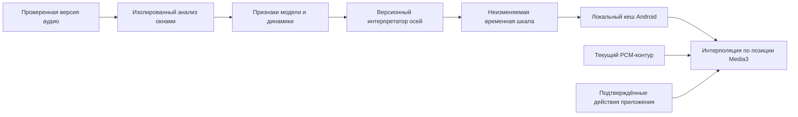

# AutPlay Face: готовые модели, датасеты и план проверки

Дата: 2026-09-10. Статус: исследование и предложение для Face Contract/Timeline; production-модель не выбрана. Пользователь задал порядок работ **Android/audit → Face → PA3** и уточнил **личное некоммерческое использование**. Этот документ начинает проработку Face, но не заявляет готовность Timeline, качество модели или результаты аппаратного benchmark.

## Результат реализации первого этапа

Face Contract v1 реализован и проверен на сервере и Android. Обе замороженные связки реально
запущены в отдельном Linux-контейнере на CPU: Musicnn + DEAM и Discogs-EffNet + Jamendo mood/theme.
На трёх синтетических 12-секундных сигналах проверены формы и конечность выходов, сохранены
сырые оценки, время и память. Готовые модели технически применимы без обучения с нуля.
Это не проверка качества на музыке и не выбор production-интерпретатора. Датасеты не скачивались.

Точный runtime, артефакты, результаты и оставшиеся условия описаны в
[Face Contract handoff](../../implementation/HANDOFF_FACE_CONTRACT.md). Контракт сохраняет явный
отказ от ненадёжной оценки; текущий экран Face остаётся локальным и нейтральным до квалификации
модели и реализации жизненного цикла Timeline.

## Рекомендация

Начать с замороженных предобученных музыкальных моделей, сравнить две готовые связки и добавить лёгкий анализ динамики. Обучение с нуля не требуется. Готовые модели могут дать характер трека; отдельный интерпретатор должен превратить их оценки в непрерывные оси Face. Датасеты нужны для независимой проверки и, при необходимости, дообучения.

Сравниваемые связки: Musicnn + готовый DEAM/mood head и Discogs-EffNet + готовые mood/theme/timbre heads. MERT95 оставляем следующим экспериментом при недостаточном качестве. Это порядок эксперимента, а не утверждение, что одна связка уже лучше на музыке пользователя.

Исходные границы: [Face product concept](../AutPlay_Face_Product_Concept_v1.md), [локальный handoff](../../implementation/HANDOFF_FACE_LOCAL.md), [план Resonance Lens](AutPlay_Face_Resonance_Lens_Plan.md). Сейчас production Face использует нейтральную основу и реакцию на PCM-контур. Семантическая временная шкала, её доставка и модель ещё не реализованы.

## Модель и датасет решают разные задачи

- Предобученная модель получает доступное аудио и вычисляет признаки или оценки для новой записи. Её можно запустить без самостоятельного обучения.
- Датасет содержит записи и разметку. Сам по себе он не определяет характер произвольной песни. Он полезен для обучения, калибровки и проверки.
- Готовые метаданные можно использовать только после надёжного сопоставления записи. Одинаковые название/исполнитель не доказывают совпадение версии, ремастера, live-записи или временной шкалы.
- Для первой проверки достаточно небольшой разрешённой выборки собственной музыки и готовых весов. Массовая загрузка чужого датасета не является предварительным условием.
- Face не требует личных causal outcomes, которые сейчас блокируют R1B. Он оценивает музыкальный характер. Пригодные Face-признаки не закрывают автоматически оценку персональных рекомендаций SONA.

## Кандидаты

| Кандидат | Что можно получить | Чего готовый компонент не обещает | Решение для эксперимента |
| --- | --- | --- | --- |
| `msd-musicnn-1` + `deam-msd-musicnn-2` и mood heads | Valence/arousal и отдельные оценки happy/sad/relaxed/aggressive | Полные шесть осей Face и проверенную точность динамической эмоциональной разметки | Первый baseline с замороженными весами |
| `discogs-effnet-bs64-1` + `mtg_jamendo_moodtheme-discogs-effnet-1`, совместимые timbre heads | Широкие mood/theme tags; дополнительные тембровые признаки | Момент drop, психологическое состояние человека, точную семантику каждого окна | Второй baseline для широкого покрытия осей |
| MERT-v1-95M, затем при обосновании 330M | Представление музыки для собственной регрессии/классификации | Готовые значения настроения без дополнительного head | Следующий этап, если готовые heads не проходят проверку |
| CLAP с точно выбранным checkpoint | Сходство аудио с текстовыми описаниями, например tense/relaxed | Калиброванную вероятность; независимость от формулировок | Дополнительный сравнительный эксперимент для слабых осей |

Первый DEAM head является готовым регрессором поверх Musicnn. Второй mood/theme head содержит 56 классов, включая dark, dream, energetic, melancholic, relaxing и soft. Это разные пространства признаков: head от Musicnn нельзя подключить к EffNet или MERT только потому, что все они выдают векторы. [Карточка DEAM head](https://essentia.upf.edu/models/classification-heads/deam/deam-msd-musicnn-2.json), [карточка mood/theme head](https://essentia.upf.edu/models/classification-heads/mtg_jamendo_moodtheme/mtg_jamendo_moodtheme-discogs-effnet-1.json).

MERT выдаёт embeddings и требует task-specific оценки. Для 95 млн параметров FP32 арифметическая оценка составляет примерно 380 МБ только для параметров; рабочая память и активации добавляются отдельно. Это не измерение VRAM на RTX 3060. Начинать с большего 330M без сравнительного результата не оправдано. [Карточка MERT95](https://huggingface.co/m-a-p/MERT-v1-95M), [MERT330](https://huggingface.co/m-a-p/MERT-v1-330M).

CLAP сопоставляет звук и текст. Меняя набор текстовых альтернатив и их формулировки, можно менять относительные результаты. Такие scores следует проверять на одних и тех же записях, а не объявлять процентом уверенности Face. [Официальный CLAP](https://github.com/LAION-AI/CLAP).

## Какие данные полезны

**DEAM** содержит 1802 музыкальных фрагмента и полные записи с valence/arousal. Manual описывает усреднённую динамическую разметку 2 Hz в диапазоне `[-1, +1]`; первые 15 секунд в ней отсутствуют. Статическая разметка использует шкалу `[1, 9]`. Это полезный источник временных примеров, но необходимо учитывать версию разметки, согласие аннотаторов и разницу шкал. [DEAM](https://cvml.unige.ch/databases/DEAM/), [manual](https://cvml.unige.ch/databases/DEAM/manual.pdf).

**MTG-Jamendo** полезен для широких mood/theme labels целых треков. Метка всей записи не является истинной меткой каждого её окна: спокойное вступление и интенсивный финал могут иметь одну общую метку. Поэтому этот набор не заменяет временной разметки. [Официальный dataset](https://github.com/MTG/mtg-jamendo-dataset).

**Собственная контрольная выборка** нужна в любом варианте: инструментальная музыка и вокал, студийные/live записи, тихие и агрессивные треки, жанры и языки пользователя, контрастные участки внутри записи. На первом этапе можно предложить 30–50 записей для отладки и выявления явных ошибок; это инженерный размер эксперимента, не статистическое доказательство качества. Для решения о выпуске потребуется отдельная отложенная выборка и заранее зафиксированные критерии.

Нельзя оценивать готовую DEAM-модель на том же DEAM как на независимом доказательстве. Для нового head разделение должно исключать попадание соседних окон одной записи в обучение и тест; желательно разделять также связанные релизы/исполнителей. Пользовательские исправления Face нельзя автоматически превращать в Like/Dislike или переносить в систему рекомендаций.

## Как переводить признаки в выражение

Это гипотезы для проверки, а не готовая доказанная психоакустическая модель.

| Ось Face | Исходное evidence | Ошибка прямого сопоставления |
| --- | --- | --- |
| positive ↔ melancholic | Valence, happy/sad/melancholic | Весёлая аранжировка и печальный вокал могут сосуществовать |
| calm ↔ energetic | Arousal, относительная энергия, плотность атак | Громкость записи и BPM по отдельности не определяют энергию |
| soft ↔ aggressive | Aggressive/heavy/soft, характер атак | `non_aggressive` не доказывает soft |
| light ↔ dark | Mood dark с отдельным учётом тембра | Спектральная яркость не равна эмоциональной светлости |
| relaxed ↔ tense | Relaxed плюс отдельно проверяемое напряжение | `non_relaxed` не доказывает tense |
| direct ↔ atmospheric | Dream/soundscape/space, проверяемые CLAP-контрасты | Реверберация не является достаточным признаком атмосферы |

Уверенность должна быть отдельной, проверяемой величиной. Sigmoid/softmax и расстояние между embeddings не становятся калиброванной уверенностью автоматически. Для слабой оси сохраняем явное отсутствие evidence и используем визуальный fallback. Пропущенная ось не равна доказанному нейтральному нулю.

## Предлагаемый путь аудио к Face

Медленно меняющийся характер трека, временная семантика, быстрая динамика и реакции приложения остаются разными слоями. Готовый track-level классификатор можно технически запускать по окнам, но полезность и устойчивость таких значений ещё надо доказать. Точный размер окна и шаг выбираются по требованиям конкретного encoder и измерениям; частота рендера не задаёт частоту тяжёлого inference.

Для быстрой реакции подходят измеряемые энергия, атаки, паузы и спектральные признаки. Детектор beat/drop требует отдельной проверки. Существующие временные PCM bins не являются спектром, высотой тона или тембром; для этих признаков потребуется настоящий анализ сигнала.

Телефон получает компактную временную шкалу и интерполирует её по позиции проигрывания. При seek пересчитывается позиция интерполяции и отменяются устаревшие реакции; совместимая шкала остаётся пригодной. При смене записи, профиля или версии источника отклоняются несовместимые результаты. Поздняя загрузка шкалы должна давать спокойный переход. Без сервера используется валидная кешированная шкала; существующий нейтральный локальный fallback нужен при отсутствии пригодной шкалы.

## Последствия для архитектуры и эксплуатации

| Последствие | Что меняется и почему |
| --- | --- |
| Первый анализ занимает время | Глубокое выражение появится после обработки; начало playback не ждёт анализа |
| Дополнительные CPU/GPU ресурсы | Их расходует изолированный worker, с ограничением параллелизма и отменой; точная скорость пока не измерена |
| Батарея и нагрев телефона | На Android остаются кеш и интерполяция; это снижает потребность в тяжёлом inference, но frame timing и батарею всё равно надо измерить |
| Ошибки музыкальной интерпретации | Возможны неверная полярность, одинаковые выражения и дрожание; нужны независимые примеры, сглаживание, ограничение амплитуды и abstention |
| Разные версии одной песни | Анализ привязывается к точной AudioVariant и source timebase; перенос на другой мастер/live без проверки запрещён контрактом |
| Обновление модели | Новая версия создаёт отдельное evidence; нужны совместимость интерпретатора, управляемый перерасчёт и откат |
| Хранение и удаление | Шкалы неизменяемы, но имеют владельца, сроки хранения, экспорт/удаление и ограниченный кеш; исходные Vault bytes не меняются |
| Приватность | Для предлагаемого локального/личного сервера внешний облачный audio API не нужен; доступ к шкале проверяется как к пользовательскому производному объекту |
| Runtime-совместимость | TensorFlow `.pb` нельзя просто передать текущему ONNX runtime. Доступность точного ONNX-экспорта, preprocessing и численное соответствие проверяются отдельно |

CPU API AutPlay не получает TensorFlow, PyTorch или модельные зависимости. Совместимость готовых библиотек с зафиксированным Python, Linux/CUDA и существующим worker не установлена одним наличием весов. Эксперимент изолирует среду; постоянные зависимости и контейнер фиксируются только после проверки. Пределы памяти, скорость и поддержка RTX 3060 здесь не заявлены как PASS.

## Лицензии при личном некоммерческом использовании

Личное использование делает NC-варианты подходящими кандидатами, но не объединяет лицензии кода, весов, метаданных и аудио. Для каждого выбранного артефакта сохраняем источник, версию, SHA-256 и относящийся к нему текст лицензии.

- У Essentia обнаружено расхождение официальных страниц: текущий каталог моделей указывает **CC BY-NC-SA 4.0**, общая страница — **CC BY-NC-ND 4.0**. JSON проверенных heads не разрешает это расхождение. Для частного frozen-inference эксперимент реалистичен; обещать права на распространение изменённых весов по общей странице нельзя. [Каталог](https://essentia.upf.edu/models.html), [лицензирующая страница](https://essentia.upf.edu/licensing_information.html).
- У MERT95/330 карточки весов указывают **CC BY-NC 4.0**. Лицензию кода необходимо учитывать отдельно. Это кандидат для личного исследования, а не автоматическое разрешение на будущий коммерческий продукт. [MERT95](https://huggingface.co/m-a-p/MERT-v1-95M), [MERT330](https://huggingface.co/m-a-p/MERT-v1-330M).
- У MTG-Jamendo код — Apache-2.0, метаданные — CC BY-NC-SA, права на аудио определяются по записи; дополнительно README говорит о non-commercial research/academic use. Личное использование плеера не следует автоматически приравнивать к research. Первый эксперимент может использовать готовый head и разрешённую собственную музыку без загрузки датасета. [Dataset license notice](https://github.com/MTG/mtg-jamendo-dataset#license).
- DEAM manual обозначает BY-NC, но не следует приписывать ему отсутствующий в manual номер версии лицензии. [Manual](https://cvml.unige.ch/databases/DEAM/manual.pdf).
- SA и ND относятся к условиям распространения адаптированного материала; ND не равнозначно запрету любых частных изменений. Обязанности AGPL для библиотеки рассматриваются отдельно от CC для модели. Переход к публичному сервису/распространению требует проверки точной схемы использования. [CC BY-NC-SA](https://creativecommons.org/licenses/by-nc-sa/4.0/), [CC BY-NC-ND](https://creativecommons.org/licenses/by-nc-nd/4.0/), [лицензия библиотеки Essentia](https://github.com/MTG/essentia/blob/master/Essentia%20Licensing.txt).

Практический вывод: некоммерческий режим позволяет начать сравнение готовых frozen-моделей. Если позже изменится способ распространения, может понадобиться заменить веса, получить другую лицензию или переразметить/переобучить собственный head. Собственный head не снимает ограничений лицензии базового encoder; каждый компонент проверяется отдельно. Стабильный контракт Face уменьшит объём переделки приложения.

## Последовательность реализации

1. **Довести Android/audit:** актуализировать существующее evidence, отдельно восполнить audit-specific worker/lifecycle сценарии, затем связать финальный release snapshot с физической проверкой. Локальный общий PASS не закрывает все специальные сценарии автоматически.
2. **Face Contract:** оформить `FaceSemanticState`, unknown/abstention/confidence, lineage, bounds и правила выбора fallback на основе существующего плана. Модельный формат не просачивается в renderer; новая модель не меняет значение осей без версии.
3. **Проверка готовых моделей:** выбрать разрешённые аудиозаписи, зафиксировать конкретные веса/лицензии, сравнить две baseline-связки; измерить полезность осей, temporal jitter, CPU/RTX latency, peak memory и результат на контрастных участках. До этого нет обоснованного production winner.
4. **Face Timeline:** добавить opt-in job, хранение, минимальное управление активацией, доставку, кеш, права доступа и полный lifecycle одновременно. Изолированный worker анализирует аудио; Android использует результат offline.
5. **Квалификация Face:** unknown/corrupt/late timeline, seek/смена профиля, offline и process death; затем reduced motion, TalkBack, 200% font, rotation/fold, light/dark, frame timing и батарея. Если готовые heads не проходят качество, проверить MERT95 + небольшой head на независимой разметке.
6. **PA3:** после Face вернуться к актуальному Linux runtime, release-кандидату и публичному edge; выполнить проверки TLS/renewal/rollback и реального мобильного API/Range на том снимке, который будет развёрнут. Старые PA3 receipts не заменяют сверку нового кода и схем.

В этой работе не скачивались веса/датасеты, не запускалось обучение и не активировался анализ пользовательской библиотеки. Это позволяет принять модельное решение по конкретному сравнению и последствиям, сохраняя рабочий локальный Face.
