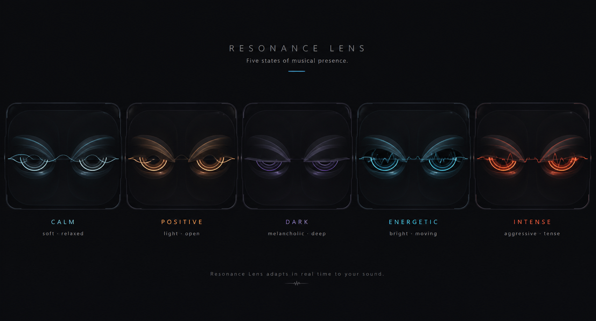

# AutPlay Face: Resonance Lens exploration v1

| Field | Value |
| --- | --- |
| Status | Non-normative visual exploration; not an implementation milestone |
| Date | 2026-08-31 |
| Scope | A more mature visual grammar for the accepted AutPlay Face semantics |
| Preview | [`autplay-face-resonance-lens-v1.png`](autplay-face-resonance-lens-v1.png) |

## Intent

The current five-state illustration communicates the semantic range, but its white dot pupils,
literal eyebrow arcs, separate eye capsules, and one-pose-per-mood construction read as a simple
mascot or emoji set. Resonance Lens keeps the accepted pair-of-eyes direction while treating it as
a musical optical instrument rather than a cartoon face.

The result should feel observant, composed, and audio-reactive. It may be characterful, but it must
not become a pet, avatar, human eye imitation, or fixed emotion picker.

## Visual grammar

Every expression is produced by the same six-part rig:

1. **Shared visor field.** A low-contrast binocular field visually binds the eyes into one system.
2. **Upper and lower aperture masks.** These replace drawn eyebrows and control openness, pressure,
   tilt, and asymmetry.
3. **Spectral iris arcs.** Two or three incomplete rings imply focus and musical phase without a
   white sclera or a round cartoon pupil.
4. **Dark optical core.** A small negative-space core carries gaze and convergence. It is never a
   white dot.
5. **Resonance filament.** One thin line crosses both eyes. It reacts to meaningful dynamics, not
   every sample or beat.
6. **Controlled micro-asymmetry.** Small differences in lid timing, arc phase, and gaze avoid a
   stamped icon look while preserving binocular coherence.

Depth comes from limited translucency and occlusion inside the apertures. The outer UI stays flat
and quiet so the Face remains compatible with a practical Android player rather than becoming a
full-screen visualizer.

## Semantic mapping

The visual rig remains continuous. The five named scenes are test fixtures, not an enum.

| Musical axis | Primary visual parameter | Secondary parameter | Avoided cliche |
| --- | --- | --- | --- |
| positive ↔ melancholic | vertical light distribution and upper-mask curvature | warm ↔ violet spectral bias | smile/frown eyebrows |
| calm ↔ energetic | filament amplitude and arc phase velocity | aperture breathing range | bouncing eyes |
| soft ↔ aggressive | edge radius and core sharpness | transient attack speed | triangular angry eyes |
| light ↔ dark | luminous coverage inside the iris | mask occlusion and local contrast | simply changing the background |
| relaxed ↔ tense | aperture height and binocular convergence | symmetry tolerance | a fixed squint pose |
| dry/direct ↔ dreamy/atmospheric | edge definition | restrained bloom and trail persistence | fog or rainbow glow everywhere |

## Reference scenes

| Scene | Aperture | Iris / core | Filament | Read |
| --- | --- | --- | --- | --- |
| Calm | open, low pressure, nearly symmetric | cool wide arcs, soft core | almost flat with slow drift | stable and spacious |
| Positive | more vertically open, light biased upward | restrained warm arcs, outward ease | gentle single lift | open, not smiling |
| Dark | partially occluded with lower luminance | violet arcs recede into negative space | sparse and low | deep, not sad |
| Energetic | open with small phase asymmetry | bright cyan arcs with faster eccentric motion | several bounded peaks | active, not frantic |
| Intense | compressed, convergent, high local contrast | coral arcs and a narrow sharp core | short high-attack peaks | focused and forceful, not angry |

## Motion model

Motion has three independent time scales, matching the accepted product concept:

- **Track character:** a slow, critically damped transition between baselines. Initial prototype
  range: 900–1600 ms, with no hard pose swap.
- **Current dynamics:** small aperture, arc, and filament modulation. Normal amplitude should remain
  around 2–6%; larger changes are reserved for meaningful transitions, pauses, or drops.
- **App reaction:** one brief secondary gesture, then a return to the musical baseline. Suggested
  starting points are 180–450 ms for play, pause, Like, and skip reactions.

The Face should contain rest periods. It must not pulse continuously at the track BPM. Motion is
never input-blocking and does not replace text, controls, haptics, or accessibility semantics.

Suggested event gestures:

| Event | Gesture | Explicitly not used |
| --- | --- | --- |
| Play | core focuses and apertures open slightly | a permanent bounce loop |
| Pause | arcs settle and the filament becomes quiet | eyes closing as if asleep |
| Like | one warm, binocular outward impulse | hearts or a happy emoji |
| Dislike / skip | a short lateral shutter sweep before the next baseline | an angry grimace |
| Idle | dim stable apertures with occasional low-amplitude refocus | staring or constant blinking |

## Accessibility and degradation

- Reduced motion freezes the continuous modulation and uses a stable expression or a short
  low-distance crossfade for state changes.
- Color is redundant: aperture, occlusion, arc geometry, and contrast must distinguish states in a
  monochrome capture.
- The Face is decorative for TalkBack. Playback and user-action outcomes remain represented by the
  authoritative controls and concise state labels.
- No network, server, GPU, or detailed analysis is required. Missing analysis produces a neutral or
  coarse locally derived baseline, never fake precision.
- The design must be checked at its smallest intended Now Playing size, not only on a large concept
  board.

## Prototype gates

Before treating this direction as implementation input, validate all of the following:

1. A monochrome five-scene test is correctly distinguished without labels.
2. Intermediate blends do not collapse into the nearest named pose.
3. At mobile scale, the core and aperture remain legible while the filament does not alias.
4. A 30-second playback sample contains visible rest, not constant movement.
5. Reduced-motion and no-analysis captures remain honest and visually intentional.
6. In a small preference test, target adjectives are `mature`, `musical`, and `focused`; warning
   adjectives are `cute`, `emoji`, `angry`, `robot pet`, and `horror`.

## External references used

- Apple Human Interface Guidelines, [Motion](https://developer.apple.com/design/human-interface-guidelines/motion): motion should be purposeful, brief, optional, and never the only carrier of meaning.
- Android Developers, [Accessibility](https://developer.android.com/design/ui/mobile/guides/foundations/accessibility): visual information must remain legible and accessible semantics stay authoritative.
- Disney Research, [PAPILLON: Expressive Eyes for Interactive Characters](https://la.disneyresearch.com/publication/papillon-expressive-eyes-for-interactive-characters/): expressive eyes can use arbitrary non-human shapes rather than copying anatomical eyeballs.
- Disney Research, [Realistic and Interactive Robot Gaze](https://la.disneyresearch.com/wp-content/uploads/root.pdf): gaze direction, saccades, and coordinated eye movement are strong life cues and therefore should be used deliberately.
- Milutinovic et al., [Anthropomorphic Robotic Eyes](https://pmc.ncbi.nlm.nih.gov/articles/PMC9024502/): gaze, eyelids, and surrounding eye geometry provide separable non-verbal controls. Resonance Lens uses gaze and aperture masks while deliberately omitting literal eyebrow glyphs.

## Boundary

This exploration does not replace `AutPlay_Face_Product_Concept_v1.md`, update the accepted UI
contract, choose a rendering stack, or claim implementation. Promotion requires explicit user
approval and a separately activated implementation milestone.
