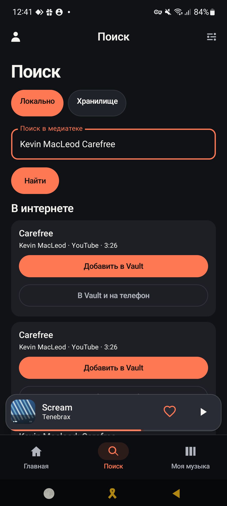
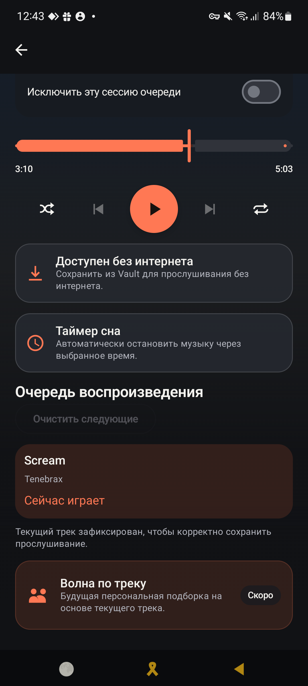

# Phone music and selected Internet acquisition

Verified on the connected Samsung M52 on 2026-09-16. Installed application:
`0.3.6-music-library`, version code 10, Room schema 16. Installation used an in-place
update; application data, listening history and existing worktree changes were preserved.

## Delivered behavior

- Settings / Music folder: discover phone audio, select files and copy verified bytes
  into `Music/AutPlay`. Source files remain intact. New copies have readable titles
  plus a content hash in their filenames; repeated import reuses the local identity.
- Settings / Music folder: explicitly send selected files to the paired private Vault.
  WorkManager retains progress; a fresh explicit attempt can retry a terminal failure.
- Full player: download the current Vault track into Media3 durable offline storage.
  The control becomes "Available offline" on completion.
- Search: explicit Search requests also query the Internet. The current provider is
  YouTube; up to five results retain provider relevance order. Each displays title,
  uploader/provider and duration, with separate Vault-only and Vault-plus-phone actions.
- Selection acquires the exact snapshot member through a leased server job, normal
  SHA-verified Vault ingest, owner publication and sync. Device download follows publication.
- Streaming remains the default for Vault tracks that have not been downloaded.

## Verification

Android assembly and 293 unit tests passed. Targeted server checks passed: 81 initial
regressions; 8 music/migration lifecycle gates; 2 HTTP authorization/private-response
checks; 26 media/Vault checks. The final float64 rejection adjustment passed all 16
media tests. Ruff passed and six new production modules passed mypy. Server schema
upgraded additively to `0031_music_library`, with a database backup and original container
specifications retained privately. APIs, stream and both worker services are healthy.

Opt-in `PhoneMusicLiveAcceptanceTest` on the actual paired M52 passed:

1. `copyPreservesSourceAndRepeatedImportRestoresOneEntry`: source/copy full SHA equality,
   published `Music/AutPlay` location, repeated-import identity and local restore.
2. `uploadFromPhonePublishesPlayableVault`: phone-origin WAV reached COMMITTED Vault
   state, owner publication completed and the ordinary playback resolver returned its variant.
3. `completedVaultDownloadReadsEveryByteWithoutNetwork`: cache-only read of the entire
   downloaded upload matched the source SHA. No upstream network factory was present.
4. `internetSelectionPublishesVaultAndDownloadsToPhone`: real five-result Carefree search,
   exact selection, READY Vault acquisition, device download and cache-only ExoPlayer
   playback advancing beyond one second. Server acquisition job completed.

Manual UI verification exercised phone scanning, inspected real Internet result cards,
and downloaded an existing Vault track using its player button. It changed to "Available
offline". A final inventory check resolved and read real beginning/end byte ranges for
3,004 advertised Vault tracks with zero failures. Nine other library entries remained
PENDING at that snapshot while the existing downloader/bridge continued. These counts
are observations, not a frozen catalog size.

Final APK SHA-256:
`b41d6b1e343fd59a08e496a537755398127bdbe08262218e9503e4c4f909c07d`

Final server image ID:
`774fed4ecbd513d5f92158884a4f6ffb1f7d25d5b01605c1a5a2cb5c59f6975d`

## Boundaries and retained evidence

PCM WAV support uses the same decode/probe/hash gates as existing AAC, FLAC, MP3 and
Opus. Float64 WAV is rejected because the pinned Android player cannot decode it.
Cross-recording byte collisions retain the existing quarantine/review policy; no fuzzy
identity merge or owner-ref consolidation was added. Internet availability and the
number of eligible results depend on the source; unavailable acquisitions report failure.

The rapid test-only remove/restore sequence before its first sync produced two
optimistic-version conflicts for the synthetic fixture. Its final active library state,
upload and playback were verified; those immutable conflict records were retained.
An older inactive-profile dead letter was also preserved. The database integrity check
passed, schema stayed 16, and all 28 pre-existing listening events remained present.
The clearly named test tone and selected Carefree track remain available for inspection.

Android implementation is in the `m52-ui` worktree; the server implementation and
ADR-051 are in the main AutPlay checkout. No commit or push was performed. Private
rollout backups and bounded execution state are excluded from publication.

